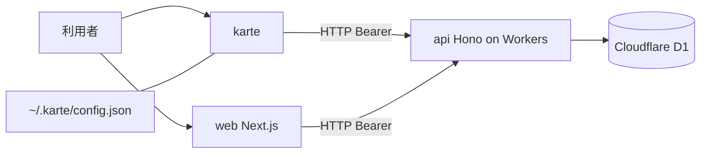

# Architecture

bun workspaces による TypeScript モノレポ。api と cli と web の3ワークスペースで構成する。

## Runtime

api は Cloudflare Workers(wrangler)上で動作する。cli は bun で動作する。web は Next.js で動作する。

## Layers

api は domain と application と infrastructure と interface の4層で構成する。interface は Next.js App Router 記法(route.ts と動的セグメント [param])でルートを定義し、app.ts が :param に対応づけて登録する。

web の app ディレクトリはルートごとに collocation する。ルート直下には page.tsx と actions.ts(Server Actions)などの規約ファイルだけを置き、画面を構成するコンポーネントは各ルートの \_components 配下、表示用の純関数は \_lib 配下に置く。画面横断の共有コンポーネントは web/components に置き、shadcn 生成物(web/components/ui)は直接編集しない。

## Data

api は Cloudflare D1(SQLite)を Drizzle ORM 経由で読み書きする。スキーマは api/src/schema.ts に集約する。二重登録を防ぐ整合性は一意索引で担保する(給与明細の社員と期間、感謝の月次原資の社員と期間など)。

## Data Fetching

cli は引数をローカルの HTTP リクエストに変換し、内部の Hono ルートで処理したうえで、api を叩く。接続先は既定で http://127.0.0.1:8787、環境変数 KARTE_API で上書きできる。web は Hono の型付きクライアント(hc)で api を叩く。

## Authentication

ログインで取得した JWT トークンを Authorization ヘッダに Bearer トークンとして付与する。cli はトークンを ~/.karte/config.json に保存する。web は httpOnly cookie に保持する。api は jose でトークンを検証する。

認証情報は identities テーブル、アカウント状態は accounts テーブルが正で、従業員台帳(employees)は認証情報を持たない。アクセストークンの有効期限は 1 時間、リフレッシュトークンは 7 日でローテーションする(POST /auth/refresh、再利用検知つき)。期限切れ・tokenVersion 不一致のトークンは 401 を返す。web は middleware がアクセストークン失効時に refresh_token cookie から自動で再発行する。設計の全体は [[iam-auth-design|IAM 認証・認可システム設計]] を参照。

## Security

パスワードは PBKDF2-SHA256・10 万反復・個別ソルト(crypto.subtle 実装)でハッシュ化する。旧実装(SHA-256 固定ソルト)からの移行はログイン成功時に自動で行うほか、一度もログインしないユーザーの旧ハッシュは管理者バッチ(POST /batch/migrate-password-hashes、karte batch migrate-password-hashes)で pbkdf2-wrapped-legacy 形式へ一括移行できる。

ログインは IP 単位とメールアドレス単位の二重のレート制限を KV で行う。KV 未バインドの開発環境では制限をスキップするため、本番では RATE_LIMIT KV のバインドが必須。

ログイン以外の全エンドポイントには Workers の Rate Limiting binding(API_RATE_LIMITER)を使い、IP 単位のグローバルレート制限(既定で 60 秒あたり 600 リクエスト)をミドルウェアでかける。Workers KV と違い高頻度カウントに耐えるネイティブ機能のため、KV のような書き込み制約を受けない。binding 未設定の環境(ローカル開発・テスト)ではスキップするため、本番では wrangler.jsonc の ratelimits バインドが必要。ヘルスチェック用の /health は対象外。

CORS は env.CORS_ORIGIN で許可オリジンを制限する。ワイルドカードは使わない。

API レスポンスには hono/secure-headers で X-Content-Type-Options: nosniff、Strict-Transport-Security(HSTS)、X-Frame-Options などのセキュリティヘッダを付与する。別オリジンの正規クライアント(web / cli)からの利用を阻害しないよう COOP / CORP は無効化し、クロスオリジンの制御は CORS に委ねる。

リクエストボディは 1 MB を上限とする(Hono bodyLimit ミドルウェア)。フリーテキストフィールドは最大 200〜50,000 字、ID・コード類は最大 200 字のバリデーションを各ルートに設ける。日付フィールドは ISO 8601 形式(YYYY-MM-DD)を強制する。

ルートの認可は permission ベースで行う。verify-bearer がリクエスト毎に DB からアカウントの permission 集合を解決し、各ルートの can- ヘルパーが deny-by-default で判定する。自分のデータ(self)は permission にせず employee_id の所有者照合で許可する。ロールは permission の集合として動的に定義できる。詳細は [[roles-and-permissions|ロールと権限]] を参照。

状態遷移を伴う操作(休暇申請の承認・却下など)は事前条件チェックを持ち、同一リクエストの二重処理を防ぐ。

## Styling

web は Tailwind CSS と shadcn で構成する。

## 構成図

