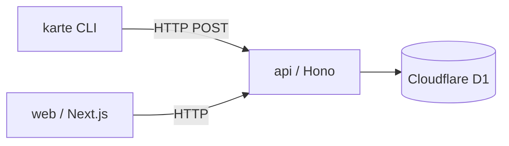

# Architecture

実コードは未実装。以下は[[index|方向性]]に基づく想定構成であり、実装が進んだらコードを正として更新する。

## Runtime

api は Cloudflare Workers (wrangler) 上で動かす想定。cli は bun のローカルプロセスで動かす想定。

## Rendering

web は Next.js App Router。サーバコンポーネント主体で、必要な箇所のみクライアントコンポーネントとする想定。

## Data Fetching

api は Hono のルーティングで HTTP を受ける。web と cli は api を HTTP 経由で呼ぶ。

## Authentication

未確定。認証方式は今後の意思決定で定める。

## Styling

web は Tailwind と shadcn を用いる想定。

## 構成図

