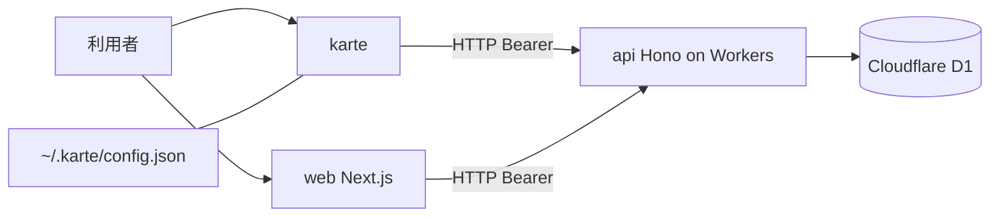

# Architecture

bun workspaces による TypeScript モノレポ。api と cli と web の3ワークスペースで構成する。

## Runtime

api は Cloudflare Workers(wrangler)上で動作する。cli は bun で動作する。web は Next.js で動作する。

## Layers

api は domain と application と infrastructure と interface の4層で構成する。interface は Next.js App Router 記法(route.ts と動的セグメント [param])でルートを定義し、app.ts が :param に対応づけて登録する。

## Data

api は Cloudflare D1(SQLite)を Drizzle ORM 経由で読み書きする。スキーマは api/src/schema.ts に集約する。二重登録を防ぐ整合性は一意索引で担保する(給与明細の社員と期間、感謝の月次原資の社員と期間など)。

## Data Fetching

cli は引数をローカルの HTTP リクエストに変換し、内部の Hono ルートで処理したうえで、api を叩く。接続先は既定で http://127.0.0.1:8787、環境変数 KARTE_API で上書きできる。web は Hono の型付きクライアント(hc)で api を叩く。

## Authentication

ログインで取得した JWT トークンを Authorization ヘッダに Bearer トークンとして付与する。cli はトークンを ~/.karte/config.json に保存する。web は httpOnly cookie に保持する。api は jose でトークンを検証する。

JWT の有効期限は発行から 8 時間。期限切れトークンは 401 を返す。

## Security

パスワードは PBKDF2-SHA256・10 万反復・個別ソルト(crypto.subtle 実装)でハッシュ化する。旧実装(SHA-256 固定ソルト)からの移行はログイン成功時に自動で行う。

CORS は env.CORS_ORIGIN で許可オリジンを制限する。ワイルドカードは使わない。

リクエストボディは 1 MB を上限とする(Hono bodyLimit ミドルウェア)。フリーテキストフィールドは最大 200〜50,000 字、ID・コード類は最大 100 字のバリデーションを各ルートに設ける。日付フィールドは ISO 8601 形式(YYYY-MM-DD)を強制する。

ルートの認可は employee_id の所有者照合で行う。他者のデータへのアクセスは application の summary など明示的に許可された操作を除き拒否する。

状態遷移を伴う操作(休暇申請の承認・却下など)は事前条件チェックを持ち、同一リクエストの二重処理を防ぐ。

## Styling

web は Tailwind CSS と shadcn で構成する。

## 構成図

