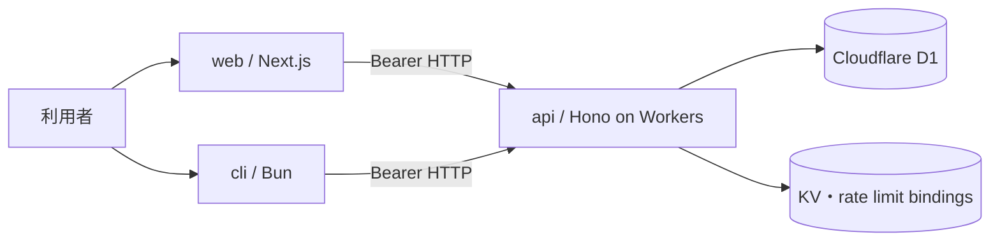
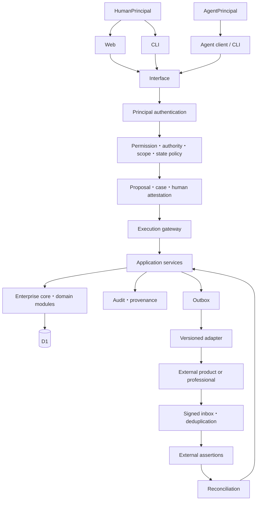

# システムアーキテクチャ仕様

規範性: 補助仕様。中核モデルを実装する配置、依存方向、信頼境界を定める。

実装済みの配置、依存方向、信頼境界と、未実装の要求構成を定義する。現行構成の正本は workspace の `package.json`、route、migration、deployment config とする。要求構成は設計制約であり、実装済みであることを意味しない。図は依存関係を定義し、runtime topology の完全な列挙を目的としない。

## 現在の構成

- `api`: Hono と Cloudflare Workers で動く HTTP API
- `cli`: 引数を local Hono route で検証し、HTTP API を呼ぶ Bun CLI
- `web`: Next.js、React、Tailwind、shadcn による Web UI
- `D1`: SQLite 互換の永続化。migration SQL が schema の正本

実装されている route の正本は `api/src/app.ts` と `api/src/interface`、データ制約の正本は `api/migrations` である。`api/src/schema.ts` は Drizzle query と型生成に使う同期表現である。

## API の層

`api/src` は次の依存方向を持つ。

- `domain`: 型、値、不変条件、状態遷移
- `application`: use case、transaction、policy の調整
- `infrastructure`: D1、外部 port、repository の実装
- `interface`: HTTP schema、認証 context、response mapping

依存は interface と infrastructure から application と domain へ向ける。domain は Hono、D1、外部 SDK、Web の型を参照しない。

route は App Router 形式の directory に置き、`app.ts` が Hono path へ登録する。route を追加しただけでは API に公開されないため、登録と型再生成を一つの変更として扱う。

## Web と CLI

Web と CLI は提供面であり、業務規則と認可の正本ではない。

- Web の route 固有 component は `_components`、表示用純関数は `_lib` へ collocate する。
- `web/components/ui` は shadcn 生成物とし、直接編集しない。
- Web と CLI は `api/app` の `AppType` を type-only で参照し、それぞれ `hc` client を生成する。
- API の実行時 module を client bundle へ import しない。
- CLI route は `cli/app/index.ts` へ登録する。
- UI の非表示や CLI help は認可ではなく、API が最終判断する。

## 認証と認可

現在は login で発行した token を Bearer として API へ送る。Web は httpOnly cookie、CLI は local config を使う。token の検証、session 失効、account 状態、permission、scope、案件資格は API が評価する。

目標モデルでは Human、Agent、Service、Connector を別 Principal として認証する。人間 token を AI や connector が借用しない。現行実装は permission ベース(deny-by-default)で、verify-bearer が request ごとに account の permission 集合を DB から解決する。詳細は [認可モデル](./authorization-model.md) と [[roles-and-permissions|ロールと権限]] を参照する。

## データと transaction

- 強い不変条件は application の事前検査だけでなく、unique index、check、条件付き更新で DB 境界にも置く。
- 状態遷移は expected revision を検査する。
- business result と監査または outbox が片方だけ残らない transaction 境界を作る。
- 履歴を必要とする関係は物理削除せず、有効期間、取消、archive、訂正で表す。
- valid time、recorded time、policy version を必要に応じて分ける。
- retry 可能な command は idempotency key と payload digest を保存する。

## 要求構成

AI 自動化と外部 API を安全に扱うため、API 境界は次の未実装要件を満たす。

## Policy と実行の境界

要求構成では、次を一つの管理者権限へ集中させない。

- Principal と TechnicalPermission の管理
- OrganizationalAuthority の assignment
- Proposal の作成
- HumanAttestation または合議体 decision
- ExecutionAuthorization の発行
- connector secret による外部実行
- audit retention と policy 変更

低リスク環境では同一の人間が複数責務を担える policy も許すが、独立承認や定足数を必要とする policy を表現し、強制できる構造を持つ。

## 外部連携の境界

外部 SDK は infrastructure adapter に閉じ込める。domain は canonical port だけを参照する。外部 callback は interface で署名、replay、schema を検証し、inbox を経て application service へ渡す。

外部との整合は二相 commit に依存せず、outbox、inbox、idempotency、retry、dead-letter 相当の例外案件、reconciliation で回復する。詳細は [外部連携モデル](./integration-model.md) を参照する。

## セキュリティ原則

- CORS は明示した origin に限定する。
- request body、文字列、ID、日付を interface schema で制限する。
- rate limit binding が必要な環境では未設定を安全に検出する。
- response へ安全な header を付与する。
- secret を source、document、log、prompt、client bundle へ含めない。
- field policy を response と export の両方へ適用する。
- 外部 URL、redirect、webhook、file input を信頼境界として扱う。
- 監査だけで防御したことにせず、認可と DB 制約で side effect を防ぐ。

具体的な反復数、token 寿命、rate limit 値など運用可能な値はコードと deployment config を正とし、この恒久文書へ複製しない。

## 可換性による適合確認

会社モデルから実装への写像が次を保存することを integration test で確認する。

- Web、CLI、Agent の request が同じ application command へ正規化される
- permit なしの side effect path が存在しない
- Proposal、HumanAttestation、Execution の digest が一致する
- retry と一回実行の業務効果が一致する
- domain event と audit または outbox が同じ transaction outcome を持つ
- external mapping が ID、単位、時点、source、version を失わない
- current relationship と historical snapshot を取り違えない
