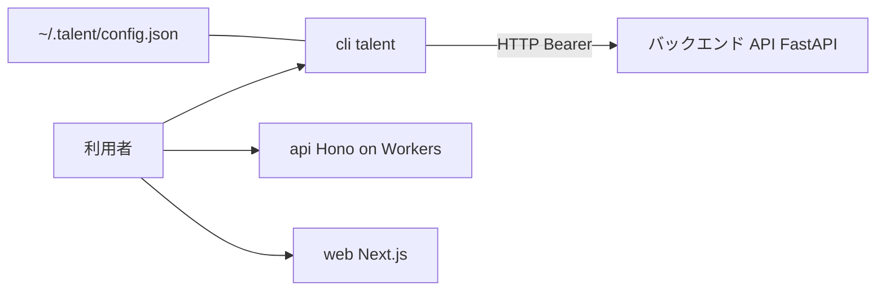

# Architecture

bun と npm workspaces による TypeScript モノレポ。api と cli と web の3ワークスペースで構成する。

## Runtime

api は Cloudflare Workers(wrangler)上で動作する。cli は bun で動作する。web は Next.js で動作する。

## Rendering

web は Next.js による描画。現状は初期スキャフォールドのページのみ。

## Data Fetching

cli は引数をローカルの HTTP リクエストに変換し、内部の Hono ルートで処理したうえで、バックエンドの API(既定 http://127.0.0.1:8000)を叩く。接続先は環境変数 TALENT_API で上書きできる。

## Authentication

cli はログインで取得したトークンを ~/.talent/config.json に保存し、以降のリクエストの Authorization ヘッダに Bearer トークンとして付与する。

## Styling

web は Tailwind CSS 系の構成(globals.css と postcss)を持つ。

## 構成図

