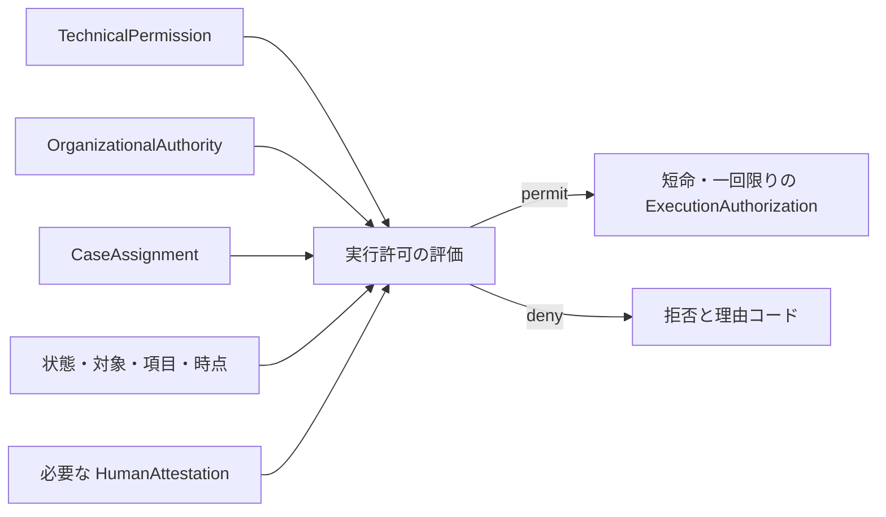

# 権限と意思決定モデル

会社を拘束する判断権限と、システム操作権限を分離する。いずれか一つを他の代替として使用してはならない。

## 権限型

- `OrganizationalAuthority`: 会社を拘束する判断を行う制度上の権限
- `TechnicalPermission`: API 操作の候補を呼び出す技術的権限
- `CaseAssignment`: 特定案件で提案、閲覧、判断する資格
- `HumanAttestation`: 人間本人が固定された内容を確認した証明
- `ExecutionAuthorization`: 必要な条件を合成した対象限定かつ短命な実行許可

概念上の実行許可は次の交差とする。操作に不要な条件は、方針が明示的に除外する。

```text
ExecutionAuthorization
  = TechnicalPermission
  ∩ OrganizationalAuthority
  ∩ CaseAssignment
  ∩ StateAndScopePolicy
  ∩ RequiredAttestations
  ∩ TimeValidity
```



## 組織構造

`OrgRole` へ次を混在させてはならない。

- `OrganizationalOffice`: 一人が就く役職
- `CollectiveBody`: 構成員、定足数、議決方式を持つ合議体
- `ResponsibilityRole`: 組織関係から導出する責任
- `ResponsibilityAssignment`: 対象範囲と成果への継続責任を役職または合議体へ割り当てる期間付き関係
- `RoleClass`: 同種の責務を持つ複数人の分類

合議体の判断は、構成員一人の承認として記録してはならない。次を保持する。

- 構成員と有効期間
- 審議対象と agenda
- 候補者 snapshot
- 定足数と議決方式
- 各構成員の vote または attestation
- resolution outcome
- 棄権、利益相反、欠席

## 継続責任

`ResponsibilityAssignment` は、LegalEntity、OrgUnit、Project、Capability、Case または domain resource に対する継続責任を、OrganizationalOffice または CollectiveBody へ割り当てる。対象、期待する成果、scope、開始、終了、根拠、assignment revision を保持する。

承認者と継続責任主体を同一視してはならない。DecisionRecord は、判断時点で有効な ResponsibilityAssignment と、役職就任者または合議体構成員の snapshot を保持する。人の異動または退職後も、誰がどの役職または合議体の資格で責任を負っていたかを再構成できなければならない。

方針が継続責任主体を要求する操作で、有効な ResponsibilityAssignment を一意に決定できない場合は拒否する。AgentPrincipal、ServicePrincipal、ConnectorPrincipal を継続責任主体にしてはならない。

## 判断型

- `Proposal`: 対象、操作、差分、効果、前提条件を固定した提案
- `DecisionAct`: 権限を持つ主体が判断した出来事
- `DecisionContent`: 判断対象、理由、条件、参照資料
- `DecisionOutcome`: permit、deny、return、abstain
- `DecisionRecord`: 主体、資格、方針版、時点、内容 digest の記録
- `CollectiveDecision`: 合議体の定足数と議決から得た決定
- `EmergencyBusinessDecision`: 通常手続きを待てない場合の別種の判断
- `PostReview`: 緊急判断の妥当性と是正を事後審査する義務

承認は `Proposal` に対する `Decision` の一種とする。クリック、タスク完了、既読を承認として扱ってはならない。

## 委任型

- `AuthorityDelegation`: 決裁権限の限定移転
- `ActingAssignment`: 不在時の役職代行
- `StandingSubauthority`: 定常範囲の専決
- `TaskProxy`: 特定案件の操作代理
- `ExecutionMandate`: AI またはサービスへの限定実行委任

各委任は、委任元、受任者、権限種類、操作、対象、項目、金額または量、目的、開始、終了、再委任可否、取消、根拠を持つ。委任元が持たない権限または委任範囲を超える権限を付与してはならない。

## 緊急時

- `BreakGlassAccessGrant`: 障害対応の一時的な技術アクセス
- `EmergencyBusinessDecision`: 通常経路を待てない会社判断

両者を同一視してはならない。緊急判断は専用の `AuthorityRule`、理由、範囲、期限を持ち、`PostReview` を生成する。法令または施行済み方針が要求する合議、外部判断、職務分離を省略してはならない。

## 金額条件

金額を使う規則は次を明示する。

- 通貨
- 税込または税抜
- 一件、契約、月、案件の集約単位
- 分割の合算期間
- 為替換算 source と基準時点
- 下限と上限の包含関係
- 予算内外と予算版
- 法人、部署、法域、支出カテゴリ
- 例外規則の優先順位

初期データとサンプル設定の金額は未施行とし、自社の権限ある主体が承認して施行するまで権限判定に使用してはならない。

## 方針評価

`AuthorityRule` は次を入力にする。

- action type と対象
- initiator、decider、consulted、executor の Principal と関係
- accountable な ResponsibilityAssignment と判断時 snapshot
- 会社、組織、案件、法域
- 金額、数量、分類、機密度
- 対象状態と revision
- 規程版と施行期間
- 利益相反、自己判断、職務分離
- 委任または緊急根拠

複数規則の優先順位と deny の優先を定義する。規則なし、評価失敗、参照切れは拒否する。表示用 metadata を方針評価結果として使用してはならない。

## 不変条件

- `TechnicalPermission` と `OrganizationalAuthority` は相互に生成されない
- `AgentPrincipal` は `HumanAttestation` を作成できない
- `AgentPrincipal`、`ServicePrincipal`、`ConnectorPrincipal` は会社を拘束する Decision の decider または ResponsibilityAssignment の担い手になれない
- 独立承認が必要な提案を提案者一人で承認できない
- 承認者を継続責任主体の代わりに記録しない
- 合議体判断を構成員一人の判断へ縮退できない
- 案件開始時の候補者、根拠、定足数、方針版を固定する
- 役職解除または退職で過去の判断根拠を削除しない
- 委任、役職代行、案件代理、緊急アクセスを同一視しない
- 規程の同期、レビュー、公開、施行、技術適用を別状態にする

## 現行実装差分

現行 governance 実装の `org_role` は、役職と合議体を区別しない。公開承認は role ごとに一件であり、定足数を表さない。`authority_rules` は構文検査と表示の metadata であり、業務 API 全体を強制する Policy Decision Point ではない。

governance 文書の同期または公開だけで、権限と意思決定の実装を完了としてはならない。差分は [能力台帳](./capability-map.md)、コード、migration、テストで追跡する。
