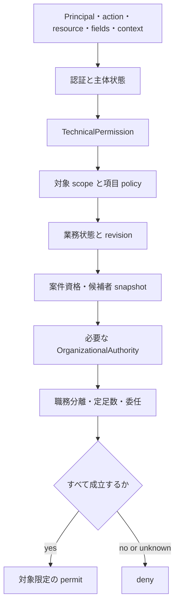

# 認可モデル

認可は、Principal、操作、対象、項目、状態、時点の組を評価する。会社を拘束する判断権限は [権限と意思決定モデル](./authority-model.md) が定める。技術的認可を会社上の権限として使用してはならない。

## Principal

- `HumanPrincipal`: 人間本人として認証した主体
- `AgentPrincipal`: AI エージェントとして認証した主体
- `ServicePrincipal`: 内部バッチまたはサービス
- `ConnectorPrincipal`: 外部 API 資格情報を使う接続主体

`Account` は Principal の認証状態を保持する。`Person` と `Employee` は業務上の対象であり、Account と同一ではない。人間以外の Principal へ架空の従業員を割り当ててはならない。

## 認可判定

```text
authorize(principal, action, resource, context, fields, time)
  = authenticated(principal)
  ∧ principal_is_operable(principal, time)
  ∧ technical_permission(principal, action)
  ∧ scope_allows(principal, resource, context, time)
  ∧ field_policy_allows(principal, fields, purpose)
  ∧ state_transition_allows(resource, action, context)
  ∧ case_assignment_allows_when_required(principal, context)
  ∧ organizational_authority_allows_when_required(principal, action, context)
  ∧ attestations_satisfied_when_required(action, context)
  ∧ separation_of_duties_holds(principal, action, context)
  ∧ delegation_valid_when_used(principal, action, context, time)
  ∧ not_expired_or_revoked(principal, context, time)
```

各 action は必要な条件を方針で宣言する。未定義、参照切れ、時刻不明、評価失敗は拒否する。



## TechnicalPermission

- Permission は API operation の上限を表す安定 key とする
- ロールは Permission の集合とする
- 業務コードで `root`、`hr` などのロール名を直接判定しない
- Permission だけで対象範囲、決裁権限、案件資格を付与しない
- ロールの付与と剥奪へ認可、職務分離、監査を適用する
- 最後の実効管理者を失う変更は transaction 内で拒否する

## Scope

scope は対象集合と有効時点を返す。少なくとも次を区別する。

- self
- participant
- assigned_case
- direct_reports
- org_unit
- org_subtree
- organization
- resource_custody
- external_tenant

`organization` は自社内の全社 scope を表す。`external_tenant` は connector が接続する外部製品内の対象であり、法人の選択に使用してはならない。

複数 scope の和集合によって項目範囲または purpose を拡張してはならない。過去記録は、保存済み参加資格または履歴閲覧方針で評価する。現在の組織関係で評価してはならない。

## CaseAssignment

案件開始時または step 開始時に候補者を解決し、次を snapshot する。

- candidate Principal
- 根拠となる関係または役職 assignment
- 解決時点
- step、round、sequence
- quorum と decision rule
- policy version
- 委任元と委任関係

組織変更で進行中案件の候補者または定足数を暗黙変更してはならない。候補者不在は修復案件として扱い、元 snapshot と修復理由を残す。

## FieldPolicy

- `ClassificationLevel`: public、internal、confidential、restricted
- `DataCategory`: directory、hr-sensitive、health、financial、authentication、legal、audit
- `HandlingPolicy`: 閲覧、変更、export、保持、暗号化、mask、目的制限

一覧、件数、検索候補、詳細、更新、履歴へ同じ対象条件を適用する。閲覧不可の対象を件数、候補、エラー差、preload から漏らしてはならない。更新 route は許可した field set だけを受理し、過剰投稿を拒否する。

## 状態と並行更新

- action を許可された状態遷移として定義する
- expected revision または同等の前提条件を検査する
- 認可後に状態が変わった場合は再評価する
- 承認済み `Proposal` を自動補正して競合を隠さない
- idempotency key と payload digest を結ぶ

## 委任

案件操作の代理には `TaskProxy` を使う。決裁権委任、役職代行、AI への実行委任と同じ型を使ってはならない。

`TaskProxy` は、委任元、代理人、対象 template または case、操作、開始、終了、取消、再委任可否を持つ。期間は半開区間で評価する。重複と自己委任を transaction 内で拒否し、代理人と委任元を記録する。

## 職務分離と定足数

- 提案者、対象者、資源所有者だけで独立承認要件を満たしてはならない
- 同一 Principal の複数アカウントで定足数を満たしてはならない
- 合議体は候補者集合と quorum rule を snapshot する
- 利益相反、棄権、欠員を decision outcome として保持する
- AI を human quorum の構成員にしてはならない
- 緊急アクセスで職務分離を無条件解除してはならない

## HumanAttestation

人間承認が必要な action は、`HumanPrincipal` の attestation を変更不能な proposal digest へ結ぶ。自然言語コメント、ログイン済みセッション、AI の説明から attestation を推定してはならない。

承認時と実行直前に次を検査する。

- HumanPrincipal の本人性と step-up 認証
- OrganizationalAuthority と案件資格
- proposal digest、target、revision、expiry
- policy version と必要な他の attestation
- 自己承認と利益相反

## 緊急アクセス

`BreakGlassAccessGrant` は、目的、対象、action、field、開始、終了、発行者、承認者を制限する。利用ごとに audit event を残し、失効後に事後 review を要求する。

緊急の会社判断には `EmergencyBusinessDecision` を使う。BreakGlassAccessGrant で正当化してはならない。

## 監査

permit と deny の双方について、次を再構成できる記録を残す。

- requested_by、executed_by、on_behalf_of
- principal kind、account、session、agent execution
- action、resource kind、resource ID、field set
- permission、scope、case assignment、authority rule、delegation
- policy version、valid time、decision time
- proposal digest、idempotency key、correlation ID
- decision、reason code、result

AI の prompt 全文または秘密を監査記録へ保存してはならない。入力参照、モデルまたは tool の実行版、正規化した `ProposedAction` を保存する。

## API 境界

- API が最終認可を行う
- Web と CLI の表示制御を認可として扱わない
- AI と外部コールバックを同じ application service と policy evaluation へ通す
- 存在秘匿は `404`、未認証は `401`、存在を開示できる権限不足は `403`、状態競合は `409`、入力不正は `422` とする

## 適合条件

- Principal kind ごとの許可と拒否を検査する
- 同じ Permission でも scope 内外で結果を分ける
- list、count、detail、mutation、history の対象条件と field policy を一致させる
- 組織変更後も candidate snapshot と quorum を維持する
- 自己承認、定足数水増し、利益相反を拒否する
- proposal digest の変更で既存 attestation を無効にする
- Web、CLI、AI、callback の policy result を一致させる
- permit 後の state、revision、authority、expiry 変更を実行直前に拒否する
- 取消、退職、role 解除後も過去の根拠を再構成する
- 認可を通らない side effect を静的検査と integration test で検出する

## 現行実装差分

現行 API は HumanPrincipal 相当の account と employee を中心に認証し、route ごとに Permission、本人関係、組織関係、案件候補を評価する。System には `HumanAttestation` と `ExecutionAuthorization` の domain 型と永続化制約があるが、Principal kind、step-up、共通 policy evaluation、application service、repository、Execution Gateway、既存 route からの利用は未実装である。`AgentPrincipal` と `ConnectorPrincipal` の独立した認証も未実装である。

System workflow の責任と利用済みと判定する条件は [System workflow](./system-workflow.md) に従う。差分は [能力台帳](./capability-map.md)、コード、migration、テストで追跡する。domain 型または空 table の存在だけで利用経路を実装済みとして扱ってはならない。
