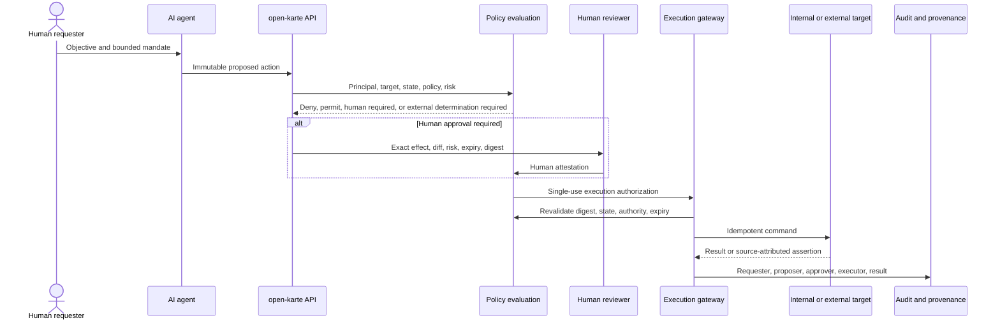
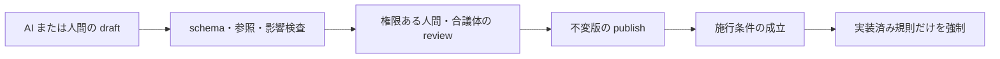

# AI 自動化と人間承認

規範性: 仕様正本。AI の委任、提案、人間承認、限定実行、障害処理の契約を定める。

AI 自動化は、目的の委任、変更提案、方針評価、人間承認、限定実行、結果確認を分離する。人間操作を模倣する経路を作ってはならない。

## Principal

- `HumanPrincipal`: 人間本人として認証した主体
- `AgentPrincipal`: AI エージェントとして認証した主体
- `ServicePrincipal`: バッチまたは内部サービス
- `ConnectorPrincipal`: 外部 API 資格情報を使う主体

`AgentPrincipal` と `ServicePrincipal` は `HumanAttestation` を生成できない。人間の目的で AI が動く場合は `requested_by` と `executed_by` を分ける。人間の access token を AI へ渡してはならない。

## 実行フロー

この順序を省略して side effect へ到達してはならない。方針が自動実行を明示的に許可した場合だけ、HumanAttestation の段階を除外できる。

## ProposedAction

承認対象は、次を持つ正規化済み `ProposedAction` とする。

- action type
- target IDs と target kind
- 正規化済み parameter
- 変更前後または diff
- expected revision と前提条件
- 副作用
- 外部接続先
- idempotency key
- policy version
- expiry
- proposal digest

表示内容と実行 payload は同じ正規表現から生成する。別々に生成してはならない。一項目でも変更した場合は新しい digest と承認を要求する。

## リスク分類

操作、対象、可逆性、影響範囲、機密度、外部効果、金額、法域、検証可能性で分類する。機能名または AI の確信度だけで分類してはならない。

- 自動実行可能: 方針が明示し、可逆で、範囲が限定され、外部の不可逆効果がない
- 人間承認必須: 権限、雇用、公開規程、金銭的約束、個人情報、外部送信、広範な一括変更
- 外部判断必須: 法律、税、給与、会計、健康、安全の最終判断
- 実行禁止: 権限自己拡張、監査停止、承認迂回、出所不明データの確定化

schema 検証、不変条件、差分、simulation、dry run を判定根拠にする。

## HumanAttestation

- HumanPrincipal として再認証し、必要な step-up 認証を行う
- OrganizationalAuthority、TechnicalPermission、案件資格を検査する
- Proposal の効果、差分、対象、外部送信、期限を表示する
- proposal digest と policy version へ attestation を結ぶ
- 自己承認、利益相反、定足数を検査する
- 承認、却下、差戻し、棄権を区別する

人間承認を、法的妥当性、税計算、外部実行成功の保証として扱ってはならない。必要な外部専門判断は別の前提条件とする。

## ExecutionAuthorization

Execution Gateway は、一回限りまたは短命の `ExecutionAuthorization` だけを受理する。次を固定する。

- Principal
- action と target
- proposal digest
- allowed field set
- expected revision
- expiry
- idempotency key
- connector と operation

実行直前に状態、権限、方針版、期限、digest を再検査する。競合時に提案を自動補正してはならない。

connector の秘密は Execution Gateway または専用 secret boundary が保持する。AI の prompt または実行環境へ渡してはならない。

## 定義と規程の変更

AI は規程、手続き、データ定義、mapping の提案を作成できる。同じ AgentPrincipal が提案、承認、公開、施行、自己権限追加を完結してはならない。

文書に規則があることを、技術的強制の証拠として扱ってはならない。強制 mapping と適合テストを持つ規則だけを自動認可に使用する。

## 障害処理

- 不確実性、schema 不一致、曖昧な外部応答は例外案件へ送る
- retry は同じ idempotency key と proposal digest を使う
- 部分成功は完了済み step と補償可能性を記録する
- AI 停止後も人間が提案、承認、実行、照合を継続できる状態を残す
- prompt transcript へ秘密または不要な機微情報を含めない

## 不変条件

- AgentPrincipal は HumanAttestation を作成できない
- AgentPrincipal は自分の mandate、権限、方針、監査を変更できない
- 承認対象と実行 payload の digest を一致させる
- 承認後の変更は再承認を必要とする
- 実行前に権限、状態、版、期限を再検査する
- requester、proposer、approver、executor、connector を別々に記録する
- 外部結果を Assertion として受領し、採用過程を残す
- Web、CLI、AI へ同じ業務 API と認可を適用する

## 現行実装差分

本フローの実装状態は [能力台帳](./capability-map.md)、API、CLI、Web、テストを正とする。独立した AgentPrincipal、HumanAttestation、ExecutionAuthorization、Execution Gateway が存在しない経路を、本仕様へ適合済みとしてはならない。
