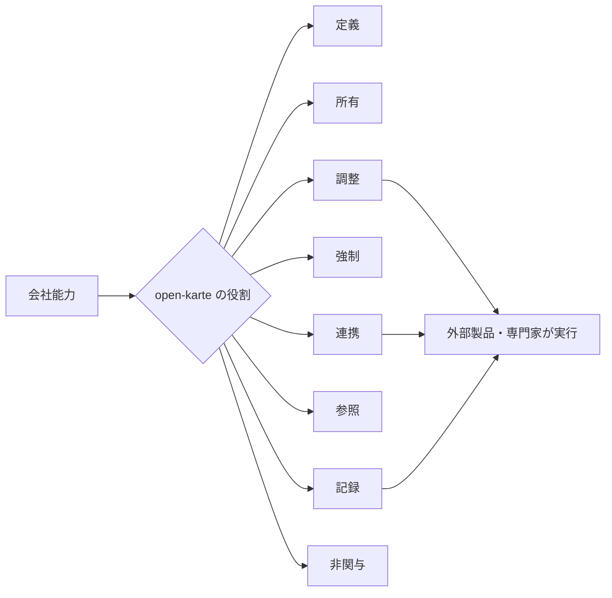

# 製品能力

open-karte は自社の一般的な業務能力を分類し、製品の責任境界を割り当てる。法律、税、会計、給与計算、決済もモデルから除外せず、実行主体を外部へ割り当てる。

公開 repository には、open-karte 開発元または利用者の自社に固有の事業、戦略、顧客、契約、取引、財務、人事を記録しない。主体と能力は製品モデル上の一般型として扱い、実在組織の事実と結び付けない。

実装状態は route、schema、画面、migration と一致させる。能力の列挙は roadmap または実装約束を意味しない。

## 分類軸

各能力は次の独立した軸を持つ。

- 会社での位置: 中核、隣接、外部必須
- 製品の役割の値: 定義、所有、調整、強制、記録、参照、連携、非関与
- 実現主体: open-karte、人間、外部製品、専門家、組合せ
- 実装状態の値: 実装済み、部分実装、台帳のみ、未実装、非対象

実装状態の「非対象」は会社モデルに存在しないという意味ではない。open-karte がその能力を実行しないという意味で使う。

製品の役割は `・` で複数値を合成できる。`非関与` は単独で使用する。実装の完成度は製品の役割へ混ぜず、実装状態だけで表す。

## 戦略と統治

### 経営戦略と全社目標

- 会社での位置: 隣接
- 製品の役割: 記録・参照
- 実現主体: 経営者と外部の戦略管理
- 実装状態: 部分実装。全社・部門・個人の目標ツリーと経営ダッシュボードは実装済み。経営戦略の策定は実行しない

### 会社統治と法定機関

- 会社での位置: 外部必須
- 製品の役割: 調整・記録
- 実現主体: 権限ある人間、合議体、外部専門家
- 実装状態: 部分実装。governance 文書、role assignment、review、publish、会議体台帳、議事録、意思決定記録はあるが、合議体の定足数と authority enforcement は未完成

## 顧客と提供

### 顧客管理、営業、契約、受注

- 会社での位置: 隣接
- 製品の役割: 非関与
- 補足: 社内手続きに必要な取引先参照は別能力として連携できる
- 実現主体: 外部製品
- 実装状態: 非対象

### 製品提供と顧客 support

- 会社での位置: 隣接
- 製品の役割: 非関与
- 実現主体: 外部製品と事業部門
- 実装状態: 非対象

## 組織

### 部署、所属、reporting relation

- 会社での位置: 中核
- 製品の役割: 所有
- 実現主体: open-karte と権限ある人間
- 実装状態: 実装済み。期間付き関係と過去 snapshot の統一は部分的

### 組織計画と要員計画

- 会社での位置: 中核
- 製品の役割: 調整・記録
- 実現主体: 人間と外部 planning 製品
- 実装状態: 部分実装。年度・部署別の人員計画の記録と実在籍比較は実装済み。外部 planning 連携は未実装

### 法人と事業所

- 会社での位置: 中核
- 製品の役割: 記録
- 実現主体: open-karte と外部 master
- 実装状態: 未実装。自社 profile と LegalEntity record はない

### Deployment と単一法人境界

- 会社での位置: 中核
- 製品の役割: 所有・強制
- 実現主体: 自社と open-karte
- 実装状態: 部分実装。self-host deployment があり、route と schema に法人 selector と tenant partition はない。自社 profile と LegalEntity record は未実装

### Job、Position、office、cost center

- 会社での位置: 中核
- 製品の役割: 所有・記録
- 実現主体: open-karte
- 実装状態: 部分実装。表示項目と role はあり、等級マスタと割当履歴は実装済み。役職マスタと選択入力は実装済み(従業員登録と人事発令が役職マスタの code を参照する)。役職の期間付き履歴は人事発令が持つ。Kind と期間関係の分離が不完全

### Project と外部関係者

- 会社での位置: 中核
- 製品の役割: 記録・調整
- 実現主体: open-karte と外部 project 製品
- 実装状態: 未実装

## 人

### 従業員台帳と directory

- 会社での位置: 中核
- 製品の役割: 所有
- 実現主体: open-karte
- 実装状態: 実装済み

### 採用と候補者

- 会社での位置: 隣接
- 製品の役割: 記録・調整
- 実現主体: open-karte、人間、外部採用製品
- 実装状態: 部分実装。募集と候補者パイプラインの記録は実装済み。外部採用製品との連携は未実装

### Onboarding

- 会社での位置: 中核
- 製品の役割: 所有・調整
- 実現主体: open-karte、人間、外部 connector
- 実装状態: 実装済み。外部 connector は未実装

### 異動、休職、退職、再入社

- 会社での位置: 中核
- 製品の役割: 所有・調整・記録
- 実現主体: open-karte と権限ある人間
- 実装状態: 部分実装。ライフサイクル event と archive はあるが、全関連能力の一貫した projection は継続課題

### 証明書と life event request

- 会社での位置: 中核
- 製品の役割: 調整・記録
- 実現主体: open-karte、人間、外部専門 system
- 実装状態: 部分実装

### 個人設定

- 会社での位置: 中核
- 製品の役割: 所有
- 実現主体: open-karte
- 実装状態: 部分実装

### 福利厚生と報酬事実

- 会社での位置: 中核
- 製品の役割: 記録・参照
- 実現主体: 外部 provider と open-karte
- 実装状態: 部分実装

## 時間

### 勤怠

- 会社での位置: 中核
- 製品の役割: 所有・記録
- 実現主体: open-karte
- 実装状態: 実装済み。法的適合判断は外部

### 休暇

- 会社での位置: 中核
- 製品の役割: 所有・調整
- 実現主体: open-karte と人間
- 実装状態: 実装済み。法定付与と適用判断は外部

### Shift

- 会社での位置: 中核
- 製品の役割: 所有・調整
- 実現主体: open-karte
- 実装状態: 実装済み

### 出張

- 会社での位置: 中核
- 製品の役割: 調整・記録
- 実現主体: open-karte、人間、外部手配製品
- 実装状態: 部分実装

### 労働時間と休暇の法的判断

- 会社での位置: 外部必須
- 製品の役割: 調整・記録
- 実現主体: 外部労務 system と専門家
- 実装状態: 非対象。入力事実、依頼、Assessment、採否、期限は体系内に持つ

### Project 工数

- 会社での位置: 隣接
- 製品の役割: 記録・連携
- 実現主体: 外部 project 製品または open-karte extension
- 実装状態: 未実装

## 資源と施設

### 備品台帳、custody、loan

- 会社での位置: 中核
- 製品の役割: 所有
- 実現主体: open-karte
- 実装状態: 実装済み

### 棚卸し

- 会社での位置: 中核
- 製品の役割: 所有・記録
- 実現主体: open-karte と人間
- 実装状態: 実装済み

### 貸与品の request と reservation

- 会社での位置: 中核
- 製品の役割: 所有・調整
- 実現主体: open-karte
- 実装状態: 部分実装。現在の rental request は資産台帳の確保と同義ではない

### 書籍貸出

- 会社での位置: 中核
- 製品の役割: 所有
- 実現主体: open-karte domain extension または外部 library 製品
- 実装状態: 未実装。BookEdition、BookCopy、Loan、HoldRequest を [ドメイン拡張規約](./domain-extension.md) で定義する

### 会議室

- 会社での位置: 中核
- 製品の役割: 所有
- 実現主体: open-karte
- 実装状態: 実装済み

### 駐車場、座席、設備予約

- 会社での位置: 中核
- 製品の役割: 所有・調整
- 実現主体: open-karte domain extension または外部 facility 製品
- 実装状態: 未実装。共通 Reservation と各資源固有 metadata を分ける

### 資産保守と software entitlement

- 会社での位置: 中核
- 製品の役割: 調整・記録
- 実現主体: 外部資産管理製品と open-karte
- 実装状態: 部分実装。ライセンス・SaaS の台帳は実装済み。資産保守は未実装

### 拠点、入退館、物理 security

- 会社での位置: 中核
- 製品の役割: 調整・記録
- 実現主体: 外部 access control 製品
- 実装状態: 未実装

## 金銭、調達、契約

### 経費

- 会社での位置: 中核
- 製品の役割: 所有・調整・記録
- 実現主体: open-karte と外部会計・支払製品
- 実装状態: 実装済み。支払、仕訳、税務は外部

### Budget

- 会社での位置: 中核
- 製品の役割: 所有・記録
- 実現主体: open-karte と外部計画製品
- 実装状態: 実装済み。会計予算の正本ではない

### 給与明細と給与改定

- 会社での位置: 外部必須
- 製品の役割: 調整・記録・参照
- 実現主体: 外部給与製品と権限ある人間
- 実装状態: 部分実装。給与改定の事実記録と閲覧は実装済み。給与明細は schema のみ。給与計算は行わない

### 年末調整

- 会社での位置: 外部必須
- 製品の役割: 調整・記録
- 実現主体: 外部税務・給与製品と専門家
- 実装状態: 台帳のみ。税額計算と適用判断は行わない

### 取引先、契約、購買

- 会社での位置: 中核
- 製品の役割: 調整・記録
- 実現主体: open-karte、人間、外部契約・購買製品
- 実装状態: 部分実装。取引先台帳と契約記録は実装済み。購買と発注は未実装

### 支払

- 会社での位置: 外部必須
- 製品の役割: 調整・記録
- 実現主体: 外部 payment provider と金融機関
- 実装状態: 未実装。提案、決定、指示、外部 Assertion、reconciliation を扱い、資金移動は行わない

### 法人 card と配賦

- 会社での位置: 中核
- 製品の役割: 調整・記録
- 実現主体: 外部 card・会計製品
- 実装状態: 未実装

### 会計、税務、給与計算

- 会社での位置: 外部必須
- 製品の役割: 調整・記録・参照
- 実現主体: 外部専門製品と専門家
- 実装状態: 非対象。input、request、external computation、acceptance、evidence は体系内に持つ

## 成長と対話

### 目標、評価 cycle、評価

- 会社での位置: 中核
- 製品の役割: 所有・調整・記録
- 実現主体: open-karte と人間
- 実装状態: 実装済み

### Skill と training

- 会社での位置: 中核
- 製品の役割: 所有・記録
- 実現主体: open-karte と外部 learning 製品
- 実装状態: 実装済み。外部 learning 連携は未実装

### Career と社内公募

- 会社での位置: 中核
- 製品の役割: 所有・調整
- 実現主体: open-karte
- 実装状態: 実装済み

### 個別面談と survey

- 会社での位置: 中核
- 製品の役割: 所有・記録
- 実現主体: open-karte
- 実装状態: 実装済み

### 感謝 point

- 会社での位置: 隣接
- 製品の役割: 所有・調整
- 実現主体: open-karte と外部 reward provider
- 実装状態: 実装済み。point は法定通貨、給与、会計残高ではない

## 知識と governance

### 社内 knowledge

- 会社での位置: 中核
- 製品の役割: 所有
- 実現主体: open-karte
- 実装状態: 実装済み

### 規程版、公開、対象、acknowledgement

- 会社での位置: 中核
- 製品の役割: 調整・記録
- 実現主体: open-karte と権限ある人間
- 実装状態: 部分実装。同期、review、publish、acknowledgement はあるが、施行状態、candidate snapshot、合議体、rule enforcement は未完成

### Procedure と Control

- 会社での位置: 中核
- 製品の役割: 定義・調整・記録
- 実現主体: open-karte、人間、AI、外部製品
- 実装状態: 部分実装。Definition の保存と表示はあり、汎用 ProcedureCase と ControlRun への実行 mapping は未完成

## Risk、法務、compliance

### 外部 check request

- 会社での位置: 中核
- 製品の役割: 調整・記録
- 実現主体: 外部 check provider と権限ある人間
- 実装状態: 部分実装。専用 request はあるが、最終判断と一般 connector は未完成

### 法令知識と法的判断

- 会社での位置: 外部必須
- 製品の役割: 参照・調整・記録
- 実現主体: 公式 source と外部専門家
- 実装状態: 非対象。法的結論を自動生成しない

### Data retention、開示、削除

- 会社での位置: 中核
- 製品の役割: 調整・記録・強制
- 実現主体: open-karte、人間、外部専門家
- 実装状態: 未実装

### 労働安全衛生

- 会社での位置: 外部必須
- 製品の役割: 調整・記録
- 実現主体: 外部専門家と専門製品
- 実装状態: 部分実装。健康診断・ストレスチェックの実施記録と労災・事故の記録は実装済み。医学的判断と法的判断は外部

### Risk register、ControlRun、内部 audit

- 会社での位置: 中核
- 製品の役割: 所有・調整・記録
- 実現主体: open-karte と人間
- 実装状態: 未実装。governance metadata の control 宣言は実行記録ではない

### Security と privacy incident

- 会社での位置: 中核
- 製品の役割: 調整・記録
- 実現主体: open-karte、人間、外部専門家
- 実装状態: 部分実装。IT インシデントの発生と解消の記録は実装済み。procedure definition からの実行 case は未実装

### Privacy management

- 会社での位置: 中核
- 製品の役割: 調整・記録・強制
- 実現主体: open-karte、人間、外部専門家
- 実装状態: 部分実装。field-level purpose、retention、data subject request、processing inventory は未完成

## IAM と authority

### Password、session、account

- 会社での位置: 中核
- 製品の役割: 所有
- 実現主体: open-karte
- 実装状態: 実装済み

### Principal kind と外部認証

- 会社での位置: 中核
- 製品の役割: 所有・連携
- 実現主体: open-karte と外部 identity provider
- 実装状態: 部分実装。Human、Agent、Service、Connector の独立 Principal は未実装

### System role と TechnicalPermission

- 会社での位置: 中核
- 製品の役割: 所有
- 実現主体: open-karte
- 実装状態: 部分実装

### Scope、field policy、case assignment

- 会社での位置: 中核
- 製品の役割: 所有・強制
- 実現主体: open-karte
- 実装状態: 部分実装。route ごとの実装を共通 policy へ統合する余地がある

### TaskProxy と職務分離

- 会社での位置: 中核
- 製品の役割: 所有・強制
- 実現主体: open-karte
- 実装状態: 部分実装

### OrganizationalAuthority と HumanAttestation

- 会社での位置: 中核
- 製品の役割: 調整・記録・強制
- 実現主体: open-karte と権限ある人間・合議体
- 実装状態: 未実装。governance role と workflow approval は、ResponsibilityAssignment、判断時 snapshot、継続責任主体を含む概念の一部だけを表す

### Break-glass access

- 会社での位置: 中核
- 製品の役割: 所有・強制・記録
- 実現主体: open-karte と独立承認者
- 実装状態: 未実装

## Workflow と記録

### 汎用 application workflow

- 会社での位置: 中核
- 製品の役割: 所有・調整
- 実現主体: open-karte
- 実装状態: 実装済み

### 専用 request と approval

- 会社での位置: 中核
- 製品の役割: 所有・調整
- 実現主体: open-karte
- 実装状態: 部分実装。domain ごとに汎用 workflow との接続差がある

### Case、Task、Decision、quorum

- 会社での位置: 中核
- 製品の役割: 所有
- 実現主体: open-karte
- 実装状態: 部分実装。workflow instance はあるが、全 domain 共通の case と CollectiveDecision は未完成

### Proposal、HumanAttestation、ExecutionAuthorization

- 会社での位置: 中核
- 製品の役割: 所有・強制
- 実現主体: open-karte
- 実装状態: 未実装

### Business event、audit、provenance

- 会社での位置: 中核
- 製品の役割: 所有・記録
- 実現主体: open-karte
- 実装状態: 部分実装。追記監査はあるが、actor chain と全 domain coverage は継続課題

### Evidence、attachment、signature、retention

- 会社での位置: 中核
- 製品の役割: 調整・記録
- 実現主体: open-karte と外部 document・signature 製品
- 実装状態: 部分実装。evidence metadata はあるが、共通 attachment、電子署名、retention 実行は未完成

## 外部連携と運用

### API、Web、CLI

- 会社での位置: 中核
- 製品の役割: 所有
- 実現主体: open-karte
- 実装状態: 部分実装。全 operation が三提供面で同等ではない

### AI Agent client

- 会社での位置: 中核
- 製品の役割: 所有・強制
- 実現主体: open-karte と外部 AI runtime
- 実装状態: 未実装。CLI 利用は可能だが AgentPrincipal、mandate、attestation chain はない

### Notification

- 会社での位置: 中核
- 製品の役割: 所有
- 実現主体: open-karte と外部 notification provider
- 実装状態: 部分実装。内部通知はあるが、全 domain と外部 provider の統一 contract はない

### 外部承認チャネル

- 会社での位置: 中核
- 製品の役割: 連携・強制
- 実現主体: open-karte と外部 messaging provider
- 実装状態: 未実装。外部 identity mapping、単回 state token、step-up、HumanAttestation callback contract はない

### Metric projection と dashboard

- 会社での位置: 中核
- 製品の役割: 所有・参照
- 実現主体: open-karte
- 実装状態: 部分実装。dashboard はあるが、MetricDefinition、MetricObservation、as-of、provenance、集計と drill-down の共通認可は未実装

### Batch、health、job operation

- 会社での位置: 中核
- 製品の役割: 所有
- 実現主体: open-karte
- 実装状態: 部分実装

### Search、import、export

- 会社での位置: 中核
- 製品の役割: 所有・連携
- 実現主体: open-karte
- 実装状態: 未実装。domain ごとの検索はあるが横断 contract はない

### Connector、outbox、inbox、reconciliation

- 会社での位置: 中核
- 製品の役割: 所有
- 実現主体: open-karte と外部 adapter
- 実装状態: 未実装。外部参照項目が存在しても、横断 connector、outbox、inbox、reconciliation contract はない

### Self-host platform

- 会社での位置: 中核
- 製品の役割: 所有
- 実現主体: 自社と open-karte
- 実装状態: 実装済み

## 網羅性の点検

新しい能力が見つかったら、機能名を増やす前に次を確認する。

- 会社に必要な能力か、製品が実行する能力か
- 定義、所有、調整、強制、記録、参照、連携、非関与のどれか
- 内部、人間、外部製品、専門家の誰が実現するか
- source of truth はどこか
- [会社メタモデル](./company-model.md) の既存概念で表せるか
- [ドメイン拡張規約](./domain-extension.md) に従う固有 extension が必要か
- 法律、税、支払など外部実現でも、依頼、Decision、Assertion、evidence が体系に残るか
- AI が提案できる範囲、人間承認、実行境界、監査を説明できるか
