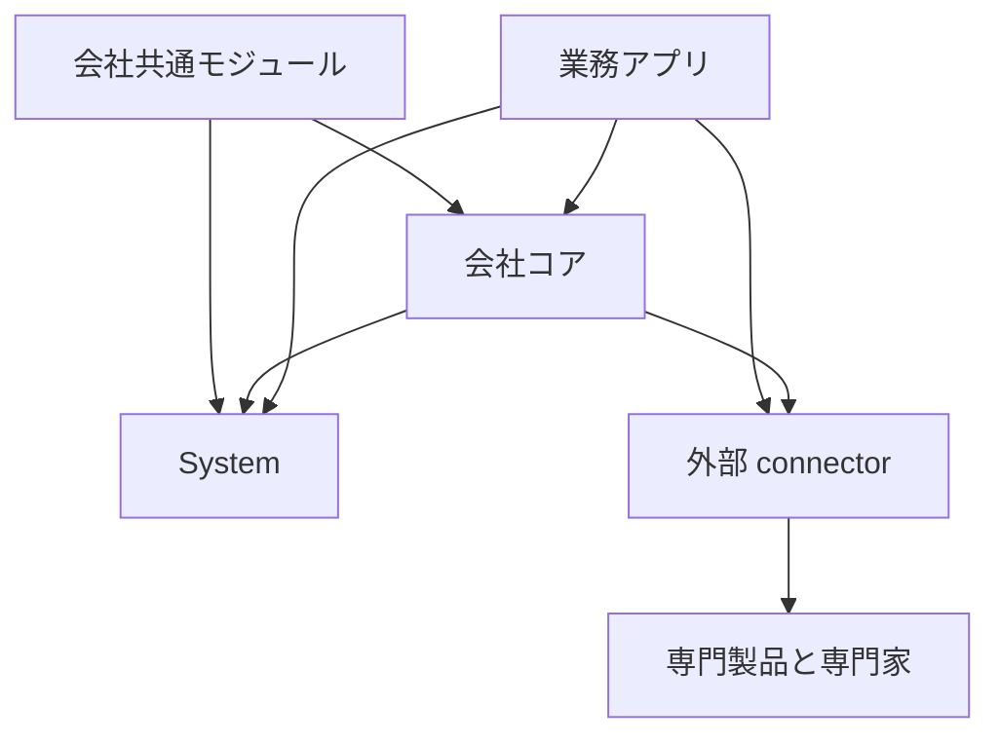
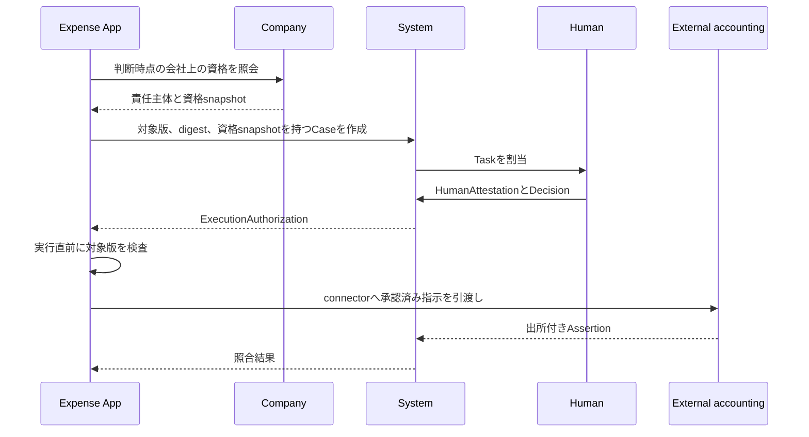

# 会社の解体図

製品内を[System、会社コア、会社共通モジュール、業務アプリ](company-foundation.md)に分ける。会社運営に必要であることと、この製品が内部実装することを同一視しない。

依存は業務コンテキストから Company、Company から System への一方向とする。業務コンテキストは System を直接利用してよい。System は Company と業務コンテキストを知らず、業務コンテキスト同士は直接依存しない。

## System

System は業務内容と会社組織から独立した、停止不能な実行基盤である。

[作業の依頼・成果確認・責任の引き継ぎ](system-work-items.md)は、担当者の受領、成果の版、人の再認証付き確認、受領を伴う責任の移管を保持する。作業の完了と、Appの実行許可・外部処理の成功は別の記録になる。

### 主体と認証

- HumanPrincipal、AgentPrincipal、ServicePrincipal、ConnectorPrincipal
- Account、Identity、identity binding、外部 IdP
- password、session、access token、refresh token、失効、rotation
- machine credential、step-up authentication、credential recovery

現行実装には Human、Agent、Service、Connector の Principal、Account、Identity、password、外部 identity、session、token rotation、machine credential、password または外部 identity による短期 step-up がある。machine credential は raw secret を返却時以外に保持しない。機械access tokenは発行元credentialを署名したclaimに保持し、API認証でAccountの状態・token版、Principalへの所属、credentialの失効・期限、Connectorの停止を再検査する。一つのcredentialを失効しても、同じAccountの別credentialは利用を継続できる。

発行元credentialを持たない従来の機械tokenは拒否し、machine sessionから再発行する。機械credentialはweb・mobile sessionには使用できない。Principal導入前の人のAccountは既存sessionを継続できるが、判断候補・証言と実行時に再検査する承認者には登録済みのHumanPrincipalが必要になる。Principalの欠落を人と推定しない。[外部identity同期](external-identity-imports.md)は機械主体とprovider scopeを検査し、新規登録と氏名・email変更を公開Company正本へ原子的に反映する。確認済みの既存人物・雇用履歴を接続する[移行API](company-api.md#既存従業員の公開履歴への接続)を備える。履歴不足の解消と複数providerへの対応は未完成である。

### 技術的認可

- permission、role、role binding
- resource scope、field policy、purpose、時間制約
- 職務分離、緊急アクセス、代理操作の制限
- request 時と実行直前の再評価

現行実装には permission、role、role binding、global と resource scope の認可、field、purpose、有効期間、会社上の authority evidence、職務分離条件を同じ fail-closed policy で評価する経路がある。connector と外部交換 route は resource scope を強制し、IAM、Principal、connector、dead letter の高リスク変更は step-up を要求する。永続的な field policy 配布と BreakGlassAccessGrant の発行・事後 review は未実装である。

### 案件と判断

- ProcedureDefinition と版
- Case、Task、Assignment、期限、escalation
- Proposal と変更不能な payload digest
- Decision、HumanAttestation、quorum
- approval、rejection、差戻し、取消、再申請
- Delegation、代理元、代理先、対象範囲、有効期間
- ExecutionAuthorization、失効、実行直前の再検査

専用業務の内容は各 App が所有する。System は対象コンテキスト、resource kind、resource ID、resource version、proposal digest を保存し、任意 JSON を業務上の正本にしない。特定業務の正本を必要としない汎用手続きだけは、版付きの正規化済み Proposal body として System が所有する。

System には版付き ProcedureDefinition と Proposal、Case、DecisionTask、候補と除外の資格 snapshot、HumanAttestation、Delegation、ExecutionAuthorization がある。公開、提出、編集、判断、取消、再割当、委任、参照の application service と repository、および参加定足数、成立賛成数、否決条件、代理可否、差戻し可否、自己判断禁止、append-only 証跡、一回実行を強制する永続化制約がある。application request の HTTP 契約はこの System workflow を直接使用し、旧 request model は削除済みである。

### 記録と証拠

- audit event、actor chain、request correlation
- evidence、attachment metadata、content digest、source
- valid time、recorded time、policy time
- revision、supersession、correction、retention、legal hold、開示制御
- 外部 Assertion と社内での acceptance、dispute

現行実装には追記監査、安定 JSON、request correlation、actor、対象、変更前後を保持する監査 event がある。Principal、machine credential、connector、外部交換、照合、dead letter 再投入の重要変更は状態更新と同じ D1 batch で監査される。System添付には[期限付き保持と削除停止](system-attachment-preservation.md)があり、設定・解除を監査し、掃除処理とDBの直接変更でも保全を強制する。System監査の[開示設定](system-audit-disclosure.md)は全体と閲覧者ごとの項目・対象種別・目的・期限を版付きで保存し、一覧・詳細・件数と最終監査へ適用する。監査台帳自体の保持設定、添付内容の開示制御、バックアップを含む失効の運用機構は未実装である。

Systemの添付証拠の準備処理は、所有Account、状態、作成時刻、内容digest、名前、型、容量を検査し、業務保存と同じtransactionで再照合する。証拠として渡すのは公開metadataだけであり、暗号鍵や保存先を含めない。添付の紐付けと業務保存は一緒に確定し、後続の失敗では両方を巻き戻す。保全中でも業務への紐付けを許可するが、内容の差し替えは許可しない。

本人による[未紐付け添付の開示](system-attachment-disclosure.md)では、取得中の状態変更と認証失効を閲覧監査と同じtransactionで再検査する。監査の保存や照合に失敗した場合は内容を返さない。閲覧記録を人間による成果確認や承認として扱わない。

未紐付け添付の掃除は、作成から24時間を超えた予約・未紐付け行を対象とする。本体の削除前にDBで状態を再検査し、鍵を破棄して紐付けを禁止する。先に業務への紐付けが確定した場合は本体を残し、先に削除が始まった場合は準備済みの証拠を含む業務保存を拒否する。本体またはDB行の削除に失敗した場合は消去済み行を残し、次回の掃除で再試行する。重複実行時は実際に行を回収した処理だけが回収数へ加算する。

### 非同期実行と通知

- scheduler、batch、job、lease、heartbeat
- idempotency key、outbox、inbox、retry、dead letter
- notification message、delivery、既読
- timeout、重複、順序逆転、部分失敗の回復

現行実装には batch、通知、冪等な Job 登録、lease、heartbeat、成功、retry、dead letter、step-up 付き再投入、outbox、重複排除する inbox がある。lease token と lease Account の両方を検査し、別主体による完了、期限外完了、二重再投入を拒否する。

登録処理に束縛したJobは、Serviceの現在の権限を検査する実行adapterが業務変更・完了・監査を同じtransactionへ保存する。失敗は待機時間を置いて再試行し、上限到達時はdead letterへ残す。汎用HTTP APIからのclaim・完了・再投入を拒否し、再投入でも登録処理と操作を保持する。[入退社の自動配送](onboarding-automation.md)には、定期起動の入口、人事発令からのチェックリスト生成、受領結果、状態確認と再投入APIがある。配備先の定期実行設定、他のAppへの配送、生成後の訂正に伴うタスクの取消・置換は、この接続だけでは完了しない。

### 外部接続

- connector identity、接続設定、secret reference
- command handoff、webhook、callback、import、export
- external assertion、acceptance、reconciliation、exception case
- API version、schema version、rate limit、circuit breaking

現行実装には版付き connector、ConnectorPrincipal、方向と operation と idempotency key を固定した交換、外部 Assertion、reconciliation run と item、共通 outbox と inbox がある。connector と交換の変更、Assertion と照合結果は監査され、connector の停止、重複、retry、異なる connector の Assertion 混入を拒否する。transport 固有の署名検証、rate limit、circuit breaker、mapping 実装は connector adapter の責任として残る。

### 運用

- configuration、feature activation、health、readiness
- migration safety、seed verification、backup と restore の検証点
- observability、監査 export、障害診断
- API、Web、CLI、AI、callback の同一 application rule

現行実装には health、feature gate、migration、seed 検査、API、Web、CLI がある。すべての operation が同じ入口で提供されているわけではない。

## Company

Company は一つの deployment で運営する会社の同一性、人、組織、責任、権限の正本である。

### 会社と法人

- LegalEntity、会社 profile、法域
- locale、timezone、基準日、通貨、会計年度
- 事業所、勤務場所、法人、拠点、組織単位の区別
- 外部 master との識別子対応と source

現行実装には LegalEntity、CompanyProfile、Site、Workplace があり、法域、locale、timezone、通貨、会計年度開始月と外部識別子を版付き Company resource として保持する。CompanyProfile を未設定の組織は profile 読取を存在しない状態へ閉じる。 法人・拠点・勤務場所と勤務場所が参照する組織の全有効期間をDBでも検査する。関連する記録の短縮・延長・取消は、同じ組織変更commandで確定できる。参照先の空白や期間外を残す変更は全体を拒否し、過去の記録を保全する。

### 人と雇用

- Person、Employee、Employment
- employee code と不変 ID の分離
- 雇用開始、在籍状態、休職、復職、終了、再雇用
- valid time と recorded time を持つ履歴、訂正、重複禁止

現行実装には従業員台帳、在籍期間、状態期間、ライフサイクル revision がある。人事発令による判断と組織変更は期間モデルを正本にし、旧 employee 現在値は既存 wire の表示 projection として同じ transaction で更新する。版付きresource APIと業務台帳の接続は未完成であり、[Company APIの保存先と参照整合性](company-api.md#storage-と移行)に制約を記載する。

### 組織

- OrgUnit、Department、OrgUnit kind
- Membership、ReportingRelation
- 組織の有効期間、改組、統合、廃止
- 過去時点の組織 snapshot

現行実装には opaque OrgUnit identity、名称・kind・親子関係の period version、期間付き Assignment、organization revision、atomic change operation がある。単一 root、code 重複、親期間、循環、主務重複、上司在籍、部分適用を Domain と DB の両方で拒否する。旧部署表と membership は既存 wire の互換 projection に限定し、検証済み lifecycle の判断正本には使わない。既定organizationの接続済みOrgUnitでは、公開APIと既存APIが期間IDと全訂正履歴を共有する。既存組織は管理者が親から順に履歴を確認して接続する。片側だけの保存はDBでも拒否する。

公開Assignmentの変更は所属期間へ原子的に反映し、公開ReportingRelationは業務の管理範囲と判断候補へ接続する。[公開所属と期間台帳](company-organizational-authority.md#公開所属と期間台帳)に接続の制約を記載する。接続済み所属の役職変更・異動・終了・訂正・退職は、人事発令から公開履歴と期間対応を一括更新する。会社初期化時の所属と、公開Employee・接続済みOrgUnitへの新規配属も公開履歴を作る。上長付きの配属・上長変更は対応するReportingRelationを記録し、独立した複数上長と将来予約を保全する。既存所属と上長の履歴は確認済みの移行で接続できる。上長本人の退職では部下側の関係を終了し、後任は明示して再割当する。公開OfficeAssignmentとOrganizationalAuthorityの雇用・所属終了との連動は[退職と組織責務](company-api.md#退職と組織責務)に従う。既存責務は全改訂・定義・scopeを確認して公開履歴へ接続できる。独立した公開割当との統合と既存編集画面の版照合は未完成である。

`/company` は LegalEntity、CompanyProfile、Site、Workplace、Person、Employee、Employment、OrgUnit、Assignment、ReportingRelation、Job、Position、Grade、OrganizationalOffice、OfficeAssignment、Responsibility、AuthorityScope、ResponsibilityAssignment、CollectiveBody、CollectiveBodyMembership、OrganizationalAuthority、AccountEmployeeLink を同じ resource、revision、半開期間、command 契約で公開する。read は D1 atomic batch で一つの organization revision へ固定し、write は expected revision、resource revision、SHA-256 fingerprint 付き idempotency receipt、append-only 履歴を強制する。契約と失敗条件は [Company API](./company-api.md) に定める。

公開上長関係の本人・上司・組織は、[終了済みの関係を含む全参照期間](company-api.md#上長関係の参照期間)を会社版の確定時にも検査する。組織の訂正で過去の関係を期間外へ残す変更は全体を拒否する。確認した関係の訂正と組織変更は同じcommandで保存できる。

### 職務と責任

- Job、Position、Grade、OrganizationalOffice
- OfficeAssignment、ResponsibilityAssignment
- OrganizationalAuthority、対象範囲、金額以外の条件、期限
- CollectiveBody、構成員、定足数、決議方式
- 委任可能性と継続責任主体

現行実装には Job、Position、Grade、OrganizationalOffice、OfficeAssignment、汎用 Responsibility、AuthorityScope、ResponsibilityAssignment、CollectiveBody と期間付き構成員がある。版付きresourceを参照するCompany resolverは、在籍、System Account、対象本人の除外、scope、合議規則を同一revisionと時点で評価する。汎用申請、人事変更申請、稟議、経費では、Companyの公開責務・役職・合議体をSystem DecisionTaskへ接続している。休暇などの独自承認経路には接続が残り、技術的権限と会社上の判断資格の合成を全業務では保証していない。

職務・役職・責務・合議体・決裁資格の定義と任用は、[過去から将来までの参照期間](company-organizational-authority.md#公開責務と期間台帳)をDBでも検査する。定義の短縮や将来取消によって、期間外の任用を残す変更は確定しない。

稟議のHTTP・Web・CLIは共通の提出・判断・実行Applicationを使用する。規程設定には`ringi:procedure:manage`、提出と本人の取消には`ringi:submit`、判断と決裁確定には`ringi:approve`を要求し、判断者には現在の会社資格も要求する。既存roleへの自動付与はしない。規程がない場合は提出を拒否する。規程の候補から起案時の提出先を選んでも、合議の必要人数は減らない。

稟議は表示した提案版・digest・Task key・roundに判断を記録し、複数段階、差戻し、否認、取消、承認後の確定待ちを区別する。判断・業務状態・監査・判断通知を同じtransactionへ保存する。決裁確定では、人事と共通のCompany資格再検査とSystemの実行許可を使い、稟議の更新・実行監査・結果通知を同時に保存する。確定に失敗した場合は確定待ちを表示し、受信箱から同じ対象を再試行できる。汎用案件APIから稟議の参照・変更・修復を迂回できない。

未接続の旧稟議は本人が内容を確認して現在の規程へ提出する。番号、起案日、内容を保全し、元の提出先が現在の会社候補に含まれない場合は接続を拒否する。過去の承認を新しい判断として引き継がない。差戻し後は旧稟議を保持し、新しい番号と再送キーで修正版を提出する。同じ差戻し元から複数の修正版を作らない。

### System との対応

- AccountEmployeeLink
- Principal を Person、Employee、Office と同一視しない対応
- System の Case に対する会社上の判断資格の解決
- 判断時点の Employment、Membership、ResponsibilityAssignment の snapshot

現行実装にはAccountとEmployeeの対応、期間履歴による在籍・組織資格の参照、版付きresourceによる資格解決がある。Accountに対応する従業員表示と在籍判定は、Companyの従業員一覧と同じ期間snapshotを使う。版付きresourceの資格証拠は汎用申請と人事変更申請のSystem Taskへ接続済みだが、既存workflow全体がそれを利用する状態には達していない。Accountの一対一の同一性を保持し、有効期間は公開履歴へ接続している。終了・取消・期間の空白を従来の対応表で補わず、確認済みの既存対応は同じ公開履歴へ接続する。

### 雇用事実と人事発令

- 入社、異動、昇降格、役職変更、休職、復職、退職、再入社
- 発令日、発効日、記録日、理由、根拠
- 訂正、取消、競合検出、projection rebuild

現行実装には personnel action と lifecycle revision がある。公開一覧は確定した発令の履歴を読み、対象・発効日・記録者・訂正関係を返す。種別だけを保存する旧台帳は読取専用とし、発令履歴へ混ぜない。検索・ページング・権限の契約は[人事発令の公開履歴](company-api.md#人事発令の公開履歴)に従う。所属と責務を変える発令は共通 `OrganizationChangeSet` validator を通り、発令、organization operation、period version、current projection、監査を一つの batch で確定する。訂正は同じ period の連続 revision として検証し、expected Employee revision と expected organization revision のどちらが stale でも全体を拒否する。onboarding task、退職申請、証明書依頼などの手続きは Company の事実ではなく App と System workflow へ分離する。

## 会社共通モジュール

会社共通モジュールは、コード上では削除可能なAppとして業務目的と業務上の不変条件を所有する。すべて `api/src/contexts/` 直下へ独立して置き、削除または無効化できる。

### 社内情報

- `announcement`: 掲示、公開期間、対象
- `knowledge`: 社内 knowledge article
- `meeting`: 会議と議事録
- `regulation`: 規程、版、施行、確認
- `governance-document`: 統制文書、review、公開

### 汎用手続き

template に基づく汎用手続きは App ではなく System の ProcedureDefinition、Proposal、Case として提供する。Employee、経費、休暇、契約など固有の正本または実行規則が必要になった時点で、専用 App または Company がその業務事実を所有し、opaque な subject と digest で System へ接続する。独立した `request` コンテキストは作らない。

### 採用と人事手続き

- `recruitment`: 募集、候補者、選考記録
- `onboarding`: 入社準備 template、assignment、task
- `offboarding`: 退職申請と退職準備。雇用終了の事実は Company が所有する
- `certificate-request`: 証明書の発行依頼と引渡し
- `life-event`: 従業員の届出と確認
- `work-style`: 勤務形態の申請と記録
- `headcount-plan`: 組織別の要員計画

### 時間

- `attendance`: 打刻と勤務実績
- `leave`: 休暇申請と残数記録
- `family-care-leave`: 育児・介護休業の申請記録
- `shift`: pattern、assignment、交代依頼
- `company-calendar`: 稼働日と休日
- `business-trip`: 出張申請と実績

法定付与、残業適法性、労務判断は外部専門製品と専門家が担う。

休暇の承認・却下は、現在のHuman、失効していないAccountとトークン、`leave:approve`、本人の従業員対応、在籍中の上長または部門責任者という会社資格を要求する。`org:manage`で判断資格を補わない。処理開始後に変わった申請内容・権限・会社履歴は保存時にも検査し、判断・残数消費・資格証拠を含む監査を同じtransactionで確定する。監査を保存できなければ判断も残数消費も取り消す。通知の失敗は確定した判断を取り消さない。詳細と承認待ち一覧は申請ID・内容digestを`decision_target`として返し、承認・却下では同じ値を必須とする。確認後に変わった内容は409で拒否し、再確認を要求する。Webは確認画面を開いた時点の内容を保持し、CLIは確認済みの対象を明示指定する。どちらも送信時に最新の対象へ自動で差し替えない。

休暇のSystem DecisionTaskへの接続、段階承認・差戻し・委任、通知の永続的な再送は未完成である。

### 社内の金銭手続き

- `expense`: 経費申請、社内承認、外部引渡し
- `budget`: 部署別の社内予算枠
- `ringi`: 支出や契約に先立つ社内決裁依頼
- `compensation-change`: 給与改定の社内提案と発令事実

仕訳、税額、給与、支払、銀行残高を正本にしない。

経費の提出HTTPは、`expense:submit`を持つHumanと現在の在籍・本人対応・主務を確認し、経費と本人所有の添付を一括保存する。添付が存在しない場合や保存の途中で失敗した場合は、経費だけを残さない。新権限は既存roleへ自動付与しない。

経費をCompany資格とSystem案件へ接続する提出・判断・取消・決裁確定のApplicationとDB制約を実装している。金額・費目・負担組織・使用日・備考・添付証拠を提案digestへ固定し、表示した判断対象、複数名の判断、資格失効、再送、一回実行を検査する。既存経費の接続では番号・日付・内容・添付を保全し、過去の承認を新しい判断として作らない。差戻し後は旧経費を保持し、新しい番号で修正版を作る。

経費のHTTP・Web・CLIは、専用の規程設定、提出、表示した提案への判断、取消、差戻し後の再提出、確定の再試行へ接続した。旧経路の直接更新・削除は受け付けない。受信箱と件数は現在の判断資格で絞り、候補が続く場合は続きがあると表示する。申請者の異動後も提出済み経費の負担組織を保持し、判断保存前の会社変更を拒否する。

添付はSystemへアップロードし、返されたIDを提出の再送でも使う。領収書の取得は[業務に紐付いた添付の開示](system-attachment-disclosure.md#業務に紐付いた添付)に従い、現在のSystem権限・Company資格・案件と証拠を閲覧監査の保存前後に同じtransactionで再検査する。社内の決裁確定は支払済みを意味せず、外部への引渡しと結果の受領・照合、保持・hold・追加の開示設定は未完成である。経費機能全体を完成済みとは扱わない。

### 資源と施設

- `asset`: 備品台帳、custody、貸出、返却、廃棄
- `stocktake`: 棚卸しと差異記録
- `room`: 会議室と排他予約
- `rental`: 貸与依頼と返却
- `software-license`: [サービスの契約・プラン・利用者割当と解除履歴](service-usage.md)

### 対外管理

- `partner`: 取引先の社内参照台帳
- `contract`: 契約記録、期限、更新判断
- `antisocial-check`: 外部 check の依頼、結果主張、社内採否

顧客管理、営業、受注、法的契約解釈、本人確認の最終判断を実行しない。

### 安全と規律

- `health-checkup`: 実施記録と期限
- `work-accident`: 労災と事故の記録
- `disciplinary-action`: 懲戒手続きと発令記録
- `commendation`: 表彰記録
- `it-incident`: security と IT incident の案件

医学的判断、法的判断、労務適否の最終判断を実行しない。

### 成長と対話

- `goal`: 全社、部門、個人の目標
- `performance-review`: 評価 cycle、form、判断記録
- `skill`: skill definition と保有記録
- `certification`: 資格定義と保有記録
- `training`: course と受講記録
- `career`: 社内公募、応募、career sheet
- `one-on-one`: 面談記録
- `survey`: 調査と回答
- `thanks`: 感謝 message、point、reward

### 合成表示

dashboard、inbox、directory、search は複数コンテキストの read model または UI composition とする。独自の業務事実、状態遷移、正本 table を持たない。複数 context を一つの HTTP response へ束ねる route は `api/src/api/routes` に置く。

### 現行実装

汎用手続きと approval delegation は `api/src/contexts/system` にあり、Company の資格 resolver と最上位の `api/src/api/routes` が既存 HTTP 契約へ合成する。Company の人事変更申請は Company が業務 subject と発令事実を所有し、System の Proposal、Case、Task、ExecutionAuthorization と原子的に接続する。`api/src/contexts/request` は存在せず、境界検査が再導入を拒否する。

上記の業務実装はCompanyから独立したbounded contextへ分離済みである。単一所有のdomain、application、infrastructure、schema、seed、routeは所有contextへ置き、複数contextを読むread modelとSystem・Companyの接続routeだけをAPI compositionへ置く。部署予算と経費、棚卸しと資産、評価接続目標と評価は、それぞれ同じ不変条件を共有するため一つのbounded contextが所有する。

`api/context-ownership.json` がCompanyの許可領域、旧areaからbounded contextへの写像、route所有者、API composition routeを固定する。境界検査はSystemから下位への依存、Companyから業務への依存、業務同士の依存、Companyへの非コア領域の再流入、route所有者のずれを拒否する。

App として分離する際は、既存コードがあることだけで完成扱いにしない。認可、失敗、競合、訂正、監査、無効化、削除可能性、route test を検査し、不足を同じ Task で完成させるか route registry から外す。

## 外部連携

次は会社運営に必要でも、この製品内に実装しない。専門製品または専門家を正本とし、API connector で接続する。

### 会計と税務

- 総勘定元帳、勘定科目、仕訳
- 月次・年次決算、財務諸表
- 消費税、法人税、地方税などの税額計算
- 税務申告、電子申告、法定帳票の確定

### 給与と社会保険

- 給与、賞与、控除、手取りの計算
- 源泉徴収、住民税、年末調整の計算
- 社会保険料、労働保険料の計算と届出判断
- 給与振込と給与明細の法的確定

### 資金移動

- 送金、決済、清算、返金
- 銀行口座と残高の正本
- 法人カード取引の実行と確定
- 資金繰り、与信枠、決済ネットワーク

### 法務と専門判断

- 法令適合性、契約解釈、届出義務の最終判断
- 電子署名の法的効力判定と認証局
- 本人確認、信用、制裁、反社会的勢力の最終判断
- 医学的診断、産業保健、労務適否の最終判断

### 事業固有システム

- 販売、CRM、marketing、受注
- 顧客向け製品提供と customer support
- 商品在庫、倉庫、調達、製造、品質、物流
- 業種固有の production system

外部連携では、入力、社内依頼、Decision、ExecutionAuthorization、外部への指示、外部 Assertion、採否、照合、例外、証拠を分離して記録する。内部承認を外部成功として表示してはならない。

## 承認の責任分担

経費申請を例に責任を分ける。

System は経費の意味、Employee、Department を知らない。Company は経費 record と workflow state を持たない。Expense App は認証、承認状態、会社組織の正本を複製しない。System から Company を呼ばず、App または API composition が Company の資格 snapshot を取得して System の型へ渡す。

## 完成の判定

能力は次をすべて確認できるまで実装済みとしない。

- 対象、主体、関係、状態、出来事、版、有効期間、source of truth が定義されている
- 不正状態を domain rule または database constraint で拒否する
- technical permission と会社上の authority を必要な時点で検査し、評価不能を拒否する
- 取消、訂正、競合、timeout、重複、順序逆転、部分失敗、再試行の結果が定義されている
- 重要な変更を actor、理由、対象版、証拠とともに再構成できる
- Web、CLI、AI、callback が同じ application rule を通る
- unit、application、repository、route、認可、失敗、再試行の test がある
- App の無効化を API が強制し、削除が他の App の変更を要求しない
- 外部連携が送信、受理、外部成功、社内採用、照合を分ける

未完成の能力は未完成と表示し、重要な業務判断の正本にせず、新しい依存元を増やさない。
