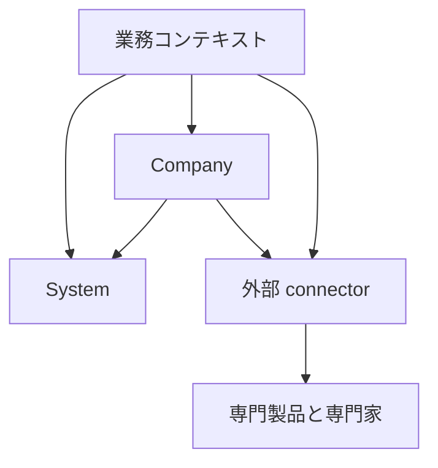
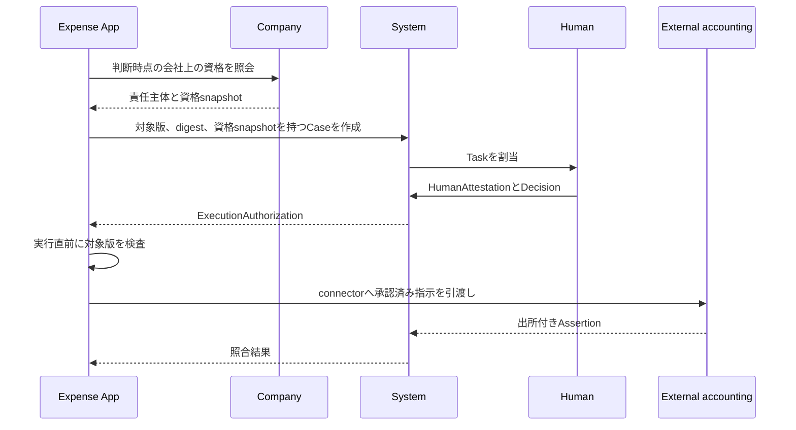

# 会社の解体図

会社に必要なシステム全体を System、Company、Apps、外部連携に分ける。会社運営に必要であることと、この製品が内部実装することを同一視しない。

依存は業務コンテキストから Company、Company から System への一方向とする。業務コンテキストは System を直接利用してよい。System は Company と業務コンテキストを知らず、業務コンテキスト同士は直接依存しない。

## System

System は業務内容と会社組織から独立した、停止不能な実行基盤である。

### 主体と認証

- HumanPrincipal、AgentPrincipal、ServicePrincipal、ConnectorPrincipal
- Account、Identity、identity binding、外部 IdP
- password、session、access token、refresh token、失効、rotation
- machine credential、step-up authentication、credential recovery

現行実装には Account、Identity、password、外部 identity、session、token rotation がある。Principal kind、Agent、Service、Connector の独立した認証と step-up は未完成である。

### 技術的認可

- permission、role、role binding
- resource scope、field policy、purpose、時間制約
- 職務分離、緊急アクセス、代理操作の制限
- request 時と実行直前の再評価

現行実装には permission、role、account role と route ごとの認可がある。field policy、共通 scope policy、職務分離、緊急アクセスの一貫した強制は未完成である。

### 案件と判断

- ProcedureDefinition と版
- Case、Task、Assignment、期限、escalation
- Proposal と変更不能な payload digest
- Decision、HumanAttestation、quorum
- approval、rejection、差戻し、取消、再申請
- Delegation、代理元、代理先、対象範囲、有効期間
- ExecutionAuthorization、失効、実行直前の再検査

専用業務の内容は各 App が所有する。System は対象コンテキスト、resource kind、resource ID、resource version、proposal digest を保存し、任意 JSON を業務上の正本にしない。特定業務の正本を必要としない汎用手続きだけは、版付きの正規化済み Proposal body として System が所有する。

System には版付き ProcedureDefinition と Proposal、Case、DecisionTask、候補と除外の資格 snapshot、HumanAttestation、Delegation、ExecutionAuthorization がある。公開、提出、編集、判断、取消、再割当、委任、参照の application service と repository、および quorum、自己判断禁止、append-only 証跡、一回実行を強制する永続化制約がある。application request の HTTP 契約はこの System workflow を直接使用し、旧 request model は削除済みである。

### 記録と証拠

- audit event、actor chain、request correlation
- evidence、attachment metadata、content digest、source
- valid time、recorded time、policy time
- revision、supersession、correction、retention、legal hold、開示制御
- 外部 Assertion と社内での acceptance、dispute

現行実装には追記監査と安定 JSON がある。全 operation の監査、証拠、保持、開示、actor chain、訂正経路は未完成である。

### 非同期実行と通知

- scheduler、batch、job、lease、heartbeat
- idempotency key、outbox、inbox、retry、dead letter
- notification message、delivery、既読
- timeout、重複、順序逆転、部分失敗の回復

現行実装には batch、通知、限定された outbox がある。汎用 job lifecycle、inbox、dead letter、再実行と照合の統一基盤は未完成である。

### 外部接続

- connector identity、接続設定、secret reference
- command handoff、webhook、callback、import、export
- external assertion、acceptance、reconciliation、exception case
- API version、schema version、rate limit、circuit breaking

現行実装には個別の外部参照と callback がある。交換可能な connector、共通 outbox、外部結果の照合基盤は未完成である。

### 運用

- configuration、feature activation、health、readiness
- migration safety、seed verification、backup と restore の検証点
- observability、監査 export、障害診断
- API、Web、CLI、AI、callback の同一 application rule

現行実装には health、feature gate、migration、seed 検査、API、Web、CLI がある。すべての operation が同じ入口で提供されているわけではない。

## Company

Company は一つの deployment で運営する会社の同一性、人、組織、責任、権限の正本である。

### 会社と法人

- LegalEntity、会社 profile、法域
- locale、timezone、基準日、通貨、会計年度
- 事業所、勤務場所、法人、拠点、組織単位の区別
- 外部 master との識別子対応と source

現行実装には明示的な Company profile と LegalEntity record がなく、timezone などは deployment 設定へ分散しているため未完成である。

### 人と雇用

- Person、Employee、Employment
- employee code と不変 ID の分離
- 雇用開始、在籍状態、休職、復職、終了、再雇用
- valid time と recorded time を持つ履歴、訂正、重複禁止

現行実装には従業員台帳、在籍期間、状態期間、ライフサイクル revision がある。Company の判断と組織変更は期間モデルを正本にし、旧 employee 現在値は既存 wire の表示 projection として同じ transaction で更新する。

### 組織

- OrgUnit、Department、OrgUnit kind
- Membership、ReportingRelation
- 組織の有効期間、改組、統合、廃止
- 過去時点の組織 snapshot

現行実装には opaque OrgUnit identity、名称・kind・親子関係の period version、期間付き Assignment、organization revision、atomic change operation がある。単一 root、code 重複、親期間、循環、主務重複、上司在籍、部分適用を Domain と DB の両方で拒否する。旧部署表と membership は既存 wire の互換 projection に限定し、検証済み lifecycle の判断正本には使わない。

`/company/v1` はLegalEntity、CompanyProfile、Person、Employee、Employment、OrgUnit、Assignment、ReportingRelation、Position、Grade、Responsibility、CollectiveBody、OrganizationalAuthority、AccountEmployeeLink、PersonnelActionを同じresource、revision、半開期間、command契約で公開する。readはD1 atomic batchで一つのorganization revisionへ固定し、writeはexpected revision、resource revision、SHA-256 fingerprint付きidempotency receipt、append-only履歴を強制する。契約と失敗条件は [Company API](./company-api.md) に定める。

### 職務と責任

- Job、Position、Grade、OrganizationalOffice
- OfficeAssignment、ResponsibilityAssignment
- OrganizationalAuthority、対象範囲、金額以外の条件、期限
- CollectiveBody、構成員、定足数、決議方式
- 委任可能性と継続責任主体

現行実装には position、grade、governance role、期間付きの汎用 Responsibility と、直属上司、部門責任者、任意責務、管理系列を時点解決する OrganizationalAuthority resolver がある。resolver は候補 Account と使用した組織投影、営業日、organization revision、根拠を snapshot として返す。Account role は操作権限に限定し、workflow 未定義や旧 role selector を会社上の資格として補完しない。法人、地域、金額等の条件 scope と合議体を一貫して強制するモデルは未完成である。

### System との対応

- AccountEmployeeLink
- Principal を Person、Employee、Office と同一視しない対応
- System の Case に対する会社上の判断資格の解決
- 判断時点の Employment、Membership、ResponsibilityAssignment の snapshot

現行実装には Account と Employee の一対一対応と、それを在籍・組織資格、active な canonical System Account と同時に検査する Company resolver がある。System workflow の候補解決はこの resolver を利用し、Company snapshot を証拠へ保存する。System TaskとCompany APIにはopaqueな文字列IDだけを渡し、canonicalな組織状態を評価できない場合は推測せず停止する。

### 雇用事実と人事発令

- 入社、異動、昇降格、役職変更、休職、復職、退職、再入社
- 発令日、発効日、記録日、理由、根拠
- 訂正、取消、競合検出、projection rebuild

現行実装には personnel action と lifecycle revision がある。所属と責務を変える発令は共通 `OrganizationChangeSet` validator を通り、発令、organization operation、period version、current projection、監査を一つの batch で確定する。訂正は同じ period の連続 revision として検証し、expected Employee revision と expected organization revision のどちらが stale でも全体を拒否する。onboarding task、退職申請、証明書依頼などの手続きは Company の事実ではなく App と System workflow へ分離する。

## Apps

App は業務目的と業務上の不変条件を所有する。すべて `api/src/contexts/` 直下へ独立して置き、削除または無効化できる。

### 社内情報

- `announcement`: 掲示、公開期間、対象
- `knowledge`: 社内 knowledge article
- `meeting`: 会議と議事録
- `regulation`: 規程、版、施行、確認
- `governance-document`: 統制文書、review、公開

### 汎用手続き

template に基づく汎用手続きは App ではなく System の ProcedureDefinition、Proposal、Case として提供する。Employee、経費、休暇、契約など固有の正本または実行規則が必要になった時点で、専用 App または Company がその業務事実を所有し、opaque な subject と digest で System へ接続する。独立した `request` コンテキストは作らない。

### 採用と人事手続き

- `recruitment`: 募集、候補者、選考記録
- `onboarding`: 入社準備 template、assignment、task
- `offboarding`: 退職申請と退職準備。雇用終了の事実は Company が所有する
- `certificate-request`: 証明書の発行依頼と引渡し
- `life-event`: 従業員の届出と確認
- `work-style`: 勤務形態の申請と記録
- `headcount-plan`: 組織別の要員計画

### 時間

- `attendance`: 打刻と勤務実績
- `leave`: 休暇申請と残数記録
- `family-care-leave`: 育児・介護休業の申請記録
- `shift`: pattern、assignment、交代依頼
- `company-calendar`: 稼働日と休日
- `business-trip`: 出張申請と実績

法定付与、残業適法性、労務判断は外部専門製品と専門家が担う。

### 社内の金銭手続き

- `expense`: 経費申請、社内承認、外部引渡し
- `budget`: 部署別の社内予算枠
- `ringi`: 支出や契約に先立つ社内決裁依頼
- `compensation-change`: 給与改定の社内提案と発令事実

仕訳、税額、給与、支払、銀行残高を正本にしない。

### 資源と施設

- `asset`: 備品台帳、custody、貸出、返却、廃棄
- `stocktake`: 棚卸しと差異記録
- `room`: 会議室と排他予約
- `rental`: 貸与依頼と返却
- `software-license`: software entitlement と割当

### 対外管理

- `partner`: 取引先の社内参照台帳
- `contract`: 契約記録、期限、更新判断
- `antisocial-check`: 外部 check の依頼、結果主張、社内採否

顧客管理、営業、受注、法的契約解釈、本人確認の最終判断を実行しない。

### 安全と規律

- `health-checkup`: 実施記録と期限
- `work-accident`: 労災と事故の記録
- `disciplinary-action`: 懲戒手続きと発令記録
- `commendation`: 表彰記録
- `it-incident`: security と IT incident の案件

医学的判断、法的判断、労務適否の最終判断を実行しない。

### 成長と対話

- `goal`: 全社、部門、個人の目標
- `performance-review`: 評価 cycle、form、判断記録
- `skill`: skill definition と保有記録
- `certification`: 資格定義と保有記録
- `training`: course と受講記録
- `career`: 社内公募、応募、career sheet
- `one-on-one`: 面談記録
- `survey`: 調査と回答
- `thanks`: 感謝 message、point、reward

### 合成表示

dashboard、inbox、directory、search は複数コンテキストの read model または UI composition とする。独自の業務事実、状態遷移、正本 table を持たない。複数 context を一つの HTTP response へ束ねる route は `api/src/api/routes` に置く。

### 現行実装

汎用手続きと approval delegation は `api/src/contexts/system` にあり、Company の資格 resolver と最上位の `api/src/api/routes` が既存 HTTP 契約へ合成する。Company の人事変更申請は Company が業務 subject と発令事実を所有し、System の Proposal、Case、Task、ExecutionAuthorization と原子的に接続する。`api/src/contexts/request` は存在せず、境界検査が再導入を拒否する。

上記の業務実装はCompanyから独立したbounded contextへ分離済みである。単一所有のdomain、application、infrastructure、schema、seed、routeは所有contextへ置き、複数contextを読むread modelとSystem・Companyの接続routeだけをAPI compositionへ置く。部署予算と経費、棚卸しと資産、評価接続目標と評価は、それぞれ同じ不変条件を共有するため一つのbounded contextが所有する。

`api/context-ownership.json` がCompanyの許可領域、旧areaからbounded contextへの写像、route所有者、API composition routeを固定する。境界検査はSystemから下位への依存、Companyから業務への依存、業務同士の依存、Companyへの非コア領域の再流入、route所有者のずれを拒否する。

App として分離する際は、既存コードがあることだけで完成扱いにしない。認可、失敗、競合、訂正、監査、無効化、削除可能性、route test を検査し、不足を同じ Task で完成させるか route registry から外す。

## 外部連携

次は会社運営に必要でも、この製品内に実装しない。専門製品または専門家を正本とし、API connector で接続する。

### 会計と税務

- 総勘定元帳、勘定科目、仕訳
- 月次・年次決算、財務諸表
- 消費税、法人税、地方税などの税額計算
- 税務申告、電子申告、法定帳票の確定

### 給与と社会保険

- 給与、賞与、控除、手取りの計算
- 源泉徴収、住民税、年末調整の計算
- 社会保険料、労働保険料の計算と届出判断
- 給与振込と給与明細の法的確定

### 資金移動

- 送金、決済、清算、返金
- 銀行口座と残高の正本
- 法人カード取引の実行と確定
- 資金繰り、与信枠、決済ネットワーク

### 法務と専門判断

- 法令適合性、契約解釈、届出義務の最終判断
- 電子署名の法的効力判定と認証局
- 本人確認、信用、制裁、反社会的勢力の最終判断
- 医学的診断、産業保健、労務適否の最終判断

### 事業固有システム

- 販売、CRM、marketing、受注
- 顧客向け製品提供と customer support
- 商品在庫、倉庫、調達、製造、品質、物流
- 業種固有の production system

外部連携では、入力、社内依頼、Decision、ExecutionAuthorization、外部への指示、外部 Assertion、採否、照合、例外、証拠を分離して記録する。内部承認を外部成功として表示してはならない。

## 承認の責任分担

経費申請を例に責任を分ける。

System は経費の意味、Employee、Department を知らない。Company は経費 record と workflow state を持たない。Expense App は認証、承認状態、会社組織の正本を複製しない。System から Company を呼ばず、App または API composition が Company の資格 snapshot を取得して System の型へ渡す。

## 完成の判定

能力は次をすべて確認できるまで実装済みとしない。

- 対象、主体、関係、状態、出来事、版、有効期間、source of truth が定義されている
- 不正状態を domain rule または database constraint で拒否する
- technical permission と会社上の authority を必要な時点で検査し、評価不能を拒否する
- 取消、訂正、競合、timeout、重複、順序逆転、部分失敗、再試行の結果が定義されている
- 重要な変更を actor、理由、対象版、証拠とともに再構成できる
- Web、CLI、AI、callback が同じ application rule を通る
- unit、application、repository、route、認可、失敗、再試行の test がある
- App の無効化を API が強制し、削除が他の App の変更を要求しない
- 外部連携が送信、受理、外部成功、社内採用、照合を分ける

未完成の能力は未完成と表示し、重要な業務判断の正本にせず、新しい依存元を増やさない。
