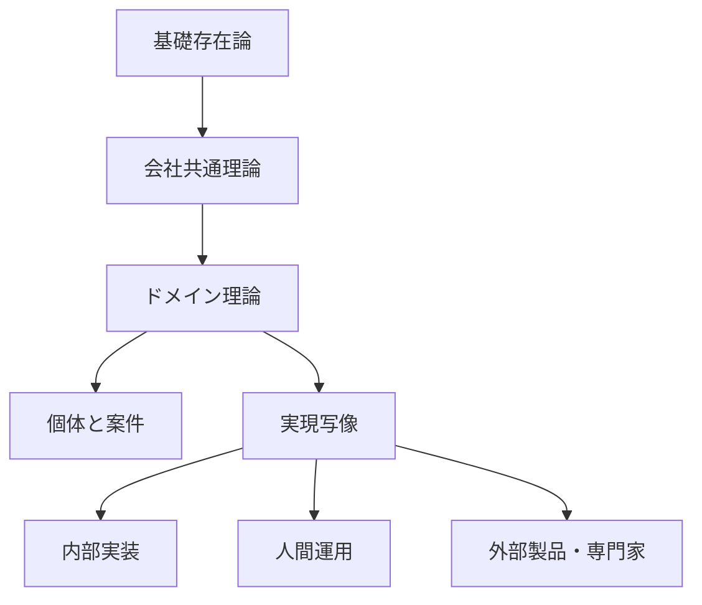
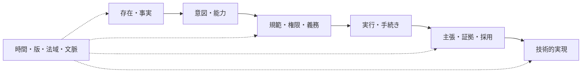
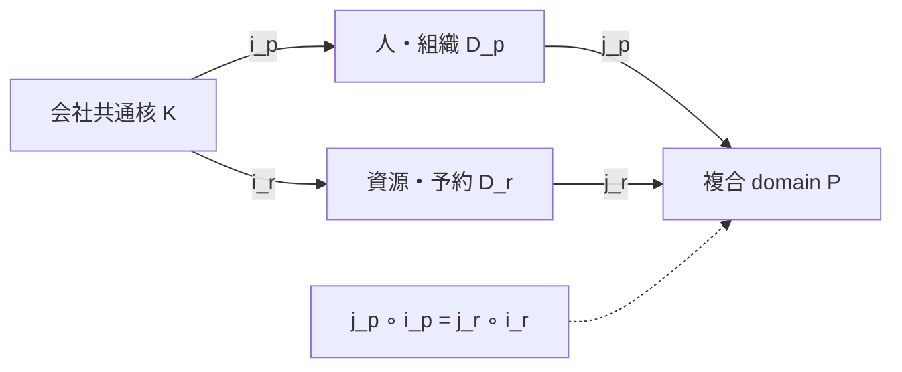

# 会社メタモデル

## 開放性

理論 `T` は次から成る。

- 語彙: 型、関係、量、状態、時間、規範
- 公理: 同一性、排他性、必須関係、時間、権限の不変条件
- モジュール: 会社共通理論とドメイン固有理論
- 写像: ドメイン、外部製品、API、データベース間の意味保存変換
- 能力質問: モデルから回答できなければならない問い
- 反例: 不正な組合せ
- 変更規則: 既存の結論を壊さない保守的拡張

完全性は、未知の概念へ意味、権限、時間、来歴、実現主体、失敗条件を追加し、既存概念との整合を検査できることを指す。すべての業務を同じ汎用レコードへ保存することを指さない。

## 抽象度

### 基礎存在論

- `Endurant`: 時間を通じて同一性を保つ対象
- `Agent`: 意図を持つか、委任範囲で行為する対象
- `Occurrence`: 期間内に起きる出来事または過程
- `Situation`: 時点または期間に成立する状態
- `Relator`: 当事者を特定の意味で結ぶ関係実体
- `InformationObject`: 内容と版を持つ複製可能な情報
- `Quantity`: 単位付きの量
- `Place`: 物理または論理的な場所
- `TimeInterval`: 始点と終点を持つ半開区間
- `Kind`: 対象の同一性を与える本質型
- `Role`: 関係または文脈で一時的に担う型
- `Phase`: ライフサイクル状態で一時的に属する型

`Person` は Kind とする。従業員、申請者、承認者は Role とする。会議室、駐車区画、書籍、ライセンスは固有の Kind とし、予約、貸出、数量管理の `Resource` role を担わせる。

### 会社共通理論

複数ドメインで同じ意味と不変条件を持つ概念だけを共通核へ置く。

- 主体と組織
- 能力、責務、権限、義務、禁止、許可
- ケース、提案、タスク、判断、実行
- 資源、資源能力、保有、割当、利用権
- 約束、契約関係、金銭量、予算枠
- 文書、版、主張、証拠、来歴
- 外部接続、指示、受領、照合

共通核へ追加する概念は、二つ以上の独立ドメインで同じ同一性と不変条件を持たなければならない。一つのドメインだけが使う項目を共通核へ追加してはならない。

### ドメイン理論

ドメインは共通核を輸入し、固有の Kind、Role、Relator、公理を追加する。

図書ドメインは `BibliographicWork`、`BookEdition`、`BookCopy`、著者、ISBN、所在、`Loan` を所有する。共通の資源 schema へ ISBN を追加してはならない。

駐車ドメインは `ParkingSpace`、車両制限、利用資格、時間枠、入退場条件を所有する。会議室と排他予約理論を共有できるが、会議設備または収容人数を共有してはならない。

### 個体と案件

型定義と個体を同じレコードで表現してはならない。案件は開始時の定義版を保持する。定義更新で既存案件の意味を遡及変更してはならない。

### 実現写像

各能力を内部コード、人間運用、外部製品、専門家の実現へ写す。実現写像は存在論の階層ではない。外部製品の交換で会社概念を変更してはならない。

## 意味面

概念を次の意味面へ分ける。一つの状態列へ統合してはならない。

- 存在・事実: 存在、出来事、成立状態
- 意図・能力: 目的と実行可能性
- 規範: 義務、禁止、許可、会社上の権限
- 実行: 手順、タスク、状態遷移、外部指示
- 認識: 観測、主張、評価、採用
- 技術: API、データ、認証、制約、adapter

時間、法域、組織文脈、機密区分、版、来歴は該当するすべての意味面へ付与する。

## 中核公理

### 同一性

- Kind は同一性を与え、Role と Phase は同一性を変えない
- 人、アカウント、Principal、雇用関係を同一視しない
- 組織、組織単位、一人役職、合議体を同一視しない
- 資源種類、資源個体、資源能力、予約、割当、利用を同一視しない
- 内部 ID は Kind と namespace の境界内で一意かつ不変とし、削除または archive 後も別の対象へ再利用しない
- 表示 code、メールアドレス、外部 ID、自然 key を内部 ID の代わりに使用しない
- 異なる Kind の内部 ID を同じ scalar 型として受け渡す場合も、target kind と namespace を検証する

### 出来事と情報

- 出来事と記録を同一視しない
- 主張と事実を同一視しない
- 判断行為、判断内容、判断結果、判断記録を分ける
- 規範は適用条件と版を持つ

### 時間

- valid time、recorded time、policy time を分ける
- 期間は `start <= t < end` の半開区間とする
- 現在の組織関係を過去の判断資格へ適用しない
- 訂正は元記録、理由、訂正主体を保持する

### 定義と実行

- 手続き定義と手続き案件を分ける
- 統制定義と統制実行を分ける
- 方針の公開、施行、確認、技術的強制を分ける
- 通知送信または既読を業務結果、承認として扱わない

### 権限と実行

- TechnicalPermission を OrganizationalAuthority として扱わない
- OrganizationalAuthority を TechnicalPermission として扱わない
- AI は HumanAttestation を生成できない
- AgentPrincipal、ServicePrincipal、ConnectorPrincipal を会社を拘束する Decision の decider または継続責任主体にしない
- 会社を拘束する Decision は、有効な ResponsibilityAssignment と人間または CollectiveBody の判断を必要とする
- 承認を変更不能な提案へ結び、実行直前に状態、版、期限を再検査する

### 外部実現

- 外部 ID を内部の同一性として使用しない
- 外部結果を出所、契約版、取得時刻、対象、単位、入力参照付き Assertion として保存する
- 内部承認、外部送信、外部受理、外部成功、社内照合を分ける

## 会社共通型

### 主体

- `Party`: 法的または業務上の当事者になれる人または組織
- `Person`: 自然人
- `Organization`: 法人、社内組織、外部組織
- `LegalEntity`: 法域の下で権利義務の主体となる組織
- `OrgUnit`: 組織単位
- `OrganizationalOffice`: 一人が占める役職
- `CollectiveBody`: 構成員、定足数、決議を持つ合議体
- `Principal`: システムが認証する操作主体
- `Account`: Principal の認証状態とセッション
- `Identity`: Principal の認証資格または外部識別子

### 関係

- `Employment`: Person と Organization の雇用関係
- `Membership`: Party と OrgUnit または CollectiveBody の所属関係
- `OfficeAssignment`: Person と OrganizationalOffice の就任関係
- `ResponsibilityAssignment`: 対象範囲と成果への継続責任を OrganizationalOffice または CollectiveBody へ割り当てる関係
- `Assignment`: Party または Principal と案件、責務、資源の割当関係
- `ProjectAssignment`: Party、OrgUnit、OrganizationalOffice または Resource と Project を役割付きで結ぶ関係
- `CostAttribution`: Commitment、BudgetEnvelope、Usage または domain record を Project または CostCenter へ根拠付きで配賦する関係
- `ReportingRelation`: 上司、部下、責任者の期間付き関係
- `Custody`: 資源の保管責任
- `Loan`: 貸出者、借受者、資源個体、期間の関係
- `Reservation`: 主体、資源能力、時間枠、優先規則の関係
- `Delegation`: 権限またはタスクの限定移転

関係は Relator として、当事者、意味、開始、終了、根拠、状態、来歴を持つ。外部キーの集合だけで表現してはならない。

### 事業管理

- `Project`: 有限の目的、責任主体、期間、状態を持つ事業上の取組
- `CostCenter`: 費用の計画、帰属、責任範囲を識別する期間付き管理単位

Project と CostCenter を法人または OrgUnit と同一視しない。ProjectAssignment と CostAttribution は対象、役割または配賦割合、有効期間、根拠、source を保持する。CostCenter を総勘定元帳の勘定科目または外部会計製品の ID として扱ってはならない。

### 能力と手続き

- `Capability`: 組織が継続的に必要とする成果
- `ProcedureDefinition`: 手順、分岐、担当、期限、完了条件の版付き定義
- `ProcedureCase`: 定義の特定版から開始した案件
- `Task`: 案件内の担当、期限、状態、完了条件を持つ作業
- `Proposal`: 実行前の具体的な変更案
- `Decision`: 権限を持つ主体の判断
- `Execution`: 承認済み指示を実行した出来事
- `ControlDefinition`: 統制定義
- `ControlRun`: 統制を実施した記録

### 資源

- `Resource`: Endurant または QuantityPool が組織利用の文脈で担う RoleMixin
- `ResourceRecord`: 担い手、管理 ID、owner、classification の情報
- `ResourceCapability`: 予約、貸出、消費、割当の能力
- `Availability`: 期間と条件に対する利用可能性
- `Reservation`: 将来の資源能力を確保する関係
- `Allocation`: 資源能力または数量の割当関係
- `Usage`: 実際の利用出来事または期間

`Resource` を identity を与える Kind にしてはならない。`MeetingRoom`、`ParkingSpace`、`BookCopy`、`SoftwareEntitlement`、`QuantityPool` は固有の Kind とする。

`ResourceCapability` が `exclusive` の場合だけ重複する有効予約を拒否する。数量型は重複区間の予約量合計を容量以下にする。共有型は重複を許可する。

### 約束と金銭

- `Commitment`: 将来の行為、引渡し、支払の約束
- `Obligation`: 規範または約束から生じる義務
- `Entitlement`: 受領、利用、要求する権利
- `MonetaryAmount`: 通貨付き金額
- `BudgetEnvelope`: 目的、期間、責任範囲を持つ上限または計画
- `PaymentProposal`: 支払提案
- `PaymentInstruction`: 外部実行主体への承認済み指示
- `SettlementAssertion`: 外部主体による清算済みという主張

予算または経費を総勘定元帳、税額計算、資金移動の正本として扱ってはならない。

## 圏論による検査

圏論は、定義済みの意味と不変条件が写像と合成で保存されるかを検査する。概念の意味を圏論だけで決定してはならない。

### Schema 圏

Schema 圏 `S` は次を満たす。

- 対象は Person、Membership、OrgUnit、ValidTime、MonetaryAmount などの型
- 射は `Membership -> Person` のような型付き全域的 aspect
- 多項関係は Relator を対象とし、当事者への射を持つ
- optional、failure、collection は明示型または Relator で表す
- path equality で表せる公理は可換条件とする

Instance `I: S -> Set` は型を個体集合へ、射を関数へ写し、恒等射と合成を保存する。database、外部 API、CSV を別 schema とする場合は、mapping 関手が保存する対象、射、可換条件、失う情報を宣言する。

### Domain の Pushout

会社共通核を `K`、ドメインを `D_p` と `D_r`、埋込みを `i_p: K -> D_p` と `i_r: K -> D_r` とする。埋込みは fully faithful とし、共通語の意味を変更してはならない。

複合ドメイン `P` は次の pushout 条件を満たす場合だけ採用できる。

- `j_p ∘ i_p = j_r ∘ i_r`
- `K` 上で一致する任意の `f_p: D_p -> X` と `f_r: D_r -> X` に対し、`u ∘ j_p = f_p` と `u ∘ j_r = f_r` を満たす `u: P -> X` が一意に存在する

公理衝突、共通語の意味変更、不要な同一視がある pushout 候補を拒否する。

### 認可の Pullback

`X` を Principal、action、resource、field、state、valid time、policy version を含む contextual action の集合とする。TechnicalPermission、OrganizationalAuthority、CaseAssignment、state と scope、HumanAttestation を満たす部分集合を `T`、`A`、`C`、`S_c`、`H` とする。

`Permitted = T ×_X A ×_X C ×_X S_c ×_X H`

不要な条件は `X` 全体を返す predicate とする。評価不能は空集合を返し、拒否する。異なる対象、時点、policy version の結果を交差させてはならない。

### 実行圏と Factorization

`M(X) = Result<X, ErrorContext>` とする。業務実行圏 `E` は Kleisli 圏の部分圏とし、Proposal、PolicyDecision、AuthorizedAction、Execution、OutcomeRecord を対象、許可された `A -> M(B)` を射とする。合成は最初の failure を保持する。

実装圏 `J` は NormalizedCommand、PolicyEvaluation、ExecutionGrant、SideEffect、AuditRecord と失敗可能な call path を持つ。意味写像 `F: E -> J` は恒等射、Kleisli 合成、主体、target、digest、拒否、結果を保存する。

business SideEffect を起こす任意の `h: NormalizedCommand -> M(SideEffect)` は、`p: NormalizedCommand -> M(PolicyEvaluation)`、`a: PolicyEvaluation -> M(ExecutionGrant)`、`e: ExecutionGrant -> M(SideEffect)` により `h = e ⋆ a ⋆ p` と factorize しなければならない。`p`、`a`、`e` は `E` の対応する射の像とする。factorization を持たない call path は認可 bypass とする。

### Migration と自然変換

schema 関手 `F: S_old -> S_new` に対し、instance pullback `Δ_F: Inst(S_new) -> Inst(S_old)` を使う。必要な Kan extension が存在し、意味上許可できる場合だけ `Σ_F` または `Π_F` を migration 候補にする。

可逆でない migration へ同型を主張してはならない。失う情報と correction path を記録する。

### 検査範囲

- Web、CLI、AI が同じ contextual action と PolicyDecision へ写る
- Proposal と Execution の payload digest が一致する
- 同じ idempotency key の retry と一回実行の効果が一致する
- 外部 mapping 後も主体、target、単位、時点、source が保存される
- 過去の Decision が候補者 snapshot と当時の policy version を使う

圏論だけで法的意味、概念の妥当性、並行実行、失効、可用性、暗号強度を証明してはならない。状態機械、database constraint、property test、脅威分析を併用する。

## データベース写像

- 共通 ID、Principal、Party、時間、来歴、外部参照だけを共有する
- Book の ISBN、著者、版は図書ドメインが所有する
- ParkingSpace の車高、充電設備、区画種別は駐車ドメインが所有する
- Reservation の制約を ResourceCapability の型に応じて適用する
- 拡張 metadata は namespace、schema version、所有ドメイン、validator を持つ
- 外部 payload は raw envelope と正規化済み Assertion に分ける

単一の Entity Attribute Value（EAV）テーブルまたは未検証 JSON へ全ドメインを格納してはならない。新しい意味または不変条件には、ドメイン固有 schema、migration、validator を追加する。

## 拒否する表現

- `resource.type = book` と任意 JSON だけで書誌、物理個体、貸出を表す
- 予約申請の保存を資源確保として表示する
- 外部給与 API 応答を出所なしの確定給与として上書きする
- AI が人間用セッションを使う
- 一人の role 承認を合議体決議として扱う
- 現在の上司を過去の承認者資格として再解決する
- 支出承認を支払完了または税務確定として扱う
- 規程 Markdown の同期を施行中の認可規則として扱う

## 現行実装差分

すべての型、写像、制約が実装済みとは限らない。実装状態は [能力台帳](./capability-map.md) に記録し、コード、migration、テストと一致させる。未実装の概念を runtime の保証として使用してはならない。
