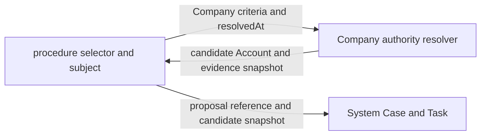

# Company organizational authority

Organizational Authority は、会社のある時点において、誰がどの責任と対象範囲に基づいて判断候補になり得るかを解決する Company の機能である。Technical Permission が API 操作能力を表すのに対し、Organizational Authority は会社上の資格を表す。

判断候補になり得ることと、実際に判断できることは同じではない。Company は候補と根拠を返す。System はその候補を変更不能な Task snapshot として受理し、認証、Account 状態、本人性、除外、委任、必要人数、HumanAttestation を検査して判断を成立させる。業務 App は何について判断するかを所有する。

## Company が所有する理由

直属上司、部門責任者、管理系列、兼務、在籍状態、Account と Employee の対応は会社という存在を構成する事実である。これらを System が解釈すると、System が Employee、Department、Employment、Responsibility を知ることになり、会社を持たない製品や異なる組織モデルで再利用できなくなる。

これらを個別 App または System が解釈すると、expense、leave、contract などが同じ組織資格を必要とするたびに組織規則が複製される。資格解決を Company に一元化し、呼び出し側は Company の公開条件と snapshot だけを利用する。

Company が返す結果を単なる Employee 一覧にすると、判断基盤へ渡す前に呼び出し側が Account 対応、有効状態、自己除外を再実装する。呼び出し側ごとに候補集合が変わり、同じ責任を指定しても異なる判断者が選ばれる。そのため Company の公開 operation は、有効な Employee と有効な Account の対応まで確認した候補と、評価根拠の snapshot を同時に返す。

Company は ProcedureDefinition、申請状態、Proposal body、Case、Task、Decision を知らない。Company に渡すのは、Company が理解できる資格条件、subject Employee、対象部門、解決時刻だけである。

## Technical Permission との分離

Technical Permission は、認証済み Account が特定の API operation を呼べるかを決める。Organizational Authority は、その Account に対応する Employee が対象 Employee または組織単位に対して会社上の責任を持つかを決める。

一方だけで判断を許可しない。`expense:approve` を持っていても対象部門への責任がなければ候補にならない。部門責任者でも必要な Technical Permission、Account の有効性、本人性を満たさなければ判断できない。

Account role から判断候補を列挙しない。workflow が会社上の資格条件を定義していなければ手続きは fail closed になる。経理責任者、人事責任者、契約決裁者などの資格は Company の ResponsibilityAssignment で表し、Technical Permission は操作能力だけに使う。

## 入力契約

Company は呼び出し元の selector 型を import しない。各 App は自分の入力を次の最小条件へ変換する。

- `employee`: 安定した Employee code で特定の社員を指す
- `direct_manager`: subject の有効な所属に記録された直属上司を指す
- `department_manager`: subject が所属する組織単位の責任者を指す
- `target_department_manager`: App が明示した対象組織単位の責任者を指す
- `responsibility`: 安定した責務 code と、任意の対象 OrgUnit で責任保持者を指す
- `management_chain`: subject から上位へ辿れる管理系列を指す

入力には `resolvedAt` を必須とする。resolver が内部時計を暗黙に読むと、同じ command の再試行や監査再構成で別の日の組織が選ばれ得る。`resolvedAt` を会社 timezone の営業日 `asOf` へ変換し、すべての条件を同じ基準日で評価する。

subject が存在しない提案では subject Employee を null にできる。この場合、直属上司や管理系列は候補を返さない。特定 Employee、責任、対象組織など、subject を必要としない条件だけが評価できる。Company は対象を推測して補わない。

## 出力契約

resolver は、一つの時点 snapshot と候補集合を返す。

snapshot は次を持つ。

- schema version
- 組織投影のschema versionと出典
- 会社 timezone で固定した `asOf`
- organization revision

snapshotの出典はcanonicalな`lifecycle`だけである。別の組織投影へfallbackせず、必要なrevisionと証拠が揃わなければ判断を停止する。

候補は次を持つ。

- Employee ID
- Employee と一意に対応し、有効性を確認した Account ID
- どの入力条件から得たかを示す criterion index
- 所属、上司、責任、管理系列のうち実際に使った証拠

criterion index は、Company が呼び出し側の selector を保存するための値ではない。呼び出し側が自分の条件と Company の証拠を対応付けるための相関値である。呼び出し側は index を元の selector へ戻し、Company snapshot と共に System の候補証拠へ保存する。

候補集合は意思決定の正本ではない。Company の組織事実から導いた変更不能な入力 snapshot であり、System Task が受理した時点から過去の組織変更で書き換えない。

## 時点と revision

lifecycle 投影では、`asOf` に有効な Employment、在籍状態、主務、兼務、上司、ResponsibilityAssignment だけを読む。退職、将来入社、無効化、アーカイブ、廃止組織は候補から除外する。

canonical履歴の下限はmigrationで確定した`baseline_on`である。それより前は旧現在値から過去状態を推測せず、Company APIと新しい資格解決を拒否する。baseline時点で雇用periodを持たない退職者などは、migrationが明示的に保存したbaseline stateからだけ解決し、現在のEmployee列を履歴として読み替えない。migrationに記録した会社timezoneとruntime設定が異なる場合も、同じinstantを別の営業日として判断しないよう資格解決を停止する。

同じ解決で読んだ Employee state の organization revision が一致しない場合、resolver は候補を返さない。異なる revision の所属と責任を混ぜると、現実には存在しなかった組織図を構成できるためである。

候補解決の入口は、Employeeとその番号の対応を読む前にlifecycleのorganization revisionと公開resourceのCompany revisionを固定する。内部snapshotと解決後にも両方の版を確認し、この三点が一致しない場合は候補を返さずconflictにする。呼び出し側は新しい `resolvedAt` を勝手に生成せず、同じ command の値を保ったまま解決全体を再試行する。

所属由来の指揮命令の証拠には assignment period ID、assignment revision、`asOf` を含め、organization revision は解決結果の snapshot に保持する。独立した指揮命令の証拠は reporting relation ID と revision を持つ。管理系列では各 edge の証拠を順番付き path として保存する。現在の組織図だけから過去の経路を推測しない。

organization revisionを持たないsnapshotは完全な履歴証拠として受理しない。canonicalなlifecycleを検証できなければ、新しい判断を停止する。

`resolvedAt` と `asOf` は用途が違う。`resolvedAt` は候補解決を実行した instant、`asOf` は会社の勤務・組織規則を評価した営業日である。System の候補 row は `resolvedAt` を持ち、Company の authority snapshot は `asOf` を持つことで両方を失わない。

## Account との対応

Company は Account と Employee の一対一対応を所有する。候補 Employee に対応がない、Account が無効、対応先が別 Employee、Employee が対象時点で在籍していない場合、その候補を返さない。

対応の期間は資格を評価する同じ会社営業日で解決する。公開対応の終了・取消・将来開始を従業員名簿と資格snapshotへ反映し、接続済みの履歴の空白を旧対応表で補わない。同一性、履歴の接続と訂正の規則は [Company API](./company-api.md) に従う。

Account の認証状態や session は System の正本であり、Company snapshot だけで判断を許可しない。候補 snapshot 作成後に Account が停止された場合、System は HumanAttestation の書込み境界で再検査して拒否する。Company snapshot は資格を固定し、System の live guard を置き換えない。

resolver は対応する active な `system_accounts` を同じ解決内で確認し、opaque string の canonical System Account ID を返す。System workflow の候補、actor、更新者、委任作成者はこの canonical ID を使う。Company は Account と Employee の対応を検証するが、System は Employee ID を解釈しない。接続規則とlive guardは [Workflow Account identity](./workflow-account-identity.md) に定める。

## 呼び出し側との接続

API composition または業務 App は、procedure selector を Company の条件へ変換する adapter を持つ。この adapter は Company table、Employment、Department、Account role を読まない。Company の解決結果を元 selector と対応付け、authority snapshot を System の候補証拠へ加えるだけである。明示的な authority workflow がない procedure を、role や最上位 Account で補完してはならない。



同じ step に複数条件があり、同じ Account が複数の根拠で候補になる場合、adapter は一つの候補へまとめつつ、すべての根拠を保存する。required approvals は Account 行数ではなく、自己除外後の一意な候補 Employee 数を基準にする現行仕様を維持する。

一つの step の primary 条件と escalation 条件は、一回の Company resolver 呼出しで解決する。二回に分けると途中の組織変更で異なる organization revision が混ざり、同じ step snapshot が一つの会社時点を表さなくなる。adapter は一つの解決結果を primary と escalation に分類し、selector index だけを各配列内の index へ戻す。

組織変更後も既存 Task の候補と必要人数を書き換えない。候補を変更する場合は新しい round と resolution ID を作り、以前の候補、証拠、判断を残す。判断時の資格再検査は、保存済み候補のうち現在も同じ条件を満たす Account だけに判断を許可するために行う。

## System との接続

System は Company resolver を呼ばない。System から Company への依存を作らないため、業務 App または最上位の API composition が Company を呼び、検証済み候補を System command へ渡す。

System が保存する候補は canonical Account ID、候補 snapshot の出典、証拠参照、解決時刻である。Employee ID、部署 code、role key、上司 path は System の判断規則に使わない。詳細な Company 証拠を System table に複製する必要がある場合も opaque evidence reference または digest とし、System が中身を解釈しない。

System は候補 snapshot を受け取っても、作成者本人、除外 Account、同一人物の別 Account、停止 Account を受理しない。Company の一対一対応検査と System の主体検査は異なる不変条件なので、片方を省略しない。

## 失敗と fail closed

次の状態では候補を推測せずエラーにするか、該当候補を除外する。

- 会社 timezone または `resolvedAt` から営業日を解決できない
- lifecycle migration が未検証または状態を読み出せない
- 同じ解決内で organization revision が一致しない
- 候補解決の途中で organization revision が変化する
- 上司関係に循環がある
- 対象時点の Employment または在籍状態を再構成できない
- Employee が退職済み、将来在籍、アーカイブ済みである
- Employee と有効 Account の対応がない
- selector の Employee code または対象部門が存在しない
- subject 本人しか候補にならない

存在しない条件を管理者、現在の上司、最上位 role で補わない。候補ゼロは Company resolver の正常な結果であり、呼び出し側が unresolvable step として提出または遷移を拒否する。

上司循環は対象 subject の探索が偶然終了しても許容しない。循環を含む組織投影は管理系列の意味を一意にできないため、解決全体を conflict とする。

同一時点に複数の上長関係がある場合は、全ての関係を循環判定に含める。登録順で上長を一人に絞らず、兼務先に閉路のない経路があっても他の経路の循環を許容しない。同一時点の判定は社員と関係の数に比例する処理で行い、分岐から生じる全経路を列挙しない。

公開resourceの指揮命令は、参照APIと同じ優先順で全履歴から有効期間を組み立てる。同じ開始日では最大revision、異なる開始日では後の開始日が優先される。後の版が終了・取消されても以前の版を復活させない。公開組織変更、接続済み組織の既存更新、組織履歴の移行は、確認したorganization revision以下の履歴と変更内容を使い、開始日を含み終了日を含まない全期間で循環を拒否する。履歴を読めない場合は変更を確定しない。

## 十分性

Company の Organizational Authority が十分であるとは、あらゆる会社の決裁規程を一つの role 名へ埋め込めることではない。次の問いへ、Company の正本と保存済み snapshot から答えられることをいう。

- どの会社時点の組織と在籍を使ったか
- どの責任または関係が候補を導いたか
- どの Employee とどの Account の対応を確認したか
- 自己、退職、アーカイブ、無効 Account を除外したか
- 組織変更後も当時の候補根拠を再構成できるか
- 評価不能時に推測せず停止したか

判断対象の内容、必要人数、判断結果、委任、実行許可はこの十分性に含めない。それらは App と System の責任である。Company がそれらまで持つと、会社事実と手続きが再び結合する。

会社ごとの決裁規程に、金額帯、地域、法人、事業、職務分掌、職務分離が必要なら、Company の ResponsibilityDefinition、ResponsibilityAssignment、AuthorityScope として追加する。ProcedureDefinition の自由文字列 role や System permission を増やして代用しない。

## 削除と変更

個別 App を削除しても Company resolver は残る。他の App は自分の条件を Company の資格条件へ変換し、直接利用できる。Company はどの App が呼んだかを知る必要がない。

組織モデルを変更するときは、Company の resolver と証拠 schema version を変更する。保存済み snapshot の意味を上書きせず、新しい schema version で新しい round を解決する。過去 snapshot を現在の resolver で再計算し、一致しないから無効とみなしてはならない。

Company 自体を持たない製品では、この resolver を登録しない。System workflow は候補 Account snapshot を別の owner から受け取れるため、Company の存在を前提にしない。

## 矛盾の検査

次の状態は責任境界と矛盾する。

- System が Employee、Department、Responsibility、role key を解釈する
- API composition または業務 App が Company の組織、在籍、Account table を直接読んで候補を作る
- Company が procedure selector、Proposal body、申請状態、Case status を保存する
- Technical Permission だけで対象範囲を決める
- 組織資格だけで API 操作能力または本人性を満たしたと扱う
- resolver が暗黙の現在時刻で再試行し、別の候補を返す
- 進行中 Task の候補が組織変更で暗黙に書き換わる
- organization revisionを持たない証拠をcanonical lifecycleと同じ保証として表示する
- Account に対応しない Employee ID を System 候補として渡す
- snapshot 作成時の Account 有効性だけで判断時の再検査を省く
- Employee IDを各呼び出し側でSystem Account IDとして扱う

矛盾が必要に見える場合は例外を足さず、会社上の責任、対象 scope、評価時点、Account 対応、System の判断規則のどれが欠けているかを特定する。

## 組織正本と変更契約

OrgUnit は変更される名称や親子関係そのものを ID にしない。安定した opaque identity と、名称、code、kind、親 OrgUnit、有効期間を持つ追記型 period version に分ける。改名、移動、改組、廃止、訂正、取消は既存 row の更新ではなく新しい revision として記録する。

所属と責務も同じく有効期間付きの version である。Assignment は Employee、Employment、OrgUnit、主務または兼務、役職、直属上司を持つ。Responsibility は Employee、Employment、OrgUnit と安定した大文字 token の責務 code を持つ。`MANAGER` と `PEOPLE_OPERATIONS` は同じ仕組みで表せるが、表示名や Account role key を責務 code に流用しない。同じ責務を複数人が持つことは許し、同一保持者、同一 OrgUnit、同一責務の期間重複だけを拒否する。

一回の組織変更は operation ID、expected organization revision、基準日、記録時刻、追加する全 period version を一つの `OrganizationChangeSet` にする。Application は書込み前に、次を全体として検証する。

- OrgUnit identity と period revision の連続性
- 有効期間内の単一 root、code の一意性、親の存続、循環の不在
- Employment に包含される状態、所属、責務
- 有効な OrgUnit への所属と責務
- 主務重複、同等所属重複、自己上司、非在籍上司、管理系列循環
- 責務保持者の所属と Account 対応

検証済み変更だけを一回の atomic batch で追記する。DB は operation の再利用、expected revision 不一致、部分適用、非連続 period revision、追記済み事実の更新と削除を拒否する。operation が `PENDING` の間は snapshot を読めないため、変更途中の組織を権限判断へ公開しない。

Personnel Action はCompanyへの人事入力adapterであり、所属または責務を変える発令は同じ `OrganizationChangeSet` validator を必ず通す。採用予定者は、同一 transaction で作成される Employee profile、Employment、Status だけを検証用 snapshot に補い、所属を二重適用しない。発令事実、組織 operation、period version、current projection、監査は同じ batch で確定する。

[会社の初期化](company-api.md#会社の初期化)は確認済みのOrgUnitと所属を作り、明示された`MANAGER`と`PEOPLE_OPERATIONS`だけをCompanyの組織変更operationで割り当てる。空配列なら責務を作らない。Account role、役職名、権限から会社上の責務を推測しない。authority workflow と必要な Responsibility が設定されていない判断は拒否する。

## 現行実装

Workforceの純粋な資格resolverは、所属と別の`managementRelations`を必須入力とする。同じEmployee・OrgUnitに複数の上長を持てるため、上長を追加する目的で所属を増やす必要はない。空の関係を所属の上長で補完せず、関係の日付、両端のEmployeeの存在と在籍、記録の重複、循環を検査する。所属由来の証拠では、所属の所有者、OrgUnit、上長、期間ID、版の一致も検査する。

`ReadOrganizationWorkforceState`は、公開ReportingRelationを参照APIと同じ有効日・版の選択で読み、Employment、所属、責務、Account対応と同じ時点へ解決する。`ResolveOrganizationAuthority`の承認候補、Employeeに対する管理範囲、配下の一覧、閲覧者との関係判定は、この明示的な指揮命令を使う。公開履歴を読めない場合は空集合で補わず、途中でCompany revisionが変わった場合も候補を返さない。対象は既存の業務台帳と同じ既定organizationである。

未移行の所属に記録された上長関係も、元の期間IDと版を保持する。ただし、同じEmployee・OrgUnitで公開関係と重なる場合は`organizational_authority_reporting_source_conflict`を返す。同じ上長であっても同一の記録と推測しない。範囲が異なる関係は合わせて循環を検査する。公開Assignmentは公開履歴から業務の所属期間へ反映する。既存の上長履歴は[所属と上長履歴の接続](company-api.md#既存の所属と上長履歴の接続)で確認して移行する。全保存経路を一つの正本へそろえる作業は未完成である。

従来の組織read modelには上長のEmployee ID配列と、設定済みcodeの配列を持つ。一人を要求する既存欄は上長のEmployee IDが一人で、codeが設定されているときだけ値を返す。複数上長のうち一人だけにcodeがあっても、その一人を選ばない。公開関係の資格証拠にはCompany revisionを必須とし、手続きへ渡す証拠にも`company_revision`を含める。

`api/src/contexts/company/domain/policies/company-governance-authority.policy.ts` は、固定済み Company resource と active な System Account ID の集合から資格候補を解決する。DB、Hono、Worker、暗黙の時計を読まず、criterion、scope、snapshot、candidate、qualification は opaque ID と明示型だけで表す。

resolver は同じ `asOf` と organization revision に属する active resource だけを受理する。Account と Employee の一対一対応、Employment、Responsibility、ResponsibilityAssignment、OrganizationalOffice、OfficeAssignment、CollectiveBodyMembership、AuthorityScope の参照を検査し、候補が存在しない正常結果と、安全に評価できない `CompanyGovernanceAuthorityError` を区別する。候補探索と qualification は criterion、assignment、Account の順で決定的に並べる。 終了済み雇用の履歴は候補資格へ含めず、再任用時は同じEmployeeの現在の有効な雇用を使う。有効な雇用を一つに決められない場合は評価不能として拒否する。

`D1CompanyResourceRepository` は LegalEntity、Site、Workplace、Employee、Employment、OrgUnit、OrganizationalOffice、OfficeAssignment、Responsibility、AuthorityScope、ResponsibilityAssignment、CollectiveBody、CollectiveBodyMembership、AccountEmployeeLink を一つの `asOf` と organization revision へ固定して読む。System Account の状態を読めない場合は候補ゼロへ畳まず unavailable として停止し、Account role を候補資格として読まない。

`POST /company/authority-resolutions`と承認Taskの生成は、同じ人間Accountの検査を使用する。Accountがactiveで終了しておらず、Accountとhuman Principalの作成時点が判定時点以前であることを要求する。Service・Agent・Connector、Principal未登録、将来作成の主体を人間の候補へ含めない。Systemの読取失敗や不正な時計を候補ゼロとして扱わない。

公開候補とTask生成は、同じ営業日のAccount対応・在籍の期間台帳を照合する。公開履歴の対応と期間台帳が一致しない場合は候補を返さない。照会の前後で会社の履歴・期間台帳が変更された場合、公開APIは409を返し、照会全体の再試行を要求する。過去の営業日を指定した照会でも、その日付の在籍を検査し、現在の在籍で補完しない。

対象営業日の雇用状態がACTIVEの場合だけ承認候補へ含める。休職中・退職済みでも責務の原記録は保持するが、承認候補には採用しない。在職と休職の雇用が同じ時点に重なる場合は、一方を選ばず不整合として拒否する。公開候補は実行許可ではなく、Task生成と判断・実行時の会社版、主体対応、在籍、自己承認、必要人数の検査を置き換えない。

`CompanyGovernanceProcedureTaskAdapter` は解決済み Company qualification を System Task の候補証拠へ変換する。個人または役職の責任は一名承認、合議体は参加定足数、必要賛成数、成立不能による否決、代理禁止、差戻し禁止として固定する。異なる assignment、個人資格、合議資格が同じ criterion で混在し意味を一意に決められない場合は Task を作成しない。

公開 Company resource の resolver は、法人、組織単位、拠点、勤務場所、地域、通貨付き金額の scope を明示型で評価する。申請の step に `governance_authority` を指定すると、汎用申請と人事申請の Task 生成は公開 resource の責務・役職・合議体を使う。指定しない step は、期間付き組織台帳に対する従業員・上司・部署責任者・責務の条件を使う。

判断時の Employee 対応と在籍の再検査は Company の公開 resolver を経由し、Account 状態の正本は canonical `system_accounts` である。System HumanAttestation は Company table を直接読まず、API composition が Company の live な主体対応と System の候補資格を合成する。

汎用申請と人事申請の承認・否認・差戻しでは、固定済みの条件を判断時点の Company 営業日で再評価する。代理判断は委任元 Account の資格を確認する。人事申請は発令対象者を資格解決の対象とし、依頼者と発令対象者の除外を維持する。追加候補は保存済み Task の期限以降だけ評価し、再検査の時刻から期限を計算し直さない。

会社上の資格の参照前に組織版、未確定操作、追記専用の期間・人事・対応・公開履歴の件数、条件で参照する従業員番号を固定する。System の判断 batch は同じ状態を再確認してから証言を保存する。途中で状態が変われば HTTP 409 を返し、証言・Task・Case を変更しない。System はこの検査を opaque な SQL statement として受け取り、Company の条件を解釈しない。公開Companyの責務条件と従来の組織条件のどちらを使うTaskでも、候補生成前の状態と候補のAccount対応を固定する検査を返す。汎用申請・人事申請の初回・後続Taskは、その検査を保存と同じbatchへ渡す。経費・稟議への汎用Taskの適用は未完了である。

会社全体のAccount状態と、公開責務の判断候補に必要なPrincipal・本人対応・在籍状態は一括で参照する。Accountごとの問い合わせを従業員数に比例して増やさない。停止・閉鎖したAccount、未登録・将来作成・機械種別のPrincipalを判断候補に含めない。在籍や本人対応が一意でない場合、または参照の一部が失敗した場合はTaskを作らない。

## 人事発令の実行時の資格

人事申請の発令では、Systemの承認済み提案とCompanyの発令内容、Case、series、digest、実行操作を照合する。各承認段階の有効な証言を実行時点で再評価し、固定済みの必要賛成数と参加定足数を満たす場合だけ発令する。責務の取消、会社規程の変更、在籍資格の失効、Account停止、機械Principalへの変更、委任の期限・取消を反映する。新しい委任を作っても、失効した別の委任による証言は復活しない。

依頼者と発令対象者は、委任元と代理人のどちらからも除外する。発令を確定する利用者は、Company Account対応と在籍が現在も有効な承認者に限定する。閲覧権限だけでは実行許可を発行しない。実行済みの同一申請への再送は保存済みの発令結果を返す。

Companyの資格とSystemのAccount・Principal・委任の参照状態を、発令・公開雇用履歴・実行許可・完了記録と同じbatchで再検査する。資格不足は403、検査後の状態変更は409となり、発令を保存しない。発令の保存に失敗しても承認証言は保持し、業務変更・実行許可・完了記録を取り消す。APIは発令処理の失敗を成功応答へ変換しない。

## 公開責務を使う手続きの条件

`governance_authority` は既定organizationの責務codeと対象scopeを指定する。金額scopeの `amount_field` は、検証・保存される申請payloadの直接のfield名であり、その数値を評価する。数値以外、負数、欠落、規程の範囲外はTaskを作成しない。

申請テンプレートの承認フロー画面は、会社の責務によるステップの追加と、責務code・対象scopeの編集を受け付ける。公開責務のステップには個別承認者や必要人数の入力を表示せず、会社の任用から候補者と合議人数を決める。新しい責務ステップは代理承認を無効、否認時は却下で作る。画面で代理承認を有効にしても、会社の責務が禁止する委任は許可しない。

旧形式の責務セレクタとAccount roleは新しい承認定義へ保存できない。通常の候補と期限後の候補に同じ制約を適用する。画面は保存済みの旧指定を表示し、旧指定が残る間は保存を拒否する。管理者が公開責務と適用範囲を確認して新しいステップを設定し、旧指定を除去する必要がある。組織コードからscope IDへの推測や、旧人数条件から合議条件への自動変換はしない。過去の定義の読み取りと実行経路の撤去は別に扱う。

入力途中で必須項目が空欄になっても画面上の編集は続けられ、不正な定義は保存できない。詳細JSONが不正な間は基本設定を無効にし、JSONの修正を要求する。

```json
{
  "version": 1,
  "steps": [
    {
      "key": "review",
      "name": "決裁",
      "approvers": [],
      "governance_authority": {
        "organization_id": "organization:default",
        "responsibility_code": "APPROVE",
        "scope": { "scope_type": "amount", "currency_code": "JPY", "amount_field": "amount" }
      }
    }
  ]
}
```

公開責務と従来の候補・追加候補を一つのstepへ混在させない。`approval_mode` は既定の `any` とし、`minimum_approvals` を指定しない。必要人数はCompanyの合議規程から固定する。stepの `allow_delegation: false` は委任を制限できるが、Companyが禁じた委任を許可することはできない。合議体で差戻しを指定した場合はTaskを生成しない。

候補は公開Employee・Employment・Account対応に加えて、業務台帳のAccount対応と有効な在籍を満たす必要がある。二つの対応が違う場合は候補を代替せず停止する。Agent・Service・ConnectorのPrincipalを人の候補へ含めず、SystemのTask候補・証言の保存時にも機械主体を拒否する。

判断時は同じ責務・申請内容から現在の資格を解決する。Companyの必要参加数・必要賛成数・否決条件・委任・差戻しの規則が保存済みTaskから変わっていれば、そのTaskへの判断を拒否する。過去のTaskと提案は変更しない。

公開責務の設定はAPI、承認フロー画面、またはworkflowのJSON定義で保存する。基本編集欄はCompanyの合議条件を表示しない。必要人数の正本はCompany規程と保存済みSystem Taskである。

## 指揮命令の参照

直属部下一覧と報告ラインはEmployee IDを基準とし、従業員codeや所属が未設定でも有効な指揮命令を返す。報告ラインは本人から全上長へ幅優先でたどり、各Employeeを一度だけ返す。深さは本人からの最短距離であり、各nodeの`manager_employee_ids`が直接の上長を表す。既存のcodeによる参照も受け付け、Employee IDとの一致を優先する。これらの参照には既定organizationへのアクセスと`company:read`が必要である。

従業員のcode・名称・主務の表示とcodeによる判断候補の解決には、組織snapshotと同じ会社営業日の履歴を使う。将来の改訂を現在の属性として使わない。従業員情報を読む間にCompanyまたは組織のrevisionが変わった場合や、必要なEmployeeが欠落した場合は取得を失敗させる。

## 公開所属と期間台帳

既定organizationのAssignmentを変更するときは、全revisionから有効な所属区間を組み立てる。同じ開始日は最新revision、異なる開始日は後の開始日を優先する。将来予約はそれ以前へ混ぜず、終了や取消の後に以前の所属を復活させない。所属のEmployeeは変更しない。

公開履歴、組織のoperation、所属期間、正本との対応、監査、再送結果を一つのtransactionで保存する。組織単位の新設と配属も同時に扱う。訂正で置き換える所属期間は失効版を先に追加し、変更後の有効期間を追加してからoperationを完了する。元の期間versionは更新・削除しない。参照失敗、主務重複、所有者の食い違い、版の競合では変更全体を確定しない。

所属期間の対応は公開AssignmentのID・版と、期間台帳のID・版を保持する。接続済みの所属を人事発令で変更するときは、公開履歴と対応も同じtransactionで更新する。発令から分かれた新しい所属期間にも公開Assignmentを作り、将来予約と元の期間終端を保つ。期間台帳だけを変更するoperationは完了できない。

役職変更、異動、終了、訂正、退職は、直接の発令と承認済み発令が共通の保存処理を使う。雇用と所属の公開履歴は同じ発令にまとめ、所属の終端に合わせて更新する。組織codeからIDを作らず、保存済みのOrgUnit IDと全期間で検証する。公開APIによる再更新でも、開始日・雇用・組織・所属種別が一致する接続済みの期間IDを保つ。

公開Assignmentの最新revisionが取消でも、過去と将来に有効な所属期間は残り得る。会社版を確定する際は、接続済みの全所属期間が同じEmployeeの有効な雇用期間に含まれることをDBでも検査する。雇用取消で将来の所属を孤立させる変更は、履歴と再送結果を含めて保存しない。

公開Employeeと接続済みOrgUnitへの新規入社・主務配属・兼務追加も、公開Assignmentと期間対応を同じ発令で作る。会社初期化時の最初の所属も公開履歴に接続し、入社日から有効にする。組織の期間境界では対象日に有効な期間を優先し、部署番号が変わっても元のOrgUnit IDで所属を特定する。

公開Employeeへの上長付き配属と上長変更は、直属上長をReportingRelationへ保存する。人事発令が管理する関係をEmployee・Employment・OrgUnit・所属種別の組み合わせへ対応させ、所属期間の上長欄には複製しない。別途登録したReportingRelationは維持し、役職だけの変更では直属上長の版も増やさない。将来予約の前の変更はその境界までに限定する。

所属終了・異動・退職では対応する直属上長の期間を閉じる。公開APIで所属を終了する場合も、対応する関係を同じ変更で終了する必要がある。所属範囲外へ残す変更と関係の所有者変更をDBで拒否する。訂正では対象発令前の指揮命令履歴を復元し、同じ関係に後続の編集があれば409で拒否する。履歴、発令、監査、対応、実行許可は同じtransactionに含める。

公開Employeeの雇用期間を人事発令で短縮した場合は、その従業員を部下または上長とする公開ReportingRelationも同じtransactionで終了する。退職日までは有効とし、その翌日から関係を無効にする。別の上長への将来予約と他の上長との関係は保全する。再入社だけで終了した上長関係は復活せず、再割当を明示する必要がある。退職日の訂正は元の発令前の関係から復元し、部下側で後続の編集があれば409で拒否する。

公開ReportingRelationの全期間は、部下と上長の雇用期間に含まれる必要がある。会社版の確定と従業員の公開対応の更新でDB検査を行い、最新の関係が終了済みでも過去の不整合を許容しない。雇用だけを短縮して関係を残す公開変更は422で拒否する。`POST /company/organization-changes`はEmploymentとReportingRelationの同時変更を受け付け、既存の雇用APIと同じ属性・Company capability・organizationのアクセス条件を使う。

既存の未接続Employeeや所属期間を発令時に自動移行しない。公開Employeeの新しい所属には接続済みのOrgUnitが必要であり、既存の上長履歴は[所属と上長履歴の接続](company-api.md#既存の所属と上長履歴の接続)で明示的に確認して移行する。既存責務は[履歴と定義の確認](company-api.md#既存責務の公開履歴への接続)で公開履歴へ接続できる。公開APIで雇用・所属・任用を同時に変更する場合の整合性は、[退職と組織責務](company-api.md#退職と組織責務)に従う。

未接続の所属に上長が記録されている場合も、上長の退職発令は部下の所属・役職・雇用を維持し、退職翌日から上長だけを外す。元の雇用期間を短縮した範囲に限定し、別の上長への将来予約や、元の雇用終端以後に確認済みの再雇用・上長指定は保全する。元の期間を更新・削除せず、分割した期間と変更原因の発令を追記する。退職日の訂正では部下側の変更も復元して再計算し、後続の所属編集があれば409で拒否する。直接発令と承認済み発令は同じ規則を使い、部下の所属に同時変更があれば組織版の照合で発令全体を拒否する。部下側の保存に失敗した場合も、雇用・発令・公開履歴・再送結果を一緒に取り消す。

## 公開責務と期間台帳

職位の職務、組織役職の職位・組織、役職任用、責務の定義・保持者・対象範囲、合議体の構成員、決裁資格の参照先は、参照する全有効期間に存在しなければならない。対象範囲が参照する法人・拠点・勤務場所も同じ条件を満たす。最新状態が取消でも、取消前の有効期間を検査する。

同じ参照先の連続する版は一つの有効期間として扱い、空白や別組織の定義では補わない。参照元と参照先を同じcommandで終了・延長できるが、参照元を期間外へ残す訂正・短縮・取消は422で拒否する。検査は会社版を確定するDB処理でも行い、失敗時は履歴と再送結果を一緒に取り消す。既存の期間不整合がある場合は、新しい制約へ置き換える前にmigrationを停止し、履歴を自動修正しない。

会社初期化で明示した責務と、公開Employeeに対する新規の責務発令は、Responsibility・AuthorityScope・ResponsibilityAssignmentを同じtransactionで保存する。責務code、Employee、Employment、OrgUnit、公開割当と期間台帳のID・版を対応させる。組織scopeは期間resourceのIDではなく、安定したOrgUnit IDを指す。対象日に一意な組織期間を確認できない場合は判断資格を返さない。

初期責務は確認日の会社営業日から有効にし、新しい割当は委任不可で作る。責務定義の表示名は確認されたcodeと同じ値で始める。同じcodeの責務定義や同じOrgUnitのscopeが存在する場合は、割当期間を包含する有効な定義だけを利用する。失効した定義を自動延長しない。

接続済みのResponsibilityAssignmentは公開組織変更APIと人事発令から更新できる。開始・終了・取消・訂正・将来予約を両方の履歴へ反映し、期間の空白を以前の版で埋めない。退職で終了した責務は再入社だけでは復活しない。保持者・雇用・責務code・対象OrgUnit・定義IDの対応は変更せず、別の任用として明示する。

公開履歴、責務期間、対応する版、組織operation、会社版、発令、監査、再送結果は同じtransactionで確定する。片方だけを保存する変更と、過去を含む責務期間を定義の有効期間外へ残す変更を拒否する。訂正対象の発令の後に同じ公開責務が編集されていれば409で拒否し、後続の確認結果を上書きしない。

未接続の既存責務をcode・保持者・期間の一致だけで公開履歴へ採用しない。公開APIで独立して登録した責務割当も、既存の期間台帳との同一性を推測しない。既存責務は全改訂と定義・scopeの対応を管理者が確認して接続する。独立した公開責務割当への接続条件は[既存責務の公開履歴への接続](company-api.md#既存責務の公開履歴への接続)に従う。Systemの委任と判断条件は引き続きSystemが所有する。

同じ責務・保持者・scopeへの複数の任用は、有効期間が重ならない場合に保存できる。重複判定は最新の状態欄だけで行わず、全改訂から組み立てた過去・現在・将来の有効期間を使う。終了日と次の開始日が等しい任用は重複としない。重複した既存履歴がある場合は、migrationが旧制約を置換する前に停止し、履歴を自動修正しない。
