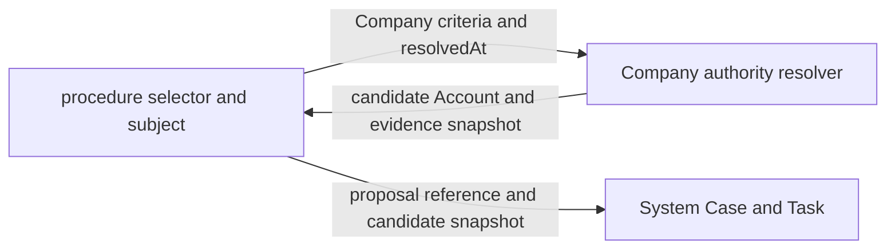

# Company organizational authority

Organizational Authority は、会社のある時点において、誰がどの責任と対象範囲に基づいて判断候補になり得るかを解決する Company の機能である。Technical Permission が API 操作能力を表すのに対し、Organizational Authority は会社上の資格を表す。

判断候補になり得ることと、実際に判断できることは同じではない。Company は候補と根拠を返す。System はその候補を変更不能な Task snapshot として受理し、認証、Account 状態、本人性、除外、委任、必要人数、HumanAttestation を検査して判断を成立させる。業務 App は何について判断するかを所有する。

## Company が所有する理由

直属上司、部門責任者、管理系列、兼務、在籍状態、Account と Employee の対応は会社という存在を構成する事実である。これらを System が解釈すると、System が Employee、Department、Employment、Responsibility を知ることになり、会社を持たない製品や異なる組織モデルで再利用できなくなる。

これらを個別 App または System が解釈すると、expense、leave、contract などが同じ組織資格を必要とするたびに組織規則が複製される。資格解決を Company に一元化し、呼び出し側は Company の公開条件と snapshot だけを利用する。

Company が返す結果を単なる Employee 一覧にすると、判断基盤へ渡す前に呼び出し側が Account 対応、有効状態、自己除外を再実装する。呼び出し側ごとに候補集合が変わり、同じ責任を指定しても異なる判断者が選ばれる。そのため Company の公開 operation は、有効な Employee と有効な Account の対応まで確認した候補と、評価根拠の snapshot を同時に返す。

Company は ProcedureDefinition、申請状態、Proposal body、Case、Task、Decision を知らない。Company に渡すのは、Company が理解できる資格条件、subject Employee、対象部門、解決時刻だけである。

## Technical Permission との分離

Technical Permission は、認証済み Account が特定の API operation を呼べるかを決める。Organizational Authority は、その Account に対応する Employee が対象 Employee または組織単位に対して会社上の責任を持つかを決める。

一方だけで判断を許可しない。`expense:approve` を持っていても対象部門への責任がなければ候補にならない。部門責任者でも必要な Technical Permission、Account の有効性、本人性を満たさなければ判断できない。

旧 `role` selector と `approverRoles` は保存済み定義を読めるよう構文上だけ残すが、Account role から判断候補を列挙しない。workflow が未定義なら手続きは fail closed になり、`role` selector しかない step は候補ゼロになる。経理責任者、人事責任者、契約決裁者などの会社上の資格は Company の ResponsibilityAssignment で表し、Technical Permission は操作能力だけに使う。

## 入力契約

Company は呼び出し元の selector 型を import しない。各 App は自分の入力を次の最小条件へ変換する。

- `employee`: 安定した Employee code で特定の社員を指す
- `direct_manager`: subject の有効な所属に記録された直属上司を指す
- `department_manager`: subject が所属する組織単位の責任者を指す
- `target_department_manager`: App が明示した対象組織単位の責任者を指す
- `responsibility`: 安定した責務 code と、任意の対象 OrgUnit で責任保持者を指す
- `management_chain`: subject から上位へ辿れる管理系列を指す

旧 `legacy_account_role` は過去定義を読み取るための互換値であり、候補を返す条件ではない。新しい workflow には使わない。

入力には `resolvedAt` を必須とする。resolver が内部時計を暗黙に読むと、同じ command の再試行、legacy backfill、監査再構成で別の日の組織が選ばれ得る。`resolvedAt` を会社 timezone の営業日 `asOf` へ変換し、すべての条件を同じ基準日で評価する。

subject が存在しない提案では subject Employee を null にできる。この場合、直属上司や管理系列は候補を返さない。特定 Employee、責任、対象組織など、subject を必要としない条件だけが評価できる。Company は対象を推測して補わない。

## 出力契約

resolver は、一つの時点 snapshot と候補集合を返す。

snapshot は次を持つ。

- schema version
- 組織投影のschema versionと出典
- 会社 timezone で固定した `asOf`
- organization revision

現行resolverが新しく作るsnapshotの出典は`lifecycle`だけである。保存済みの過去snapshotを読めるよう`legacy`値はschema上に残すが、新しい判断でlegacy投影へfallbackしない。

候補は次を持つ。

- Employee ID
- Employee と一意に対応し、有効性を確認した Account ID
- どの入力条件から得たかを示す criterion index
- 所属、上司、責任、管理系列のうち実際に使った証拠

criterion index は、Company が呼び出し側の selector を保存するための値ではない。呼び出し側が自分の条件と Company の証拠を対応付けるための相関値である。呼び出し側は index を元の selector へ戻し、Company snapshot と共に System の候補証拠へ保存する。

候補集合は意思決定の正本ではない。Company の組織事実から導いた変更不能な入力 snapshot であり、System Task が受理した時点から過去の組織変更で書き換えない。

## 時点と revision

lifecycle 投影では、`asOf` に有効な Employment、在籍状態、主務、兼務、上司、ResponsibilityAssignment だけを読む。退職、将来入社、無効化、アーカイブ、廃止組織は候補から除外する。

canonical履歴の下限はmigrationで確定した`baseline_on`である。それより前は旧現在値から過去状態を推測せず、Company APIと新しい資格解決を拒否する。baseline時点で雇用periodを持たない退職者などは、migrationが明示的に保存したbaseline stateからだけ解決し、現在のEmployee列を履歴として読み替えない。migrationに記録した会社timezoneとruntime設定が異なる場合も、同じinstantを別の営業日として判断しないよう資格解決を停止する。

同じ解決で読んだ Employee state の organization revision が一致しない場合、resolver は候補を返さない。異なる revision の所属と責任を混ぜると、現実には存在しなかった組織図を構成できるためである。

resolver は lifecycle 投影を読む前に organization revision を固定し、各 Employee state が同じ revision を参照することを検査し、Account 対応まで解決した後でもう一度 revision を読む。この三点が一致しない場合は途中で組織更新が確定した可能性があるため、候補を返さず conflict にする。呼び出し側は新しい `resolvedAt` を勝手に生成せず、同じ command の値を保ったまま解決全体を再試行する。

各 lifecycle 証拠には assignment period ID、Employee revision、organization revision、`asOf` を含める。管理系列では各 edge の証拠を順番付き path として保存する。現在の組織図だけから過去の経路を推測しない。

過去に保存されたlegacy snapshotはorganization revisionを持たず、完全な履歴正本ではない。これは過去証拠の読取互換であり、現在のresolverが同じ経路を使ってよい理由にならない。migrationが未検証なら新しい判断を停止し、legacy snapshotをlifecycleと同じ保証で表示しない。

migrationを実行するAccountがログインできなくなる循環を避けるため、Systemの認証control planeだけは未移行中のEmployee active状態をbootstrapに利用できる。この例外はCompanyの資格resolverへ入らず、上司、所属、Responsibility、対象範囲を導かない。migration検証後は認証もcanonical Workforceへ切り替わる。

`resolvedAt` と `asOf` は用途が違う。`resolvedAt` は候補解決を実行した instant、`asOf` は会社の勤務・組織規則を評価した営業日である。System の候補 row は `resolvedAt` を持ち、Company の authority snapshot は `asOf` を持つことで両方を失わない。

## Account との対応

Company は Account と Employee の一対一対応を所有する。候補 Employee に対応がない、Account が無効、対応先が別 Employee、Employee が対象時点で在籍していない場合、その候補を返さない。

Account の認証状態や session は System の正本であり、Company snapshot だけで判断を許可しない。候補 snapshot 作成後に Account が停止された場合、System は HumanAttestation の書込み境界で再検査して拒否する。Company snapshot は資格を固定し、System の live guard を置き換えない。

現行の Company 対応 table と Session は整数 Account ID を使うが、resolver は対応する active な `system_accounts` を同じ解決内で確認し、opaque string の canonical System Account ID を返す。System workflow の候補、actor、更新者、委任作成者はこの canonical ID を使う。旧整数と canonical ID の接続規則、live guard、migration の保証は [Workflow Account identity](./workflow-account-identity.md) に定める。

Company の旧対応 table が残ることは、System Account ID を整数として扱ってよい理由にならない。整数は Company 内部の互換キー、文字列は context 境界を越える認証主体の正本である。Company は両者と Employee の対応を検証するが、System は旧整数または Employee を解釈しない。

## 呼び出し側との接続

API composition または業務 App は、procedure selector を Company の条件へ変換する adapter を持つ。この adapter は Company table、Employment、Department、Account role を読まない。Company の解決結果を元 selector と対応付け、authority snapshot を System の候補証拠へ加えるだけである。明示的な authority workflow がない procedure を、role や最上位 Account で補完してはならない。

同じ step に複数条件があり、同じ Account が複数の根拠で候補になる場合、adapter は一つの候補へまとめつつ、すべての根拠を保存する。required approvals は Account 行数ではなく、自己除外後の一意な候補 Employee 数を基準にする現行仕様を維持する。

一つの step の primary 条件と escalation 条件は、一回の Company resolver 呼出しで解決する。二回に分けると途中の組織変更で異なる organization revision が混ざり、同じ step snapshot が一つの会社時点を表さなくなる。adapter は一つの解決結果を primary と escalation に分類し、selector index だけを各配列内の index へ戻す。

組織変更後に既存 Task の候補を再解決しない。再解決が必要な場合は新しい round と resolution ID を作り、旧候補、旧証拠、旧判断を残す。legacy backfill も backfill 実行時刻を明示し、当初から存在した snapshot のように扱わない。

## System との接続

System は Company resolver を呼ばない。System から Company への依存を作らないため、業務 App または最上位の API composition が Company を呼び、検証済み候補を System command へ渡す。

System が保存する候補は canonical Account ID、候補 snapshot の出典、証拠参照、解決時刻である。Employee ID、部署 code、role key、上司 path は System の判断規則に使わない。詳細な Company 証拠を System table に複製する必要がある場合も opaque evidence reference または digest とし、System が中身を解釈しない。

System は候補 snapshot を受け取っても、作成者本人、除外 Account、同一人物の別 Account、停止 Account を受理しない。Company の一対一対応検査と System の主体検査は異なる不変条件なので、片方を省略しない。

## 失敗と fail closed

次の状態では候補を推測せずエラーにするか、該当候補を除外する。

- 会社 timezone または `resolvedAt` から営業日を解決できない
- lifecycle migration が未検証または状態を読み出せない
- 同じ解決内で organization revision が一致しない
- 候補解決の途中で organization revision が変化する
- 上司関係に循環がある
- 対象時点の Employment または在籍状態を再構成できない
- Employee が退職済み、将来在籍、アーカイブ済みである
- Employee と有効 Account の対応がない
- selector の Employee code または対象部門が存在しない
- subject 本人しか候補にならない

存在しない条件を管理者、現在の上司、最上位 role で補わない。候補ゼロは Company resolver の正常な結果であり、呼び出し側が unresolvable step として提出または遷移を拒否する。

上司循環は対象 subject の探索が偶然終了しても許容しない。循環を含む組織投影は管理系列の意味を一意にできないため、解決全体を conflict とする。

## 十分性

Company の Organizational Authority が十分であるとは、あらゆる会社の決裁規程を一つの role 名へ埋め込めることではない。次の問いへ、Company の正本と保存済み snapshot から答えられることをいう。

- どの会社時点の組織と在籍を使ったか
- どの責任または関係が候補を導いたか
- どの Employee とどの Account の対応を確認したか
- 自己、退職、アーカイブ、無効 Account を除外したか
- 組織変更後も当時の候補根拠を再構成できるか
- 評価不能時に推測せず停止したか

判断対象の内容、必要人数、判断結果、委任、実行許可はこの十分性に含めない。それらは App と System の責任である。Company がそれらまで持つと、会社事実と手続きが再び結合する。

会社ごとの決裁規程に、金額帯、地域、法人、事業、職務分掌、職務分離が必要なら、Company の ResponsibilityDefinition、ResponsibilityAssignment、AuthorityScope として追加する。ProcedureDefinition の自由文字列 role や System permission を増やして代用しない。

## 削除と変更

個別 App を削除しても Company resolver は残る。他の App は自分の条件を Company の資格条件へ変換し、直接利用できる。Company はどの App が呼んだかを知る必要がない。

組織モデルを変更するときは、Company の resolver と証拠 schema version を変更する。保存済み snapshot の意味を上書きせず、新しい schema version で新しい round を解決する。過去 snapshot を現在の resolver で再計算し、一致しないから無効とみなしてはならない。

Company 自体を持たない製品では、この resolver を登録しない。System workflow は候補 Account snapshot を別の owner から受け取れるため、Company の存在を前提にしない。

## 矛盾の検査

次の状態は責任境界と矛盾する。

- System が Employee、Department、Responsibility、role key を解釈する
- API composition または業務 App が Company の組織、在籍、Account table を直接読んで候補を作る
- Company が procedure selector、Proposal body、申請状態、Case status を保存する
- Technical Permission だけで対象範囲を決める
- 組織資格だけで API 操作能力または本人性を満たしたと扱う
- resolver が暗黙の現在時刻で再試行し、別の候補を返す
- 進行中 Task の候補が組織変更で暗黙に書き換わる
- legacy と lifecycle の証拠を同じ保証として表示する
- Account に対応しない Employee ID を System 候補として渡す
- snapshot 作成時の Account 有効性だけで判断時の再検査を省く
- legacy Session の整数 Account ID を各呼び出し側で独自に文字列化する

矛盾が必要に見える場合は例外を足さず、会社上の責任、対象 scope、評価時点、Account 対応、System の判断規則のどれが欠けているかを特定する。

## 組織正本と変更契約

OrgUnit は変更される名称や親子関係そのものを ID にしない。安定した opaque identity と、名称、code、kind、親 OrgUnit、有効期間を持つ追記型 period version に分ける。改名、移動、改組、廃止、訂正、取消は既存 row の更新ではなく新しい revision として記録する。

所属と責務も同じく有効期間付きの version である。Assignment は Employee、Employment、OrgUnit、主務または兼務、役職、直属上司を持つ。Responsibility は Employee、Employment、OrgUnit と安定した大文字 token の責務 code を持つ。`MANAGER` と `PEOPLE_OPERATIONS` は同じ仕組みで表せるが、表示名や Account role key を責務 code に流用しない。同じ責務を複数人が持つことは許し、同一保持者、同一 OrgUnit、同一責務の期間重複だけを拒否する。

一回の組織変更は operation ID、expected organization revision、基準日、記録時刻、追加する全 period version を一つの `OrganizationChangeSet` にする。Application は書込み前に、次を全体として検証する。

- OrgUnit identity と period revision の連続性
- 有効期間内の単一 root、code の一意性、親の存続、循環の不在
- Employment に包含される状態、所属、責務
- 有効な OrgUnit への所属と責務
- 主務重複、同等所属重複、自己上司、非在籍上司、管理系列循環
- 責務保持者の所属と Account 対応

検証済み変更だけを一回の atomic batch で追記する。DB は operation の再利用、expected revision 不一致、部分適用、非連続 period revision、追記済み事実の更新と削除を拒否する。operation が `PENDING` の間は snapshot を読めないため、変更途中の組織を権限判断へ公開しない。

Personnel Action は製品固有の入力と既存 wire を維持する adapter であり、所属または責務を変える発令は同じ `OrganizationChangeSet` validator を必ず通す。採用予定者は、同一 transaction で作成される Employee profile、Employment、Status だけを検証用 snapshot に補い、所属を二重適用しない。発令事実、組織 operation、period version、現行互換 projection、監査は同じ batch で確定する。

migration は明示済みの OrgUnit、lifecycle assignment、manager responsibility だけを決定的に backfill する。Account role、役職名、権限から会社上の責務を推測しない。`PEOPLE_OPERATIONS` など manager 以外の責務は、Company の組織変更 operation として明示的に割り当てる。推測できない旧 workflow は自動補完せず、明示的な authority workflow と必要な Responsibility が設定されるまで拒否する。

## 現行実装

`api/src/contexts/company/domain/workforce/resolve-organizational-authority.ts` が、固定済み Workforce state と AccountEmployeeLink だけから資格候補を解決する正本である。DB、Hono、Worker、System schema、暗黙の時計を読まない。criterion、snapshot、candidate、evidence は opaque ID と判別可能な union だけで表し、整数 Employee ID、Department code、自由形式の DB evidence を公開しない。

純粋 resolver は同じ `asOf`、Employee state の一意性、period の所有者と有効期間、Account と Employee の一対一対応、参照先 Employee、組織全体の管理循環を先に検査する。候補が存在しない正常結果と、組織事実を安全に評価できない `OrganizationalAuthorityError` を区別する。候補探索は criterion 順、opaque ID、period IDで決定的に行い、入力配列やDB読取順へ依存しない。

`api/src/contexts/company/application/organization/resolve-organizational-authority-candidates.ts` はcanonical OrgUnit、Assignment、Responsibilityだけを読み、同じ解決内で一つの`asOf`とorganization revisionを固定してから純粋resolverを呼ぶ。migrationが未検証ならlegacy部署とmembershipを読まず停止する。旧整数IDとEmployee codeを既存workflow wireへ戻す変換は互換adapterだけが持ち、Account roleを候補資格として読まない。

`api/src/contexts/company/application/organization/resolve-company-procedure-task.ts` は procedure selector から Company criterion への adapter である。候補列挙、在籍判定、組織探索、Account 対応を自分では実装せず、Company resolver の証拠を System Task の候補 snapshot へ変換する。

現行実装はOrgUnit identity、期間付き階層、Assignment、汎用Responsibility、organization revision、atomic operation、Company資格候補、時点snapshot、canonical System Account ID、System TaskとCompany APIへの接続を実装した。正規条件の探索と検証は共通の純粋resolverへ収束し、Personnel Actionも共通の変更validatorに接続した。`legacy_account_role`と旧整数のCompany対応tableは過去wireの読取互換境界に残るが、新しい候補解決はlegacy組織投影を読まない。法人、地域、金額などOrgUnit以外の条件scopeと合議体は、必要になった時点で別の明示型として拡張する。

判断時の Employee 対応と在籍の再検査は Company の公開 resolver を経由し、Account 状態の正本は canonical `system_accounts` である。System HumanAttestation は Company table を直接読まず、API composition が Company の live な主体対応と System の候補資格を合成する。
