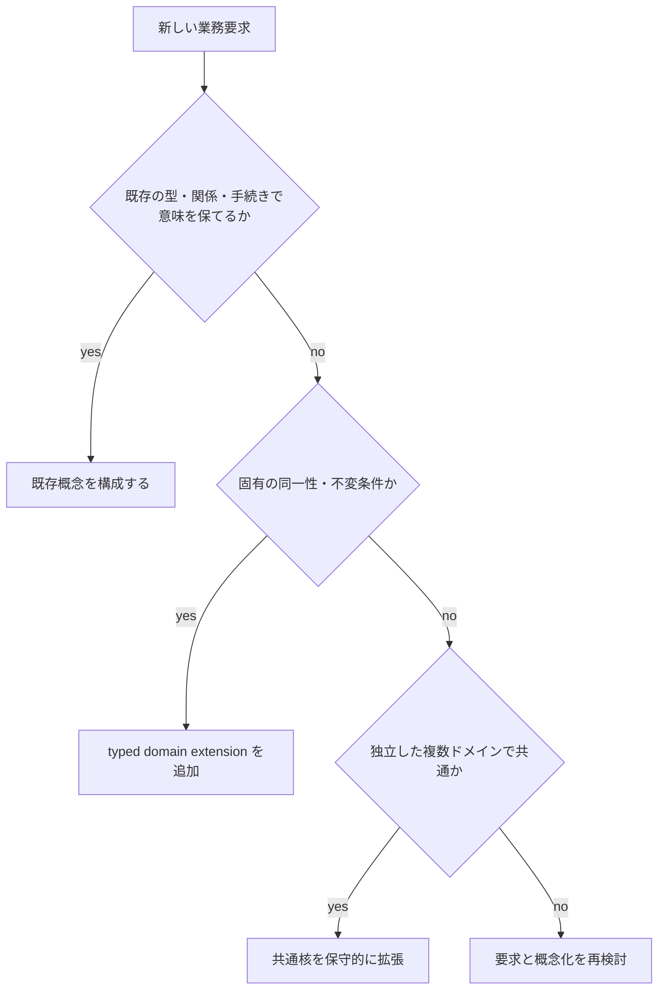
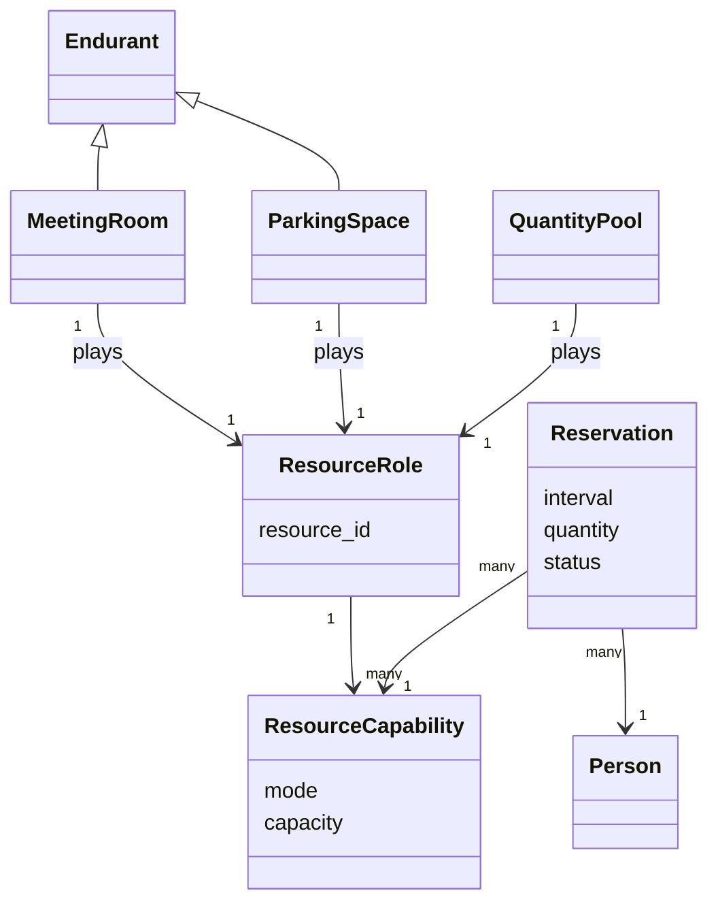

# ドメイン拡張規約

規範性: 仕様正本。新しい業務概念の所有先、型、制約、実装境界、受入条件を定める。

新しい要求は、既存概念の構成、型付きドメイン拡張、共通核の保守的拡張のいずれかで実装する。共通テーブルへの列追加を既定にしてはならない。

## 拡張方式

### 既存概念の構成

既存の型、関係、手続き、方針で意味と不変条件を保存できる場合に使う。排他予約できる駐車区画は、固有 Kind `ParkingSpace` と既存の `exclusive ResourceCapability`、`Reservation` を構成する。

### 型付きドメイン拡張

固有の同一性、項目、不変条件、ライフサイクルがある場合に使う。namespace、schema version、validator、migration を必須とする。未検証の任意 JSON を使用してはならない。

### 共通核の拡張

二つ以上の独立ドメインで同じ意味、同一性、不変条件が必要な場合だけ使う。既存モデルの結論を変えない保守的拡張とする。既存語の意味を変える場合は、新しい版、migration、decision record を作る。

## 拡張契約

各ドメインは次を宣言する。

- domain code と責任範囲
- Kind、Role、Phase、Relator
- 共通核から輸入する概念
- 能力質問と反例
- identity と natural key
- 状態機械と許可遷移
- valid time、recorded time、definition version
- Principal、TechnicalPermission、OrganizationalAuthority、scope、field policy
- 作成、更新、訂正、取消、archive、保持
- internal、human、external の実現主体
- API command、query、event
- idempotency、競合、外部障害、reconciliation
- migration と旧データの意味
- Mermaid 関係図と実装 mapping

不足項目がある拡張を実装してはならない。

## 予約理論

会議室と駐車場は、資源能力を時間区間へ確保する `Reservation` を共有する。画面項目の類似を共有理由にしてはならない。

mode は次を使う。

- exclusive: 同じ能力の重複する有効時間区間を拒否する
- capacity: 重複区間の予約量合計を容量以下にする
- shared: 重複を許可し、利用規則を適用する
- consumable: 在庫数量を減らす
- entitlement: 同時利用権を割り当てる

会議室の収容人数、設備、レイアウトは会議室 extension が所有する。駐車場の車高、車種、充電設備は駐車 extension が所有する。共通 Reservation schema へ追加してはならない。

## 図書理論

- `BibliographicWork`: 内容としての著作
- `BookEdition`: 出版社、ISBN、版、刊行情報
- `BookCopy`: バーコード、状態、所在を持つ物理個体
- `Loan`: 借受者、copy、貸出期間、返却状態
- `HoldRequest`: 利用可能になった場合の待ち要求

`HoldRequest` を資源確保済み `Reservation` として表示してはならない。物理 copy を確保した時点を別に記録する。

## 法務、税、決済

これらを会社モデルから削除してはならない。実現主体を外部へ割り当てる。

- 内部で保持する: Case、入力事実、社内 Decision、ApprovedInstruction、ExternalHandoff、外部 Assertion、Evidence、deadline、reconciliation
- 外部へ委ねる: 法的判断、税計算、給与計算、仕訳判断、資金移動、清算
- 必須 metadata: jurisdiction、rule version、source、input digest、external reference、performed_at、received_at、acceptance status

外部結果の mapping は versioned adapter が所有する。外部の `success` だけで社内承認、送信、受理、支払、清算、会計、税務を完了させてはならない。

## 受入検査

- 対象を重複せず識別できる
- Kind と Role を区別する
- 定義と案件、予定と事実、主張と採用を区別する
- 予約制約を transaction または同等の排他機構で守る
- 過去の判断に当時の組織関係と方針版を使う
- AI が HumanAttestation を代替できない
- 承認内容と実行 payload の digest が一致する
- retry で side effect が重複しない
- 外部停止、重複、順序逆転から回復できる
- source、単位、法域、版を変換後も保持する
- archive と訂正後も履歴を再構成できる
- Web、CLI、AI、外部 callback で同じ意味になる

## 採用条件

次のいずれかが未定義なら実装を開始してはならない。

- identity
- 所有ドメイン
- system of record
- 不変条件と反例
- 認可と会社上の権限
- 時間と版
- 外部境界
- 訂正、取消、障害回復

`metadata を後から追加できる` という性質を、採用条件への回答として使用してはならない。

## 現行実装差分

拡張の実装状態は [能力台帳](./capability-map.md)、schema、migration、route、テストを正とする。図書、駐車場、法務、税、決済の概念例を、機能実装済みという根拠にしてはならない。
