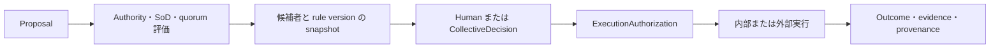

# 管理権限規程テンプレート

`effective_from` が未設定であり、`authority_rules` も空である。値を設定して正式規程として承認、施行するまでは publish または認可根拠に使用しない。法的助言として使用しない。

## 目的

会社上の意思決定権限、起案、審議、承認、実行、記録を分け、誰がどの文脈で会社を拘束できるかを明確にする。

## 概念

- `OrganizationalAuthority`: 会社として判断する権限
- `Proposal`: 対象、差分、効果を固定した起案
- `Decision`: 権限主体による判断行為と結果
- `HumanAttestation`: 人間本人が提案内容を確認した記録
- `CollectiveDecision`: 合議体の構成員、定足数、議決による決定
- `ExecutionAuthorization`: 決定後に発行する対象限定の実行許可
- `DecisionRecord`: 判断主体、根拠、版、時点、内容 digest の記録
- `ResponsibilityAssignment`: 対象と成果への継続責任を役職または合議体へ割り当てる関係

TechnicalPermission、OrganizationalAuthority、CaseAssignment、HumanAttestation を同一視しない。

## 組織上の主体

自社は、一人役職、責任 role、合議体を別々に定義する。

- 一人役職は就任者と有効期間を持つ。
- 責任 role は部署、案件、関係から導出する根拠を持つ。
- 合議体は構成員、任期、定足数、議決方式、利益相反、議事記録を持つ。

現行 `org-role` だけではこの差を完全に表現できない。合議体を一人の role assignment や一件の approval row で代用しない。

## DecisionRule

自社の rule は、少なくとも次を定める。

- action type と対象
- initiator、decider、consulted、executor、accountable な ResponsibilityAssignment
- 法人、組織、案件、法域
- TechnicalPermission と OrganizationalAuthority
- 自己判断、利益相反、職務分離
- 単独決定または CollectiveDecision
- quorum と decision method
- 条件、優先順位、例外、規則なしの既定拒否
- 必要な evidence と retention policy
- 実装 mapping と conformance test

rule metadata と本文を二重の正本にしない。人間向け本文は同じ構造化 rule から生成するか、差分を publish 前に拒否する。

## 金額条件

金額 threshold を使う場合は、数値だけでなく次を定める。

- currency
- 税込または税抜
- 一件、契約、案件、月などの集約単位
- 分割による threshold 回避を検出する期間と単位
- 為替換算 source と基準時点
- amount_min と amount_max の境界包含
- 予算内外と budget version
- 法人、部署、カテゴリ

公開 repository には自社の実額を置かない。deployment 固有の非公開 policy source で管理する。

## 標準の意思決定

1. 起案者が Proposal を作成し、対象、差分、効果、revision、evidence を固定する。
2. Policy evaluation が decider、quorum、職務分離、必要な外部判断を決める。
3. review 開始時に候補者、authority assignment、ResponsibilityAssignment、rule version を snapshot する。
4. 権限を持つ人間または合議体が proposal digest へ Decision を記録する。
5. 実行直前に状態、authority、digest、expiry を再検査する。
6. ExecutionAuthorization に限定された command だけを実行する。
7. Proposal、Decision、Execution、Outcome、継続責任主体を同じ correlation で記録する。

AgentPrincipal、ServicePrincipal、ConnectorPrincipal を decider または継続責任主体にしない。方針が継続責任主体を要求する操作で有効な ResponsibilityAssignment を決定できない場合は拒否する。

## 委任

次を別の制度として定義する。

- AuthorityDelegation
- ActingAssignment
- StandingSubauthority
- TaskProxy
- ExecutionMandate

範囲、期間、対象、再委任、取消、委任元の保有権限を検査する。代理操作では委任元と実行者をともに記録する。

## 緊急判断

緊急の会社判断を通常 proposal の自己承認として扱わない。専用 action、適格条件、必要最小範囲、expiry、evidence、実行後の PostReview obligation を持つ。

緊急アクセスと緊急の会社判断を分ける。法令、定款、契約、policy が省略を許さない合議、外部専門判断、職務分離は緊急という理由だけで解除しない。

## 法務、税、支払

社内 Decision は、法的判断、税計算、契約締結、送金、清算、会計記帳を自動的に完了させない。必要な場合は ApprovedInstruction を外部製品または専門家へ渡し、返却値を出所付き Assertion として照合する。

## 記録と保持

保持期間はこのテンプレートへ固定しない。記録カテゴリ、法域、契約、legal hold、個人情報方針を入力に、自社が版付き policy で定める。

役職解除、退職、rule 改定後も、過去の candidate、authority、Decision、digest、policy version を再構成できるようにする。assignment と decision record を通常操作で物理削除しない。

## 現行実装の制限

現行の `authority_rules` は宣言 metadata であり、全業務 API の decision を強制しない。現行 `org-role` review は合議体 quorum を表さず、review 候補者と authority assignment の完全な snapshot も持たない。

これらが実装されるまで、同期、review、publish を会社上の決裁権限が技術的に保証された証明として扱わない。
