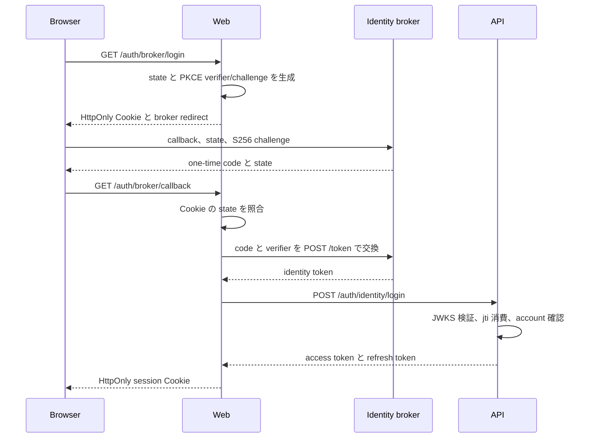
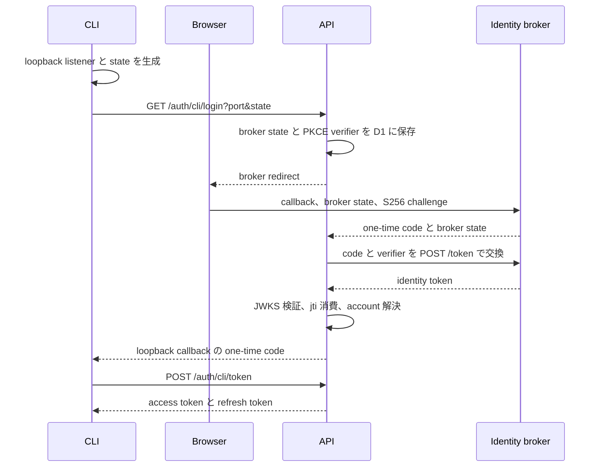

# Identity とセッション

人間のログインは、製品内のパスワード認証と、外部 identity broker による本人確認の二経路を持つ。どちらの経路も最終的なアカウント状態、permission、session 発行、失効を API が判断する。

外部 identity broker は本人確認結果だけを渡し、製品のアカウント、permission、access token、refresh token を管理しない。

## Token の分離

- identity token は外部 identity broker が発行する 60 秒の身元証明である。
- access token は API が発行する API 呼び出し用の短命 Bearer token である。
- refresh token は API が hash を D1 に保存し、利用時にローテーションする。
- identity token を access token として API resource に送らない。
- access token または refresh token を identity broker に送らない。

identity token は Ed25519 の公開 JWKS で検証する。利用側は `alg=EdDSA`、`kid`、署名、`iss`、`aud`、`exp`、`sub`、`email`、`email_verified`、`name`、`jti` を検査し、`jti` を一回だけ原子的に消費する。

API の access token は `JWT_SECRET` で検証し、request ごとに account の状態、token version、permission を解決する。外部 identity の署名鍵と API session の署名鍵を共有しない。

## Web の外部 identity ログイン

state と PKCE verifier は `HttpOnly`、`Secure`、`SameSite=Lax` の state 専用 Cookie に保存する。identity token は callback query、ブラウザ JavaScript、Cookie に渡さず、Web server と broker、API のバックチャネルだけで扱う。

## CLI の外部 identity ログイン

CLI が broker 用 PKCE verifier や identity token を保持することはない。API は broker state、PKCE verifier、CLI の loopback port と state を 10 分の一時レコードに保存し、callback で原子的に消費する。

loopback に返す code は 60 秒で失効し、D1 には hash と解決済み account ID だけを保存する。`POST /auth/cli/token` は code を原子的に消費し、最新の account 状態と Company の account・employee 対応を再確認してから session を発行する。

## 外部 identity 設定

- `IDENTITY_ISSUER`: identity token の `iss` と JWKS origin
- `IDENTITY_AUDIENCE`: Web の identity login が期待する `aud`
- `IDENTITY_LOGIN_URL`: broker のログイン入口
- `API_ORIGIN`: CLI callback URL と CLI identity token の `aud` の基準
- `IDENTITY_JWKS`: ローカル開発とテストだけで使う public JWKS

本番は `IDENTITY_ISSUER` の `/.well-known/jwks.json` を取得する。issuer は HTTPS の origin だけを許可し、userinfo、path、query、fragment を含む URL を拒否する。

## 失敗時の結果

- 外部 identity 設定、JWKS、署名、claim、state、PKCE、code、account 状態を検証できなければ session を発行しない。
- identity token の `jti` が再利用された場合は 401 を返す。
- D1 または監査への書き込みに失敗した場合は認証を成功させない。
- CLI callback は検証済み state から得た `127.0.0.1` の port だけへ戻す。
- access token の期限切れ時は refresh token をローテーションし、失効済み refresh token は再ログインを要求する。
