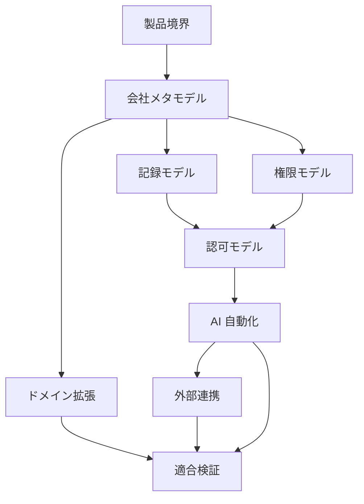

# open-karte

open-karte は、社内の人、時間、物、お金、成長に関する事実、申請、判断、記録を一つの会社モデルへ結び付けるセルフホスト基盤である。

## 目的

- 従業員台帳を人と組織の基点にする
- 業務上の主体、資源、関係、手続き、判断、記録を共通概念で表す
- Web、CLI、AI、batch、外部 callback に同じ認可と業務制約を適用する
- AI が変更案と根拠を作成し、必要な操作を人間が承認できるようにする
- 外部製品と API で接続し、正本、責任、失敗回復の境界を固定する
- 新しい業務を既存概念の合成または型付き拡張として追加できるようにする

## 責任境界

open-karte は、事実の記録、更新、検索と、それに伴う申請、判断、証跡、外部連携を扱う。

法務、税、給与、会計、本人確認、信用判断、決済は会社モデルから除外しない。入力、依頼、外部結果、採否、照合、証跡を保持し、最終計算、法的判定、申告、仕訳、資金移動を実行しない。

公開リポジトリには、開発元または利用者の自社に固有の事業、戦略、顧客、契約、取引、財務、役職、金額基準、個人情報、認証情報を含めない。

## 会社モデル

- [製品境界](./product-purpose.md): 所有、調整、外部実現、非対象
- [[feature-tiers|機能区分]]: System、Company、Apps、外部連携、既定の有効状態
- [会社メタモデル](./company-model.md): 主体、資源、関係、時間、手続き、記録
- [記録モデル](./records-model.md): 出来事、状態、主張、判断、版、来歴、訂正
- [権限モデル](./authority-model.md): 組織上の権限、委任、合議、緊急判断
- [認可モデル](./authorization-model.md): Principal、permission、scope、field、案件資格
- [AI 自動化](./automation-model.md): 提案、人間承認、実行許可、監査
- [外部連携](./integration-model.md): port、adapter、配送、正本分担、照合
- [ドメイン拡張](./domain-extension.md): 共通概念の合成、固有 metadata、受入条件
- [適合検証](./verification-model.md): 写像、可換性、脆弱性、release gate

## 実装

- [アーキテクチャ](./architecture.md): workspace、層、依存方向、transaction 境界
- [Identity とセッション](./identity-and-sessions.md): パスワード、外部 identity、Web、CLI、token の信頼境界
- [API](./api-schema.md): resource、command、応答、型生成
- [機能](./features.md): domain ごとの実装済み操作
- [画面](./sitemap.md): Web route と画面責務
- [状態遷移](./user-flows.md): 主要な操作と状態変化
- [会社の解体図](./capability-map.md): System、Company、Apps、外部連携、実装状態
- [System workflow](./system-workflow.md): 案件、判断、委任、実行許可、責任境界
- [Company organizational authority](./company-organizational-authority.md): 判断資格、時点 snapshot、Account 対応、System と App への接続
- [Company API](./company-api.md): opaque ID、時点snapshot、原子的な組織変更、失敗契約
- [ロールと権限](./roles-and-permissions.md): permission カタログ、system role、プリセット、scope 判定
- [用語](./glossary.md): 共有する型と概念
- [governance](./governance/README.md): 規程、手続き、統制、公開、施行

route、table、column、入出力型の現存状態は、コード、migration、生成型と一致させる。会社モデルに存在する未実装概念を runtime の保証として使用してはならない。

## 不変条件

- 法人と deployment の境界は [Deployment と法人](./architecture.md#deployment-と法人) に従う
- HumanPrincipal、AgentPrincipal、ServicePrincipal、ConnectorPrincipal を同一視しない
- TechnicalPermission、OrganizationalAuthority、CaseAssignment、HumanAttestation、ExecutionAuthorization を相互代替しない
- 出来事、状態、主張、判断、記録を同一視しない
- valid time、recorded time、policy time を分離する
- 提案内容と実行内容を同じ digest へ固定する
- 実行直前に主体、権限、対象、状態、版、期限を再検査する
- 外部結果を出所付き Assertion として保存し、採用と照合を分離する
- 新しい domain metadata を無検証の共通 JSON または共通 table 列として追加しない
- 意味、主体、対象、時点、版、根拠を確定できない操作を拒否する
