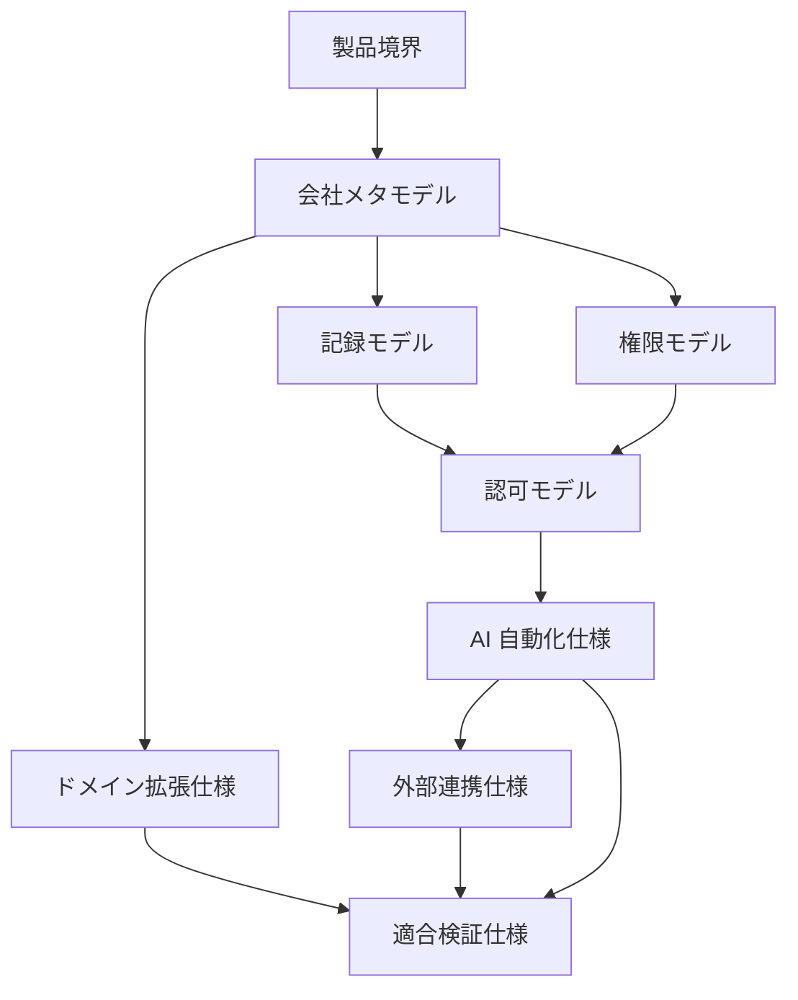

# open-karte 文書体系

規範性: 仕様 manifest。`.docs` は open-karte の製品仕様であり、製品の意味、境界、不変条件、認可、外部連携、拡張規則、実装適合条件を定義する。

## 仕様解釈

規範語を次の意味で使用する。

- 必須: 常に満たす。未実装は実装不足として扱う
- 禁止: 経路、主体、実装方式を問わず許可しない
- 許可: 明記した条件をすべて満たす場合だけ認める
- 推奨: 例外理由を記録した場合だけ逸脱できる
- 未実装: 仕様を満たしていない。実装済みと推定しない
- 外部実現: 能力は会社モデルに含むが、計算、判定または副作用を open-karte が実行しない
- 例: 要件の適用方法を示す。例だけから新しい要件を推定しない

仕様にない権限、状態遷移、データ変換、外部副作用は許可しない。意味、主体、対象、時点、版または根拠を確定できない場合は拒否する。

各文書は H1 直後の `規範性:` で次のいずれかに分類する。

- 仕様 manifest: 文書分類、解釈規則、優先順位
- 仕様正本: 製品要件と不変条件
- 補助仕様: 仕様正本を限定せずに写像または短縮定義を追加する仕様
- 実装写像: 現行実装と仕様の対応 snapshot
- 根拠記録: 非規範の用語、判断履歴、外部調査
- 非規範記録: 計画、例、観測、移行履歴
- 未施行テンプレート: schema 検証対象だが、導入組織では未承認かつ未施行の文書

## 仕様正本

- [製品境界](./product-purpose.md): 所有、調整、外部実現、非対象
- [会社メタモデル](./company-model.md): 型、関係、公理、ドメイン合成、データ写像
- [記録モデル](./records-model.md): 出来事、状態、主張、判断、記録、時間、訂正
- [権限モデル](./authority-model.md): 会社上の権限、判断、委任、合議、緊急判断
- [認可モデル](./authorization-model.md): Principal、permission、scope、field、案件資格、実行可否
- [AI 自動化仕様](./automation-model.md): 提案、人間承認、実行許可、監査
- [外部連携仕様](./integration-model.md): port、adapter、配送、正本分担、照合
- [ドメイン拡張仕様](./domain-extension.md): 既存概念の合成、型付き拡張、共通核の変更
- [適合検証仕様](./verification-model.md): 写像、可換性、脆弱性、release gate

## 実装写像

- [機能面](./features.md): 現行機能の業務操作
- [画面面](./sitemap.md): 現行 route と到達可能な操作
- [状態遷移面](./user-flows.md): 現行の主要フロー
- [能力適用範囲](./capability-map.md): 会社能力、製品責務、実現主体、実装状態

実装写像は仕様正本を変更しない。仕様正本との不一致は、明示された未実装差分または実装不具合として扱う。route、table、column、入出力型の現存確認にはコード、migration、生成型を使用する。

## 補助仕様

- [実装アーキテクチャ](./architecture.md): workspace、層、依存方向、transaction 境界
- [API 仕様](./api-schema.md): resource、command、応答、型生成規則
- [用語集](./glossary.md): 製品用語の短縮定義
- [ロールと権限](./roles-and-permissions.md): permission カタログ、動的ロール、scope 権限、system role とプリセット
- [governance](./governance/README.md): 導入組織の規程 schema と未施行テンプレート

補助仕様は仕様正本の意味を変更しない。

## 根拠記録

- [制度用語](./references/README.md): 外部制度の参照語彙
- [設計判断](./decisions/README.md): 採用済み判断と置換関係
- [根拠資料](./sources/README.md): 外部標準と法制度の調査 snapshot

根拠記録は非規範であり、仕様正本へ明記されない認可、法的判断、税計算、支払実行を生成しない。

## 非規範記録

- [実装計画](./plans/README.md)
- [IAM 分離移行記録](./iam-auth-design.md)
- [業務メモ](./notes/README.md)
- [作業候補](./backlogs/README.md)
- [観測記録](./signals/README.md)

非規範記録は要件、実装済み状態、認可根拠として使用しない。仕様正本と矛盾する記述は無効とする。

## 優先順位

同じ主題の記述が一致しない場合は、次の順に処理する。

1. 仕様正本の不変条件と禁止事項を優先する
2. より限定された domain 仕様を共通仕様へ追加適用する
3. current route、schema、型はコード、migration、生成型で確認する
4. 導入組織の規程は、承認、公開、施行期間、対象、版が確定した場合だけ適用する
5. 補助仕様、根拠記録、非規範記録から実行規則を推定しない

解決できない矛盾は仕様欠陥として記録し、安全側へ拒否する。実装または文書を暗黙に読み替えない。

## 全体不変条件

- HumanPrincipal、AgentPrincipal、ServicePrincipal、ConnectorPrincipal を同一視しない
- TechnicalPermission、OrganizationalAuthority、CaseAssignment、HumanAttestation、ExecutionAuthorization を相互代替しない
- 出来事、主張、判断、記録を同一視しない
- 提案内容と実行内容を同じ digest へ固定する
- 実行直前に主体、権限、対象、状態、版、期限を再検査する
- 法務、税、給与、会計、決済の最終計算、判定、副作用を内部実装しない
- 外部結果を出所付き Assertion として保存し、採用と照合を分離する
- 新しい domain metadata を無検証の共通 JSON または共通 table 列として追加しない
- Web、CLI、AI、batch、callback に同じ application policy を適用する
