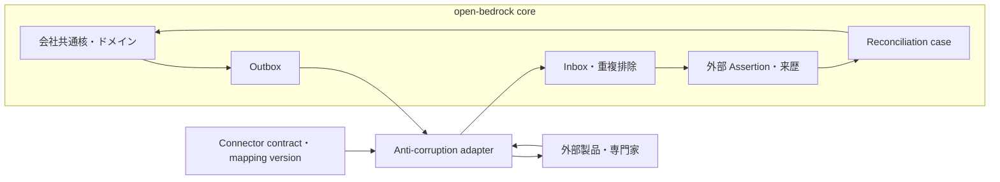
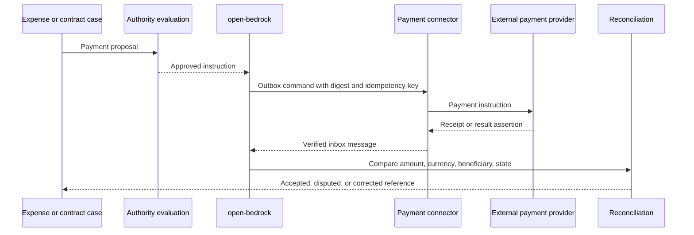

# 外部連携モデル

会社共通核とドメインを内部の意味の正本とする。外部 API、人間運用、専門家との接続には port、adapter、版付き接続契約を使う。外部製品のデータモデルへ会社概念を従属させてはならない。

## 境界

外部の status、role、ID、payload をドメインへ直接保存してはならない。adapter は外部語彙を canonical command、event、query、assertion へ変換し、mapping version を来歴へ残す。

## 接続契約

各 connector は次を宣言する。

- connector code と contract version
- source system と tenant
- inbound、outbound、bidirectional の方向
- canonical command、query、event、assertion
- 項目単位の system of record
- namespace 付き internal ID と external ID の対応
- schema version と mapping version
- 単位、通貨、timezone、locale、法域
- authentication と ConnectorPrincipal
- TechnicalPermission と OrganizationalAuthority
- correlation ID、causation ID、idempotency key
- delivery、retry、timeout、ordering、rate limit
- duplicate、late arrival、out-of-order の処理
- conflict policy と manual override
- reconciliation method と cadence
- raw payload の保持、mask、retention
- outage 中に受理する操作と状態

connector の tenant は外部製品内の接続対象を識別する。法人の選択、内部認可 scope、database partition に使用してはならない。

`bidirectional` だけを項目所有規則として使用してはならない。各項目を internal authoritative、external authoritative、human adjudicated、mergeable、immutable reference のいずれかに分類する。

## メッセージ型

- `Command`: 外部主体への実行依頼
- `Dispatch`: command を送信した出来事
- `Receipt`: 外部が受理したという応答
- `ExternalEvent`: 外部側で出来事が起きたという通知
- `ExternalAssertion`: 外部主体による状態または結果の主張
- `Reconciliation`: 内外の記録を比較し、採用、係争、訂正する過程

HTTP `200` を業務成功として扱ってはならない。送信、受理、処理中、業務完了、清算、照合完了を別状態にする。

## 配送

- 業務状態と outbox message を同じ transaction で確定する
- worker は idempotency key 付きで outbox を送信する
- 応答または webhook を inbox へ保存し、署名と replay を検査する
- `(source, external_event_id)` などの安定 key で重複排除する
- canonical assertion への変換と来歴を保存する
- timeout、retry exhaustion、semantic error を例外案件へ送る
- reconciliation で欠落、重複、状態差を検出する

内部 transaction と外部 API を分散 transaction にしてはならない。at-least-once delivery を前提とする。外部 operation が冪等でない場合は、事前照会、外部 request ID、手動確認を接続契約へ定義する。

## 正本と競合

- internal authoritative: 外部変更を提案または差分として扱う
- external authoritative: 検証済み外部 assertion を採用する
- human adjudicated: 人間の reconciliation task を要求する
- mergeable: 明示した可換 merge を使う
- immutable reference: 新しい版または訂正を作る

最新 timestamp の値を無条件採用してはならない。採用値、却下した assertion、競合理由、判断主体、mapping version を保持する。

## 外部の計算と判断

法務、税、給与、会計、本人確認、信用判断は `ExternalDeterminationRequest` として依頼する。結果は `ExternalAssessment` または `ExternalComputation` として受領し、次を保持する。

- source と資格または契約参照
- 対象と jurisdiction
- input digest と record version
- rule、model、calculation version
- performed_at と received_at
- result、単位、丸め、説明、evidence
- supersedes または corrects
- acceptance status

open-bedrock は算術または法的判断を再実装しない。schema、署名、対象、版、単位、整合性を検証する。

## 支払

open-bedrock は支払提案、社内判断、外部指示、外部参照、結果主張、照合を保持する。資金移動、銀行残高、清算台帳、仕訳、税務確定を内部実行してはならない。

## セキュリティ

- ConnectorPrincipal と secret boundary が外部資格情報を保持する
- AI と Web client へ外部資格情報を渡さない
- connector の operation、tenant、対象、field、rate を制限する
- webhook の署名、timestamp、nonce、clock skew、body digest を検証する
- outbound payload へ field policy と目的制限を適用する
- raw payload と error へ秘密、token、不要な個人情報を残さない
- SSRF、redirect、DNS rebinding、任意 URL callback を拒否する
- mapping と connector 更新へ review、version、rollback、canary を適用する

## 交換条件

外部製品の交換は、会社モデルと application service を変更せず、adapter と migration mapping の追加で行う。外部製品間の意味差を隠してはならない。表現できない意味は loss report と manual process へ記録する。

適合テストは次を検査する。

- canonical input から外部 request への変換
- 外部 response から canonical assertion への変換
- round trip で保持する ID、単位、時点、source
- 未対応値と未知 enum の拒否または隔離
- duplicate、retry、timeout、out-of-order
- connector 停止中の内部状態と再開
- reconciliation と手動訂正

## 現行実装差分

現行実装には connector registry、ConnectorPrincipal と machine credential、operation と idempotency key を固定した交換、外部 Assertion、reconciliation run と item、lease 付き Job、outbox、重複排除する inbox、retry、dead letter がある。connector の停止は対応 Principal の新規 token 発行を止め、交換、Assertion、照合、再投入は revision と監査証跡を残す。

transport 固有の署名検証、外部資格情報の取得、mapping、rate limit、circuit breaker、raw payload の mask と retention は adapter が実装する。これらを共通基盤が代行したと扱わず、外部 SDK を domain または route へ直接組み込んではならない。
