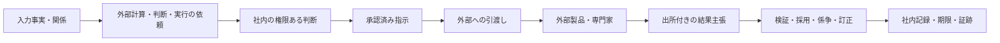

# 製品目的と境界

open-bedrock は、会社で生じる事実、関係、依頼、判断、作業、証跡を同じ意味体系で管理する。人間と人工知能（AI）エージェントは、同じ業務規則と認可を通して社内事務を実行する。

## 目的

- 人、組織、時間、資源、金銭量、成長に関する識別、関係、状態、履歴を保持する
- 申請、予約、貸出、タスク、判断、承認、取消、訂正を調整する
- Web、CLI、AI、外部コールバックへ同じ業務 API を提供する
- 誰が依頼、提案、承認、実行し、どの結果を採用したかを再構成する
- ドメイン固有の意味を型付き拡張として追加する

## 対象範囲

open-bedrock は管理部門（総務、人事、情シス、経営管理）の業務を対象とする。販売、顧客管理、在庫、製造、調達などの事業ドメインは扱わない。取引先台帳、契約記録、反社チェックのような、管理部門が担う対外業務は対象に含める。

## 製品が所有する責務

open-bedrock は次を所有する。

- 人、組織、アカウント、組織関係、資源、案件の内部識別子
- 有効期間を持つ関係、状態、予定、出来事
- 依頼、申請、タスク、判断、承認、差戻し、取消、訂正
- 技術的権限、会社上の決裁権限、案件資格、項目範囲の合成
- AI の提案と人間承認を結ぶ変更不能な実行契約
- 外部システムへの指示、外部から受領した主張、照合、例外案件
- 記録、来歴、監査、保持、開示制御

## 外部へ委ねる責務

open-bedrock は次を最終計算、最終判断、実行の正本として所有しない。

- 給与、税、社会保険料の計算
- 法令適合性、契約解釈、届出義務の専門判断
- 仕訳、決算、税務申告
- 送金、決済、清算、銀行残高
- 電子署名の法的効力判定
- 本人確認、信用、制裁、反社会的勢力の最終判定

open-bedrock は、これらの入力事実、依頼、社内判断、承認済み指示、外部への引渡し、外部結果の主張、採否、期限、証拠を保持する。

支出承認、契約締結、支払指示、資金移動、決済完了、会計記帳、税務確定を別の出来事として保持する。一つの状態で代用してはならない。

内外の線引きは金額の有無ではなく、誤りの回復可能性で決める。記録の誤りは訂正で回復できる。計算、法的判定、資金移動の誤りは金銭損害や法令違反に直結するため、外部の専門製品と専門家に委ねる。

## AI に許可する操作

AI は独立した `AgentPrincipal` として認証する。AI は、人間のアカウントを借用してはならない。

方針が明示的に許可した範囲で、AI は次を実行できる。

- 情報の検索、整理、差分作成、検証
- 正規化した変更提案の作成
- 可逆かつ低リスクな操作
- 人間が承認した提案の限定実行
- 外部連携の再試行、照合、例外案件の起票

AI への委任は、操作、対象、項目、目的、時間、予算、外部接続先を制限する。

## AI に禁止する操作

- 人間本人の承認を生成する
- 自分の提案を人間承認として確定する
- 承認後に提案内容を変更して実行する
- 自分の権限、委任、承認規則、監査保持、実行境界を拡張する
- 外部の計算、判断、主張を無条件に社内の確定事実へ変換する

## 安全上の不変条件

- 意味、権限、対象、版、時点を確定できない場合は拒否する
- 承認が必要か判定できない場合は、人間承認または外部専門判断を要求する
- 外部接続の停止を外部成功として扱わない
- 記録の物理削除より無効化、訂正、秘匿、保持期限による処理を優先する
- Web、CLI、AI、外部コールバックへ同じ業務規則を適用する
- 画面、部署名、現在の機能構成を会社概念の永続的な境界にしない
- 任意 JSON を拡張モデルとして採用しない
- 圏論を概念定義、法的妥当性、セキュリティ証明の代替にしない

## 法人固有情報

自社の事業計画、顧客、取引、組織固有の役職名、固有の金額基準を製品既定値にしてはならない。法人固有の情報は、規程、権限割当、組織構造、業務記録、外部接続設定として deployment の非公開 source で管理する。個人情報と認証情報には目的制限、項目認可、秘密管理を適用する。

初期データとサンプル設定は未施行とし、自社の権限ある主体が承認して施行するまで業務判断へ使用してはならない。

## ドメイン受入条件

新しいドメインは、次を定義するまで実装してはならない。

- 存在する対象、出来事、状態、主張
- 関係、能力、義務、禁止、許可
- 提案者、判断者、承認者、実行者
- 有効時点、法域、版、文脈
- 内部で所有する責務と外部へ委ねる責務
- 失敗、競合、取消、訂正、再試行
- 結果を再構成する証拠と来歴

## 現行実装差分

機能ごとの実装状態は [能力台帳](./capability-map.md) に記録し、コード、migration、テストと一致させる。未実装の概念を、実装済みまたは技術的に強制済みとして扱ってはならない。
