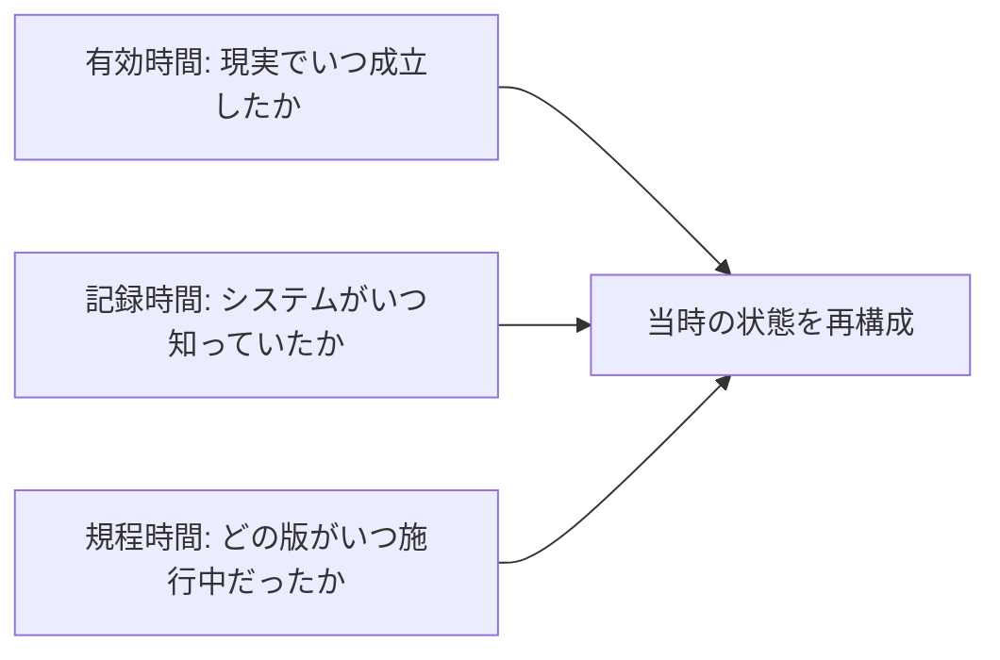

# 記録・時間・来歴モデル

open-karte は、出来事、状態、観測、主張、評価、採用、判断、記録を別の概念として保持する。データベース行を現実そのものとして扱ってはならない。

## 基本型

- `Event`: 現実またはシステムで起きた出来事
- `Situation`: ある時点または期間に成立する状態
- `Observation`: 観測主体と観測方法を伴う内容
- `Assertion`: 主体またはシステムが真であると述べた命題
- `Assessment`: 専門家、外部製品、AI による評価または算出結果
- `ExternalDeterminationRequest`: 外部主体へ評価または計算を依頼する不変記録
- `ExternalAssessment`: 外部主体が判断として作成した `Assessment`
- `ExternalComputation`: 外部主体が計算として作成した `Assessment`
- `DecisionAct`: 権限を持つ主体が判断した出来事
- `DecisionContent`: 判断対象、理由、条件を含む情報
- `DecisionOutcome`: 承認、却下、差戻し、棄権などの結果
- `AcceptanceStatus`: 未検証、採用、却下、係争中、訂正済みの区別
- `Evidence`: 主張または判断を支持、反証する情報
- `Record`: 情報を保持する不変版
- `Provenance`: 生成、変換、参照、責任主体の連鎖
- `MetricDefinition`: 指標の意味、入力、計算、単位、時間、認可を定める版付き定義
- `MetricObservation`: MetricDefinition の特定版と入力 snapshot から得た時点または期間付きの値

外部の支払結果は `SettlementAssertion` として保存する。外部主体、署名、外部 ID、金額、通貨、対象、取得時刻を保持し、銀行の清算出来事と同一視してはならない。

`ExternalDeterminationRequest` は目的、対象、法域、入力 digest、要求時点、依頼先を保持する。`ExternalAssessment` と `ExternalComputation` は request 参照、source、資格または契約参照、rule または model version、performed_at、received_at、acceptance を保持する。外部結果を内部の `DecisionAct` と同一視してはならない。

## 記録文脈

判断または訂正に使う文は、次の文脈を失ってはならない。

- subject
- predicate
- object または単位付き value
- modality: 事実、予定、義務、禁止、許可、能力、仮定
- valid time: 現実世界で成立する期間
- recorded time: システムに記録されていた期間
- policy time: 根拠規程が施行されていた期間
- context: 組織、法域、案件、目的
- source
- provenance: 入力、変換、版、署名、実行 ID
- acceptance
- classification

この文脈を全テーブルの共通列として実装する必要はない。記録から判断結果までの経路で保存する。

## 時間

- valid time、recorded time、policy time を別々に保持する
- 期間は `start <= t < end` の半開区間で評価する
- 現在の関係を過去の判断資格へ遡及適用しない
- 遅延到着と訂正を元の出来事の発生時刻へ上書きしない

## 定義版と案件

- 手続き、規程、ワークフロー、評価様式、連携 mapping は不変版を持つ
- 案件は開始時の定義版、候補者、定足数、方針版、入力 digest を参照する
- 定義更新で進行中案件の意味を暗黙変更しない
- 新しい版へ移行する場合は、移行理由と差分を記録する
- 公開済み記録の訂正は、元記録を残して訂正記録を追加する

## 業務記録と監査

- 業務イベントは、業務状態を変えた出来事を表す
- 認可判断は、Principal、権限、scope、方針、時点、許否を表す
- 監査記録は、要求、判断、実行、結果の鎖を改変検出可能にする
- 来歴は、入力、外部 source、変換版を表す

一つの汎用ログで代用してはならない。業務状態と必要な監査または outbox は、同じ transaction で確定する。

## 主体の鎖

代理操作と自動化では、次を別々に記録する。

- `requested_by`: 目的を依頼した主体
- `proposed_by`: 変更案を作った主体
- `approved_by`: 承認した人間または合議体
- `accountable_assignment`: 結果への継続責任を持つ ResponsibilityAssignment と判断時 snapshot
- `consulted`: 判断前に意見または専門判断を提供した主体
- `executed_by`: command を実行した Principal
- `on_behalf_of`: 委任元
- `connector_principal`: 外部資格情報を使った接続主体

同一 Principal が複数の役割を担う場合も、役割ごとに記録する。職務分離が必要な場合は同一 Principal を拒否する。

## 投影と事業指標

dashboard、一覧、集計、検索 index は、業務 record から生成する認可付き projection とする。projection を元の事実、判断、外部正本として扱ってはならない。

`MetricDefinition` は次を持つ。

- 安定した metric code と owner
- 入力となる record kind、predicate、dimension
- 集計方法、式、単位、currency、丸め
- valid time、recorded time、policy time の解釈
- definition version と施行期間
- source of truth と外部 mapping version
- freshness、再計算、訂正の規則
- aggregate と drill-down に適用する scope と field policy

`MetricObservation` は definition version、対象期間、as-of、dimension、入力 record の参照または digest、計算時点、provenance を保持する。入力または定義を訂正した場合は新しい observation を作り、過去値を根拠なしに上書きしてはならない。

dashboard query は、集計値と drill-down の両方に認可を適用する。件数、dimension、欠損状態、更新時刻から認可対象外の情報を推測できる場合は、抑制、集約、非表示または拒否を行う。

## 訂正、取消、削除

- 誤りは、対象、理由、作成者、承認者、時点を持つ訂正イベントで修正する
- 将来予定の取消は、取消前の記録を削除しない
- アカウント停止、退職、役職解除後も過去の判断主体と根拠を保持する
- 個人情報の削除は、法的保持、監査、匿名化、参照整合性の方針に従う
- 物理削除を通常の業務操作にしない
- 保持期限は法域と記録カテゴリごとの施行済み方針が決める

## 外部知識

法令要約と参考資料を実行規則として扱ってはならない。日付、法域、参照先、確認主体を持たない法令要約を自動判定へ使用してはならない。最新性が必要な判断は外部専門家または更新管理された source へ依頼し、結果を出所付き `Assessment` として保存する。

## 禁止事項

- `Event` と `Record` の同一視
- `Assertion` と採用済み事実の同一視
- `DecisionAct`、`DecisionOutcome`、`DecisionRecord` の同一視
- valid time、recorded time、policy time の単一 timestamp 化
- 外部 payload による内部来歴の上書き
- 現在の関係による過去の判断資格の再構成
- 訂正と削除の同一視
- AI の説明文を認可根拠または人間承認として使用すること

## 現行実装差分

時間、版、来歴、監査の実装状態は [能力台帳](./capability-map.md) に記録し、各ドメインの schema、migration、テストと一致させる。履歴再構成と改変検出は、schema、migration、テストで検証する。
