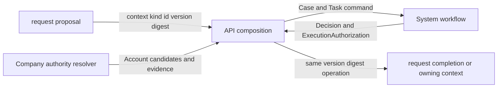

# Request context

request は、会社内で任意の提案を提出し、その内容を後から同じ意味で読み出し、必要なら承認後の業務操作へ結び付ける App である。申請という画面名ではなく、判断対象となる提案の意味と版を所有する。

request は System の一部ではない。request を削除しても、System の認証、認可、監査、通知、Case、Task、HumanAttestation、Decision、ExecutionAuthorization は成立しなければならない。個別の expense、leave、contract なども request に依存せず、それぞれが自分の提案を所有して System workflow を直接利用できなければならない。

request は Company の一部でもない。request を無効化しても、会社、従業員、雇用、組織、職務、責任、Account と Employee の対応は失われてはならない。会社の同一性を構成する事実と、その事実を変更するための任意の手続きは別の責任である。

## 分離する理由

提案内容を System が所有すると、System は休暇日数、経費金額、人事異動、契約条項などの業務 schema を知る必要がある。新しい業務のたびに基盤を変更し、App を削除しても System に payload 解釈が残るため、System の独立性が失われる。

提案内容を Company が所有すると、Company があらゆる申請の集積場所になる。Company の停止不能な正本と、削除可能な手続きの寿命が一致せず、会社機能の変更が申請画面や承認方式へ波及する。

すべての App が request を共通 library として利用すると、App 同士が request を経由して結合する。request の schema、状態、route を変えるたびに全 App の移行が必要になり、request を削除できない。したがって request は共通 workflow library ではなく、汎用的な社内依頼を提供する一つの App とする。

System workflow は request の有無に関係なく利用できる。各 App が自分の proposal version と digest を作り、Company が会社上の資格を解決し、API composition が System の Case と Task を作る。この分解により、共通なのは判断の安全性だけになり、業務の意味は所有 App に残る。

## 所有するもの

request は次を所有する。

- 依頼種別を識別する安定した template code
- 入力を受理できるかを決める schema と正規化規則
- 利用者が提出した正規化済み payload
- 提案の subject と、その提案が参照する業務対象
- 提案の版と、表示内容および実行内容を固定する digest
- 提出、取下げ、差戻し後の新規提出という request lifecycle
- 承認後にどの application operation へ接続するかを示す completion binding
- request 固有の表示、検索、本人一覧、管理一覧

template は入力フォームの都合だけではない。同じ code の template が変更されても、過去の request を当時の schema と意味で検証できる版が必要である。request が template の現在値だけを参照する場合、過去に人間が確認した内容と現在の解釈を区別できない。

payload は任意 JSON のまま正本にしない。template version が定める schema で検証し、正規化した値を保存する。未指定と null、日時の offset、数値表現、文字列正規化、配列順序などが digest 計算と実行時の再構成で一致しなければならない。

subject は request の意味を決める対象参照である。Employee などの mutable な表示値を提案の同一性に使わず、所有 context、resource kind、resource ID、resource version で固定する。表示名は snapshot または所有元からの再読込で得られるが、表示名の変化で提案対象が別物になってはならない。

completion binding は承認済みという状態を業務完了へ読み替えるものではない。どの request version と digest に対して、どの operation key を、どの target version へ実行できるかを固定する。実行成功、外部受理、外部成功、社内照合は別の結果である。

## 所有しないもの

request は次を所有しない。

- Account、Identity、credential、session、technical permission
- 汎用 Case、Task、候補 snapshot、HumanAttestation、Decision
- 汎用 Delegation と ExecutionAuthorization
- Employee、Employment、Department、Membership、ReportingRelation
- OrganizationalAuthority と判断資格の時点解決
- 経費、休暇、契約、人事発令などの業務上の最終状態
- 複数 App を束ねる dashboard、inbox、search の正本
- 外部サービスの成功、法的判断、会計処理、資金移動

request の template に approver role を文字列で保存し、request 自身が Employee と Department から候補を解決する方式は最終モデルではない。その方式は Company の資格解決と System の Task を request 内へ複製し、組織変更、代理、quorum、監査の規則が二重化する。

## System との接続

request と System の接続は、payload の複製ではなく変更不能な参照で行う。

request は提出前に payload を検証し、resource version と proposal digest を確定する。API composition は Company から判断時点の候補 Account と証拠版を取得し、System へ渡す。System は request payload を解釈せず、参照、digest、候補、除外、判断を保存する。

人間が判断するとき、表示される提案は System Case が参照する同じ request version から組み立てる。表示用データと実行用データを別々の query または別々の JSON から生成してはならない。読み出した version から再計算した digest が Case の digest と一致しない場合、表示も判断も実行も拒否する。

承認後の実行では、request の現在状態、対象 version、proposal digest、operation key、ExecutionAuthorization の期限と未使用状態を再検査する。request の提出後に対象業務が変わり、同じ操作を安全に適用できない場合は conflict として停止し、承認済みだからという理由で上書きしない。

## Company との接続

Company は request の申請状態を知らない。Company が返すのは、指定時点、指定責任、指定対象範囲において判断資格を持つ System Account と、その結論を再構成できる証拠参照である。

request は Employee ID を System の actor ID として渡さない。Account と Employee の対応が存在し、有効な Employment と Membership または ResponsibilityAssignment を確認できる場合だけ候補に変換する。対応がない、複数の対応がある、同一人物の複数 Account を排除できない、証拠版を固定できない場合は Task を開始しない。

Company の組織変更は進行中 Task の候補 snapshot を暗黙に書き換えない。再解決が必要なら現在 round を閉じ、同じ proposal digest に対して新しい候補と証拠を持つ round を開始する。過去の判断資格を現在の組織表から推測して置換しない。

人事発令のように completion が Company の事実を変更する場合、request は変更案と completion binding を所有し、Company は適用後の雇用事実と revision を所有する。適用前に基準 revision と現在 revision を比較し、競合時は判断済みの古い提案を適用しない。

## 他の App との関係

他の App は request を import しない。expense は経費提案、leave は休暇提案、contract は契約提案を自分で所有し、System workflow へ接続する。request の template 機構を利用しなければ実装できない App は、request を削除可能にできないため境界違反である。

request から他の App の completion handler を直接 import することも認めない。複数 App を接続する必要がある operation は API composition が双方の公開 application port を呼ぶ。composition は接続順序と transaction 境界を持つが、payload、業務状態、Decision の正本を持たない。

Company は下位の停止不能 context なので、request から Company の資格解決または人事事実の application operation を利用できる。Company から request を import してはならない。request を削除しても Company の事実を読み書きする独立 operation は残る。

## API composition

単一 context の resource と command は、その context の `interface/routes` が所有する。複数 context の結果を一つの HTTP response へ集約するだけの route は `api/src/api/routes` が所有する。

API composition route は業務事実を保存しない。各 context の公開 query または application operation を呼び、認証済み session、request correlation、失敗、response を合成する。集約結果を正本として更新したり、独自の状態遷移を持ったりする場合は composition ではなく、正しい所有 context が欠けている。

`/inbox/counts` は request、expense、leave、shift、thanks の未処理件数を一つの response にするため、request の route ではなく API composition route である。request を削除する場合に変更するのは composition registry、集約 route、利用側の導線であり、他の App の domain、application、schema、route ではない。

API composition は App 同士の import を隠す抜け道ではない。合成は最上位の入口でのみ行い、合成先の公開 operation に業務規則を委ねる。route 内へ個別 App の状態遷移を再実装してはならない。

## 状態の分離

request の状態、System Case の状態、completion の状態を一つの status 列で表現しない。

request の状態は、提案が draft、submitted、withdrawn、superseded、completed のどこにあるかを表す。System Case の状態は、判断が pending、approved、rejected、returned、cancelled、executed のどこにあるかを表す。completion は未実行、実行中、適用済み、競合、外部引渡し済み、外部結果待ち、照合済みなど、実行先の契約に従う。

System Case が approved でも request は completed ではない。ExecutionAuthorization が発行されても副作用は成功していない。System Case が executed でも、外部 connector が必要な場合は外部成功を意味しない。この区別があるため、再試行、照会、訂正、利用者への正確な表示が可能になる。

差戻しは既存 request version の payload を編集可能にする状態ではない。差し戻された版は固定し、修正内容は新しい version と digest にする。旧 Case と新 Case を関連付けても、旧 attestation を新しい提案へ流用しない。

取下げは判断履歴の削除ではない。request を withdrawn にし、開いている System Task を閉じ、Case を取消可能な状態へ進める。既存 attestation、候補 snapshot、監査を削除しない。

## Transaction と失敗

request 作成、subject、version、digest、System Case 作成のどこまでを同一 database transaction に置くかを application operation ごとに明示する。片方だけが残り得る場合は、idempotency key と回復可能な中間状態を持つ。Case がない submitted request、参照先のない Case、digest の違う組合せを成功として公開しない。

completion は ExecutionAuthorization の条件付き消費と業務更新を同じ整合境界へ置く。外部通信は database transaction 内に保持せず、同じ transaction で outbox を作る。connector は安定した idempotency key を使い、timeout を成功または失敗へ推測しない。

並行提出、二重判断、二重 completion は application の事前検査だけで防がない。unique constraint、expected revision、条件付き update、transaction guard を併用する。競合で更新件数がゼロなら、別 request の成功として扱わず明示的な conflict を返す。

資格解決、参照先読出し、digest 再計算、System 保存、Company 更新のいずれかが評価不能なら fail closed とする。利用者の利便性を理由に現在の組織、既定 approver、管理者 permission から推測して継続しない。

## 削除可能性

request を削除するときに対象となるのは、request context directory、route module 登録、request 所有 migration、seed、feature metadata、API composition の request 集約部分、Web と CLI の request 導線である。

削除のために System または Company の domain 型、状態遷移、schema を変更する必要がある場合、所有境界が誤っている。Company が保持する request 由来の参照は、一般的な外部参照として nullable または履歴保持可能でなければならず、request table の存在を Company の正本条件にしてはならない。

保存期間中の request 履歴を物理削除できない場合でも、runtime module の削除可能性とは分ける。履歴を archive schema または export として保持することと、Company や他の App が request の実装へ依存し続けることは同じではない。

## 十分性

request context が十分であるとは、会社のあらゆる業務を template JSON で表現できることではない。次の問いへ一意に答えられることをいう。

- 何の提案で、どの所有 context、resource、version を対象にしているか
- どの template version と正規化規則で payload を受理したか
- 利用者が見た内容、保存した内容、実行する内容が同じ digest か
- 誰が提出し、誰または何を subject とし、いつ取下げまたは再提出したか
- どの System Case がこの提案版を判断したか
- 承認後に許される operation と、実際に完了した operation は何か
- 競合、失敗、再試行、訂正後も元の提案と判断を再構成できるか

この問いへ request、Company、System、実行先の正本から答えられれば、request は提案の完全性を担保できる。個別業務の妥当性、会社上の資格、判断の成立、外部成功までを request 単独で担保する必要はない。責任を分けたまま参照、版、digest、証拠で接続することが、十分性の条件である。

template で型安全に表現できない業務、専用の競合規則や履歴が必要な業務、法的または金銭的な正本を持つ業務は独立 App または外部連携へ置く。request の汎用性を広げるために、無検証 JSON、任意 handler 名、動的 SQL、権限 bypass を追加してはならない。

## 矛盾の検査

次の状態は request の責任境界と矛盾する。

- request を削除すると System workflow または別 App が動かなくなる
- System が request template、payload field、Employee、Department を解釈する
- Company が request status、approval、attestation を会社事実として保存する
- request が他の App の schema または completion handler を import する
- request の承認 role 文字列だけから System Task の候補を決める
- template の変更で過去 request の意味または検証結果が変わる
- payload を変更しても version または digest が変わらない
- 表示、判断、実行が異なる payload から組み立てられる
- approved を completed または外部 succeeded と表示する
- API composition が集約のために業務状態を新しく所有する
- request の domain が Drizzle、D1、Hono、Company の persistence row 型へ依存する
- 評価不能時に管理者、現在の上長、既定 role を候補として補う

矛盾が必要に見える場合、例外を追加せず、所有 context、対象版、主体、資格時点、実行 operation、transaction 境界のどれが欠けているかを特定する。

## 現行実装

現行コードには `api/src/contexts/request` があり、domain、application、infrastructure、interface を持つ。application template、application request、payload 検証、subject、completion binding、従来 workflow、approval delegation、関連 route を Company から分離している。Company から request への import は境界検査で拒否される。

request の domain entity は request の Drizzle schema 型へ依存しない。request schema は request infrastructure にあり、request context から合成 schema への import は境界検査で拒否される。複数 context の `/inbox/counts` は `api/src/api/routes` にあり、API composition の route source が registry 末尾であることを検査する。

現行の template と request は、変更不能な template version、request version、canonical proposal digest をまだ持たない。`application_requests.payload` は検証後の JSON だが、System Case の digest と結ばれていない。`application_subjects` は Employee と prospective Employee に特化し、opaque な context、kind、ID、version 参照ではない。

現行の workflow、approval、delegation table と application service は request context 内の互換実装であり、System workflow kernel を利用していない。workflow selector は request の薄い adapter から Company の OrganizationalAuthority resolver へ渡される。Company は指定時点の在籍、組織、Account 対応を解決し、組織投影の出典、営業日、organization revision、使用根拠を snapshot として返す。初期候補を解決する adapter と step activation は Company table を読まず、その snapshot を候補証拠へ保存する。

Company resolver と request workflow の候補、actor、更新者、委任作成者は canonical System Account ID へ統一済みである。旧整数 Session は request の明示的な互換 adapter で一度だけ投影し、保存時は `system_accounts` 外部キー、判断時は active 状態と Employee 対応を再検査する。理由と保証範囲は [Workflow Account identity](./workflow-account-identity.md) に定める。

`role` selector は引き続き Company Responsibility ではなく Account role を使う互換条件である。そのため、主体IDと候補解決の接続はSystem Taskへ渡せる形になったが、会社ごとの最終資格モデルは未完成である。

判断時の候補 Employee 対応と在籍の再検査、委任、手動修復には、request から Company の Employee と対応 table を読む互換経路が残る。Account のactive状態はSystem正本へ切替済みだが、初期候補 resolver の分離を request 全体の Company infrastructure 非依存と読み替えない。これらは Company live guard と System HumanAttestation へ切り替えるまでの未完成差分である。

現行の personnel action completion は request から Company の application operation を利用し、revision と payload fingerprint を検査して同一 batch で適用する。これは許可された request から Company への依存である。一方、汎用 ExecutionAuthorization、request version、proposal digest には未接続なので、System workflow 利用済みとは扱わない。

現行 route は Company の認証 middleware、session、HTTP error、test helper を利用する。依存方向は request から Company なので逆依存ではないが、System の共通認証と API 共通部品への分離は未完成である。

以上から、現行実装は request の所有境界と削除方向、Company 資格 resolver への依存方向、workflow主体のcanonical Account IDを確立し、従来挙動をその境界へ移した状態である。System workflow との完全な接続、版と digest、Company Responsibility scope、旧 workflow table の廃止が完了するまでは、最終的な安全性を満たしたとは表示しない。
