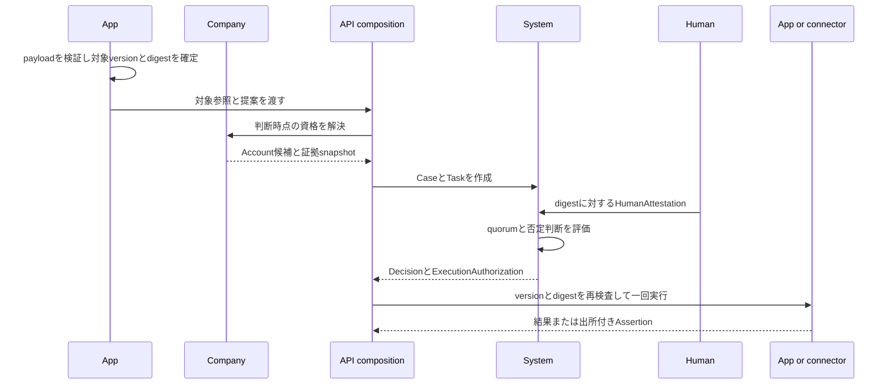

# System workflow

System workflow は、業務上の提案を変更不能な対象版へ固定し、誰がどの資格で何を判断したかを記録し、その判断から限定された実行許可を生成する。経費、休暇、人事、契約、AI 提案の意味は所有せず、それらに共通する案件、判断、代理、実行の安全性だけを所有する。

System workflow が Company や特定 App の語彙を所有すると、組織制度または業務機能を変えるたびに基盤を変更する必要が生じる。System workflow が業務 payload を所有すると、App を削除しても System にその schema と履歴解釈が残る。System は opaque な対象参照、digest、Account、資格証拠参照だけを受け取り、意味のある事実を所有元へ残す。

System workflow の責任は [会社の解体図](./capability-map.md)、会社上の判断資格は [権限と意思決定モデル](./authority-model.md)、技術的な操作許可は [認可モデル](./authorization-model.md)、AI による提案と実行は [AI 自動化](./automation-model.md)、外部副作用は [外部連携](./integration-model.md) に従う。

## 十分性

汎用の判断基盤が十分であるとは、あらゆる業務規則を System が知ることではない。次の問いへ、業務の種類に依存せず、同じ記録と制約から回答できることをいう。

- 判断対象は、どの context が所有する、どの kind、ID、version の提案か
- 人間が確認した内容と実行される内容は、同じ proposal digest か
- 判断時点で誰が候補者であり、その資格はどの版の証拠から解決されたか
- 実際に操作した Account と、その人が代理した Account は誰か
- quorum、却下、差戻し、取消の規則から、案件はどの終端状態になったか
- 現在の主体が、承認された同じ提案に対する同じ operation を、期限内に一度だけ実行できるか
- 過去の候補、除外、代理、判断、実行許可を後から差し替えず再構成できるか

この問いへ回答できれば、System は判断の完全性を担保できる。業務内容の妥当性、会社上の資格解決の正しさ、外部処理の成功までを System が単独で担保する必要はない。それらを混ぜると、どこで誤りが起きたかを特定できず、承認済みと業務完了と外部成功を誤って同一視する。

System workflow が十分に機能するのは、App、Company、System、実行先がそれぞれの責任を満たし、その境界を API composition が一つの application operation として接続した場合だけである。一つでも評価不能なら、安全側へ拒否する。

## 責任分担

App は提案の意味を所有する。入力 schema、正規化規則、対象の業務状態、resource version、変更前後、業務上の副作用、完了条件を定義する。proposal digest は、利用者へ表示する意味と実行 payload が同じ正規化済み表現から生成されるように作る。

Company は会社上の資格を所有する。Employment、Membership、ReportingRelation、ResponsibilityAssignment、OrganizationalAuthority の有効時点を評価し、候補 Account、除外 Account、根拠となる事実の参照と版、解決時点を返す。Company は案件状態、attestation、quorum、実行許可を保存しない。

System は技術主体と判断 lifecycle を所有する。Account を認証し、対象参照と digest を固定し、候補と除外の snapshot、HumanAttestation、Decision、Delegation、ExecutionAuthorization を保持する。System は Company を呼ばず、Employee、Department、役職、金額、休暇、経費などの語彙を解釈しない。

API composition は所有元を順番に呼び、型の変換と transaction 境界を構成する。composition 自身は業務事実、会社事実、判断状態の正本を持たない。System から Company を呼ばないため、System の再利用性と依存方向を維持できる。

実行先は内部 App または外部 connector である。実行先は ExecutionAuthorization の存在だけを成功扱いせず、対象 version、業務状態、技術的認可、会社上の資格、期限、digest、idempotency key を実行直前に再検査する。外部処理の受理、成功、社内採用、照合は別状態として記録する。

## 案件の対象

`SystemCaseReference` は `context`、`kind`、`id`、`version` の組である。`context` と `kind` は namespace として安定した kebab-case 名を使い、`id` と `version` の意味は所有 App が定義する。

System は参照先 payload を複製しない。参照先を読み出せない、version が存在しない、または version と digest の対応を検証できない場合は、Case を作成してはならない。System 内の参照が形式上正しくても、参照先が実在することまでは System 単独で保証しない。

提出後に業務 payload を変更する場合、既存 Case の `subject.version` または `proposalDigest` を更新してはならない。所有 App が新しい version と digest を作り、新しい Case として再提出する。旧 Case は returned、rejected、cancelled のいずれかの終端状態として残す。

## Proposal digest

proposal digest は小文字 hexadecimal の SHA-256 とする。hash 対象は、App が定義した版付きの正規化形式である。JSON の key 順、数値、日時、null、未指定、文字列正規化が実装ごとに変わる形式を使用してはならない。

表示用の説明と実行 payload を別々の情報から生成してはならない。人間が確認した表示、System が保持する digest、実行時に再構成する payload が同じ正規化済み提案へ収束しなければならない。

digest は内容の同一性を検査するが、内容の妥当性を証明しない。不正な提案を正確に hash しても正しい提案にはならない。App の schema 検証、Company の資格解決、System の判断制約をすべて通過させる。

## Task と資格 snapshot

`DecisionTask` は Case 内の判断単位である。task key、round、required approvals、proposal digest、開始、期限を固定する。候補者は canonical System Account ID で保存し、Employee ID または組織語彙を保存しない。

各候補者には、Company または別の資格所有 context が返した evidence context、kind、ID、version、eligibility digest、resolved at を保存する。System は証拠の意味を解釈しないが、どの証拠版に基づく候補だったかを変更不能な形で保持する。

組織変更は進行中 Task の候補者を暗黙変更しない。候補の変更が必要な場合、開いている round を取消し、根拠を再解決して次の round を作る。最初の attestation 後に候補または除外を追加してはならない。

required approvals は候補者数以下でなければならない。実行時は保存された候補 snapshot を使い、現在の組織だけから過去の資格を再計算して置換してはならない。

## 技術的認可と会社上の資格

TechnicalPermission、OrganizationalAuthority、CaseAssignment、HumanAttestation、ExecutionAuthorization は別の事実であり、相互に生成されない。

TechnicalPermission は API operation を呼び出せる上限である。OrganizationalAuthority は会社を拘束する判断資格である。CaseAssignment は特定 Task の候補 snapshot である。HumanAttestation は人間が固定済み提案へ行った判断証明である。ExecutionAuthorization は必要条件を合成した後の限定実行許可である。

管理者 permission を持つ Account を、自動的に会社上の承認者として候補へ追加してはならない。会社上の役職を持つ Employee を、認証済み Account の確認なしに actor として扱ってはならない。候補であることだけを、判断済みまたは実行可能として扱ってはならない。

資格を一意に解決できない、Account と会社上の主体を検証済みの対応へ結べない、証拠版を固定できない場合は、Task を開始せず拒否する。

## 人間の判断証明

`HumanAttestation` は case ID、task key、round、proposal digest、action、判断時刻へ結ぶ。action は approve、reject、return を区別する。コメントは理由の補足であり、action または digest の代替ではない。

`actorAccountId` は実際に認証し操作した Account、`representedAccountId` は候補資格を持つ Account である。本人判断では両者を一致させ、delegation ID を持たせない。代理判断では両者を分け、有効な delegation ID を必須にする。

同じ round で同一 actor が複数の判断を行ってはならない。同一 represented Account の資格を複数 actor が重複使用してはならない。Task の候補でない represented Account、除外された Account、Case の作成者である actor の attestation は拒否する。

HumanAttestation は追記専用とする。訂正は既存行の更新または削除では行わず、Task を終端させ、必要な根拠を保存して次の round または新しい Case で行う。

HumanAttestation という名前だけでは人間性を保証しない。API は HumanPrincipal の認証、Account の有効状態、必要な step-up、session の失効、TechnicalPermission を確認してから作成する。現行の System Account は Principal kind と step-up を独立表現していないため、現行 route がこの要件を満たすとは扱わない。

## 自己判断と除外

独立判断が必要な Task では、Case 作成者を候補へ含めず、actor としても受理しない。対象本人、利益相反者、方針上の除外者は、Company または App が解決して除外 snapshot として渡す。

System は対象参照から本人または利益相反を推測できない。`subject` または `policy` を理由とする除外が必要な業務で、所有元が除外 Account を解決できない場合は Task を開始してはならない。

一つの人間が複数 Account を持つ場合、Account ID の一意制約だけでは quorum の水増しを防げない。Company の Account 対応は同一人物の重複 Account を候補へ入れず、System の application service は検証済みの主体対応を受け取る。これを保証できるまでは、Account 単位の quorum を人間単位の quorum と表示してはならない。

## 判断結果

Task は、すべての attestation が同じ case、task、round、digest に属し、actor と represented Account が重複せず、represented Account が候補であることを確認してから結果を評価する。一件でも不正な attestation が混ざる場合、正しい attestation だけを選んで結果を出さず、Task 全体を拒否する。

有効な reject が一件でもあれば rejected とする。reject がなく、有効な return が一件でもあれば returned とする。いずれもなく、異なる represented Account による approve が required approvals 以上なら approved とする。それ以外は pending とする。この優先順位により、入力順で結果が変わらない。

Case を approved にできるのは、必要な Task が一件以上存在し、すべて approved の場合だけである。Case を rejected または returned にできるのは、すべての Task が終端し、対応する否定判断が存在する場合だけである。Case 全体でも reject は return より優先する。Case を cancelled にできるのは、開いている Task がない場合だけである。

ProcedureDefinition と必要 Task の生成が未実装の間は、保存済み Task がすべて approved でも、本来必要な Task がすべて生成されたことを System は証明できない。既存の申請経路を System workflow 利用済みとしてはならない。

## Delegation

System の `Delegation` は Task 操作の代理であり、Company の AuthorityDelegation、ActingAssignment、StandingSubauthority、ResponsibilityAssignment を移転しない。代理人は委任元の候補資格を使って操作するが、判断記録には actor と represented Account の両方を残す。

自己委任は禁止する。有効期間は開始を含み終了を含まない半開区間とする。取消時刻以後は使用できない。対象 scope がある delegation は、context、kind、ID、version がすべて一致する Case にだけ使用できる。

scope のない delegation は期間中の全 Case を対象にし得るため、Company または App が許可する明示的な代理方針、短い有効期間、本人確認、監査を必須とする。これらを評価する application service がない経路では、scope のない delegation を発行してはならない。

委任元が候補でない場合、delegation が存在しても attestation を作成できない。delegation は候補資格を新しく作らず、技術的 permission または会社上の authority を代理人自身へ恒久付与しない。

## 差戻しと再申請

return は同じ提案を未承認のまま編集可能にする操作ではない。returned Case の対象版と digest は固定したまま残す。App が差戻し理由を提示し、申請者が内容を変更し、新しい resource version と proposal digest で新しい Case を作る。

この分離により、どの内容が差し戻され、再提出で何が変わったかを比較できる。returned Case の digest を差し替えると、過去の attestation が別内容を指すため禁止する。

## ExecutionAuthorization

判断と実行は別状態にする。approved は人間判断が成立したことを表し、内部更新または外部処理の成功を表さない。

`ExecutionAuthorization` は case ID、operation key、proposal digest、実行主体 Account、発行時刻、期限を固定する。同じ Case と operation key の許可は一件に限定し、使用時刻は一度だけ設定できる。期限到達後、digest 不一致、既使用、対象 Case が approved でない場合は拒否する。

operation key は、App が提供する一つの application operation を識別する。曖昧な `execute`、route 名だけ、画面名だけを使用せず、同じ key が常に同じ副作用契約を指すようにする。

実行許可を使用する transaction は、許可の未使用確認、対象 version と状態の再検査、冪等性の確保、業務更新、許可の消費を一つの整合境界へ置く。外部通信を database transaction 内に保持せず、outbox を同じ transaction で作成し、connector が idempotency key と digest を維持して配送する。

System Case を executed にできるのは、その Case に発行されたすべての ExecutionAuthorization が消費済みの場合だけである。外部送信が必要な場合、消費済みは送信要求を一度引き渡したことを表し、外部成功を表さない。外部結果は Assertion と照合状態で別に記録する。

現行実装には application operation、repository、Execution Gateway、outbox との接続がない。domain 型と database 制約だけを、業務副作用が安全に実行される保証として使用してはならない。

## 取消と再割当

Case の取消前に、開いている Task を cancelled として閉じる。Task を閉じずに Case だけを取消すと、到達不能な inbox 項目と遅延 attestation が残るため拒否する。

同じ task key の次 round は、直前 round が cancelled の場合だけ開始できる。却下、差戻し、承認を、候補だけ入れ替えた次 round で上書きしてはならない。新しい内容または終端判断のやり直しは、新しい Case として扱う。

escalation 候補は `eligibleFrom` 到達前に判断できない。期限到達だけで既存候補を削除せず、ProcedureDefinition が定める escalation と quorum の関係に従う。

## 証跡と訂正

Case の対象、digest、作成者、作成時刻は変更しない。Task の key、round、quorum、digest、開始、期限は変更しない。候補、除外、HumanAttestation は更新または削除しない。Delegation は取消だけを単調に追加し、ExecutionAuthorization は使用時刻だけを一度追加する。

append-only は誤りを消せないことを意味しない。誤りを元記録の破壊で訂正せず、取消、次 round、新しい Case、または別の correction record から元記録を参照する。監査では元の判断と訂正後の有効状態を両方再構成する。

## 並行実行と失敗

domain object の検証だけに依存してはならない。複数 request が同時に同じ Task を判断し、同じ ExecutionAuthorization を使えるため、database の foreign key、unique index、check、trigger と transaction でも同じ不変条件を強制する。

不変条件違反、参照切れ、競合、期限切れ、認可失敗は fail closed とする。正しい行だけを部分保存して成功扱いせず、application operation 全体を rollback する。

通知は判断の正本ではない。通知失敗で成立済みの attestation または Decision を取り消さず、outbox から再試行する。通知成功を attestation として扱わない。

外部 timeout は成功、失敗、未実行のいずれとも断定しない。同じ idempotency key で照会または再送し、外部 Assertion と照合する。内部の approved または executed を外部成功として表示しない。

## 現行コード

現行の System workflow には次が存在する。

- `SystemCase`、`DecisionTask`、`Decision`、`HumanAttestation`、`Delegation`、`ExecutionAuthorization` の domain 型
- opaque な対象版、proposal digest、候補、除外、資格証拠参照を持つ System table
- monotonic lifecycle、自己判断禁止、候補と除外の固定、quorum、代理 scope、append-only、一回実行を強制する database 制約
- canonical DDL、migration、Drizzle schema の対応と、それらの一致を検査する test

Company には、営業日、組織投影、organization revision、根拠を固定する OrganizationalAuthority resolver がある。これは System の構成要素ではなく、request から利用される独立した Company 能力である。

Company resolver と request の既存 workflow actor、candidate、更新者、委任作成者は canonical System Account ID へ統一済みである。保存済み履歴の移行、外部キー、live guard、legacy Session adapter の責任は [Workflow Account identity](./workflow-account-identity.md) に定める。この接続は主体IDの準備を完了するが、既存判断をSystem Taskが実行していることまでは意味しない。

現行の System workflow には次が存在しない。

- ProcedureDefinition と版、および必要 Task を完全に生成したことの証明
- System workflow の application service、repository、transaction operation
- HumanPrincipal kind、step-up、共通 policy evaluation と attestation 作成経路
- Company の資格証拠を opaque evidence reference または digest として System Task へ渡す接続
- request App の変更不能な template version、request version、canonical proposal digest と System Case の binding
- Execution Gateway、idempotency、outbox、外部 Assertion との接続
- request context にある既存 application request、approval、delegation、notification の System workflow への切替

request App には template、検証済み payload、Employee に特化した subject、personnel action completion binding が存在する。ただし request version と proposal digest がなく、System Case と接続されていない。したがって、現行の System workflow は安全な永続化と domain kernel であり、既存申請の実行基盤ではない。既存 route の挙動は request context の従来実装が所有している。

## 利用済みの判定

ある App を System workflow 利用済みとして扱えるのは、次がすべて成立する場合だけである。

- App が業務 payload、schema、version、正規化、digest、業務状態を所有している
- Company が判断時点の資格と同一人物性を解決し、版付き証拠 snapshot を返している
- System application service が認証、permission、候補、除外、quorum、digest、期限を一つの経路で検査している
- ProcedureDefinition から必要な Task が漏れなく生成されたことを検査できる
- Case、Task、attestation、Decision、ExecutionAuthorization の保存と業務側の状態更新が定義済み transaction 境界にある
- 実行時に対象 version、業務状態、authority、permission、digest、期限を再検査している
- 同時判断、重複 request、失効、取消、差戻し、再申請、通知失敗、外部 timeout の結果が test されている
- Web、CLI、AI、callback が同じ application service を通る
- 旧 workflow との backfill または切替で、欠落、重複、孤児、digest 不一致がない
- System が Company または App の module と語彙へ依存せず、App の削除が他の App の変更を要求しない

domain 型だけ、table だけ、route だけ、画面だけが存在する状態を利用済みとしない。要件の一部を満たせない経路は、旧安全経路を維持するか、操作を拒否する。

## 矛盾の検査

設計または実装が次の状態になった場合、責任境界または不変条件に矛盾がある。

- System の型、table、query、error に Employee、Department、役職、経費、休暇などの語彙が必要になる
- Company が Case status、Task outcome、HumanAttestation、ExecutionAuthorization を正本として保存する
- App が認証、quorum、delegation、attestation、実行許可を独自実装する
- API composition が業務事実または判断事実を所有する
- 同じ業務 payload を App と System の両方が正本として保存する
- proposal digest を維持したまま対象 version、表示内容、実行 payload のいずれかを変更できる
- 候補または除外を最初の attestation 後に変更できる
- 一人の actor または represented Account が同じ round の quorum へ複数回数えられる
- Case 作成者が別 Account の代理として自己の Case を判断できる
- reject と return の到着順によって同じ attestation 集合の結果が変わる
- approved、executed、外部 accepted、外部 succeeded、社内 reconciled を同じ状態として扱う
- ExecutionAuthorization の存在だけで、対象 version、業務状態、期限を再検査せず副作用を実行できる
- 通知の delivery、既読、reaction、button click を HumanAttestation として保存する
- 証跡を更新または削除して訂正する
- Company または外部サービスを利用できないときに、資格や成功を推測して処理を継続する
- 一つの App directory を削除すると、別の App の domain、schema、route の変更が必要になる

このいずれかが必要に見える場合、例外を追加して進めず、所有元、対象版、主体、時点、証拠、失敗時の状態のどれが欠けているかを先に特定する。
