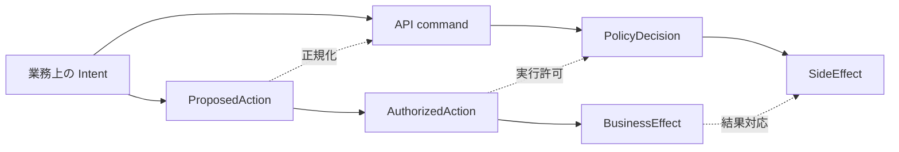
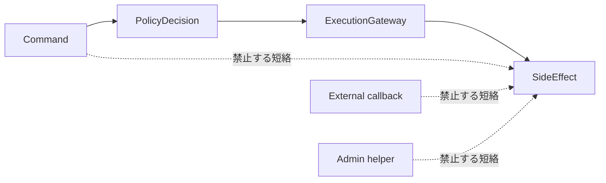

# モデル適合と脆弱性検査

規範性: 仕様正本。会社メタモデルから実装、外部 adapter、AI 自動化への写像に課す検証義務と release gate を定める。

圏論は test case を導く構造として使用する。形式証明を実施していない性質を証明済みとして扱ってはならない。

## 検査対象

- domain theory と application command
- application command と API、Web、CLI、AI client
- Proposal、Decision、HumanAttestation、Execution
- domain event、database state、audit、outbox
- canonical model と外部 API schema
- old schema と new schema の migration
- policy document と enforcement

## 検証義務

### 型保存

source の Kind、Role、Relator、単位、時間、Principal kind を別概念へ写してはならない。外部 `user` を Person、Employee、Account のどれへ写すかを mapping contract へ明記する。

### 恒等射と合成の保存

round trip で保持すると宣言した identity を変えてはならない。許可した二つの mapping の逐次適用を、対応する合成 mapping と一致させる。

### 可換性

同じ業務 action へ至るすべての入口は、同じ authorization、state transition、audit outcome を持たなければならない。

上段で許可されない経路が下段に存在する場合は認可 bypass とする。

### Call path の Factorization

side effect へ至る call path は PolicyDecision と ExecutionGateway を経由しなければならない。batch、admin helper、migration tool、webhook、test-only endpoint、AI tool も同じ条件に従う。

### 情報保存

判断と訂正に必要な次を失ってはならない。

- internal ID と external ID namespace
- Principal kind と actor chain
- target kind と target ID
- 単位、currency、timezone、jurisdiction
- valid time、recorded time、policy version
- source、mapping version、input digest
- proposal digest、idempotency、correlation、causation

lossy mapping は、失う field、影響、代替 evidence、manual process を接続契約へ明記した場合だけ許可する。

### Failure 保存

exception、timeout、partial success、deny、unknown を success へ写してはならない。失敗を `Result` 相当の型で保持し、retry と compensation を定義する。

### 時間保存

現在の relation を過去の snapshot へ写してはならない。期間境界、timezone、clock skew、expiry、revocation、late event を test する。

## 脆弱性

### Principal collapse

Human、Agent、Service、Connector を一つの account として記録する欠陥。principal kind、requested_by、executed_by、on_behalf_of、credential boundary を検査する。

### Authority collapse

TechnicalPermission を OrganizationalAuthority として扱う欠陥。両条件を独立に変化させ、片方だけでは会社を拘束する effect が生じないことを検査する。

### Collective decision collapse

合議体構成員一人の操作を Resolution として扱う欠陥。candidate snapshot、membership、quorum、vote uniqueness、conflict、decision method を検査する。

### Approval substitution

人間が確認した Proposal と実行 payload が異なる欠陥。共通 canonical representation、digest 一致、変更後の再承認を検査する。

### Confused deputy

AI または connector が ExecutionGateway の強い credential で委任外操作を行う欠陥。ExecutionAuthorization が operation、tenant、target、field、expiry を制限することを検査する。

### Stale authority

過去の候補者、組織関係、authority assignment、policy version を現在値で再解決する欠陥。案件 snapshot と判断時の再検査を分ける。

### External truth elevation

外部製品、専門家、AI の response を出所なしの確定事実へ変換する欠陥。ExternalAssertion、AcceptanceStatus、reconciliation、correction path を検査する。

### Retry amplification

retry で支払、通知、付与、予約が重複する欠陥。idempotency key、payload digest、inbox deduplication、外部 request ID、reconciliation を検査する。

### Semantic schema drift

外部 enum、単位、role、status の意味変更を型互換とみなす欠陥。contract version、未知値の隔離、mapping fixture、canary、rollback を検査する。

### Policy decoration

文書または metadata の規則を技術的強制済みとみなす欠陥。PolicyRule から enforcement point と conformance test への trace を要求する。

## Test 種別

- Unit test: value、state transition、policy predicate
- Property test: identity、composition、idempotency、interval、quorum
- Metamorphic test: entry point、retry、ordering、等価表現の結果比較
- Contract test: canonical model と external adapter の双方向 fixture
- Database test: unique、check、conditional update、transaction、append-only constraint
- Integration test: Proposal から effect、audit、outbox まで
- Migration test: old instance から new instance、rebuild、round trip、loss report
- Threat test: bypass、replay、overposting、confused deputy、secret exposure
- Model check: concurrency、deadline、revocation、multi-step workflow

## Release gate

新しい domain または connector は、次を満たすまで有効化してはならない。

- 能力質問と反例を定義する
- Kind、Role、Relator、system of record、time、version を定義する
- Principal、Permission、Authority、scope、field、attestation を定義する
- 全 entry point を同じ application policy へ通す
- Proposal と execution の digest 一致を test する
- retry、duplicate、timeout、partial success、reconciliation を test する
- mapping の保存情報と loss を明記する
- event、record、audit、outbox の transaction outcome を test する
- current relation と historical snapshot を区別する
- legal、tax、payment determination を外部実現として表示する

## 現行実装差分

次は未完成であり、実装済みの安全保証として扱ってはならない。

- Human と Agent の Principal 分離
- governance management、authority assignment、review、publish の職務分離
- 合議体と一人役職の型分離、quorum
- review candidate と authority assignment の snapshot
- authority rule と業務 API enforcement の trace
- ProcedureDefinition と ProcedureCase の分離
- ControlDefinition と ControlRun の分離
- external connector の outbox、inbox、idempotency、reconciliation

実装状態は [能力台帳](./capability-map.md)、コード、migration、テストを正とする。
